<a id="english"></a>

###### English

<div align="center">


<h1>Snowflake Method for Obsidian</h1>

**English** · **[简体中文](#简体中文)**

[](https://github.com/ZzPoLariszZ/obsidian-snowflake-method/releases) [](https://github.com/ZzPoLariszZ/obsidian-snowflake-method/actions/workflows/ci.yml) [](LICENSE) [](https://obsidian.md)

**Turn a story idea into a draft-ready plan, one Snowflake step at a time.**

A bilingual, Markdown-native fiction planning workspace for Obsidian. Your projects stay local, portable, and readable even when the plugin is disabled.

<br />

[Installation](#installation) · [Guide](#guide) · [Privacy](#privacy) · [Roadmap](#roadmap) · [Development](#development)

<br /><br />

</div>

## What is the Snowflake Method?

Randy Ingermanson's Snowflake Method takes its name from the [Koch Snowflake](https://en.wikipedia.org/wiki/Koch_snowflake), a fractal that grows from an equilateral triangle by repeatedly adding smaller triangular details to every side. He uses that step-by-step growth as a metaphor for designing a novel: begin with a one-sentence summary, then expand the plot, characters, and scenes through ten revisable steps until the story is ready to draft. The method organizes creativity rather than imposing a rigid rulebook: you can keep what helps, skip what does not, and return to earlier steps as the story develops. Read Ingermanson's [original Snowflake Method article](https://www.advancedfictionwriting.com/articles/snowflake-method/) for the complete method.

## Why this plugin?

This plugin turns that iterative workflow into a focused, Markdown-native workspace. Instead of scattering summaries, character sheets, and scene plans across separate documents and spreadsheets, you can develop them together in one guided dashboard while still opening every piece as an ordinary Obsidian note.

Your writing stays local, linkable, portable, and editable without the plugin. The workflow provides structure without enforcing it: hints never block progress and every step can be revisited.

**This is an independent, open-source community project. It is NOT affiliated with, authorized by, or endorsed by Randy Ingermanson or Advanced Fiction Writing.**

## Features

| Feature | What it provides |
|---|---|
| Guided dashboard | Navigate all ten steps and control progress without blocking validation rules. |
| Obsidian-native projects | Store summaries, characters, scenes, and drafts as ordinary local notes. |
| Worldbuilding | Track time, location, and item beside characters and scenes, add kinds of your own, and grow a category, world-status, and relationship vocabulary for each. |
| Custom fields | Give any note the fields your story needs, and keep reusable sets of them as templates for each kind. |
| Manuscript stream | Read and write the whole manuscript as one continuous page while every chapter stays its own note. |
| Typewriter scrolling | Keep the line being written at the middle of the page. |
| Focus mode | Fade everything except the paragraph being written, in four levels. |
| Revision awareness | Receive non-blocking reminders when upstream material changes. |
| Safe repair tools | Detect damaged structure and repair missing managed files without overwriting prose. |
| Bilingual workspace | Use English or Simplified Chinese independently for the interface and each project. |

## Workflow

Work from a compact premise toward a scene-level plan. Each stage keeps the earlier material visible, so you can expand or revise without losing the shape of the story.

<p align="center">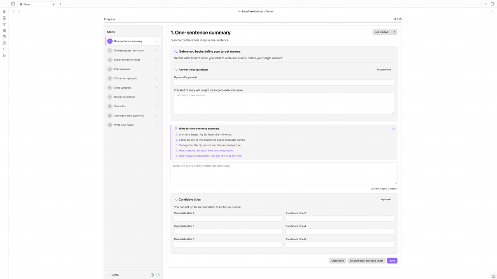</p>

<details>
<summary><strong>Screenshots</strong></summary>

<p align="center"><sub>Click any screenshot to open the full-resolution view.</sub></p>

<table>
  <tr>
    <td width="50%" valign="top">
      <a href="assets/screenshots/step_01_en.png">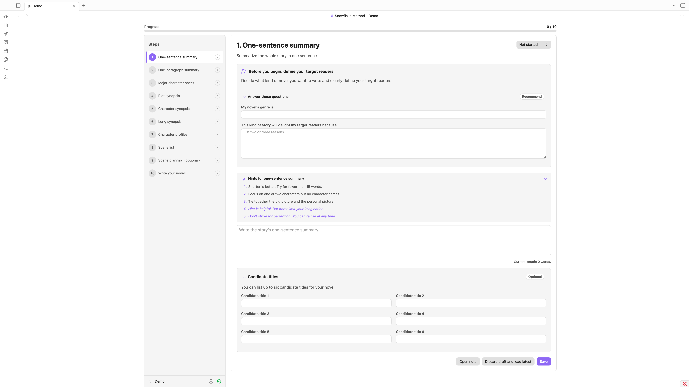</a><br />
      <strong>1. One-sentence summary</strong><br />
      <sub>Define your target readers and distill the whole story into one sentence.</sub>
    </td>
    <td width="50%" valign="top">
      <a href="assets/screenshots/step_02_en.png">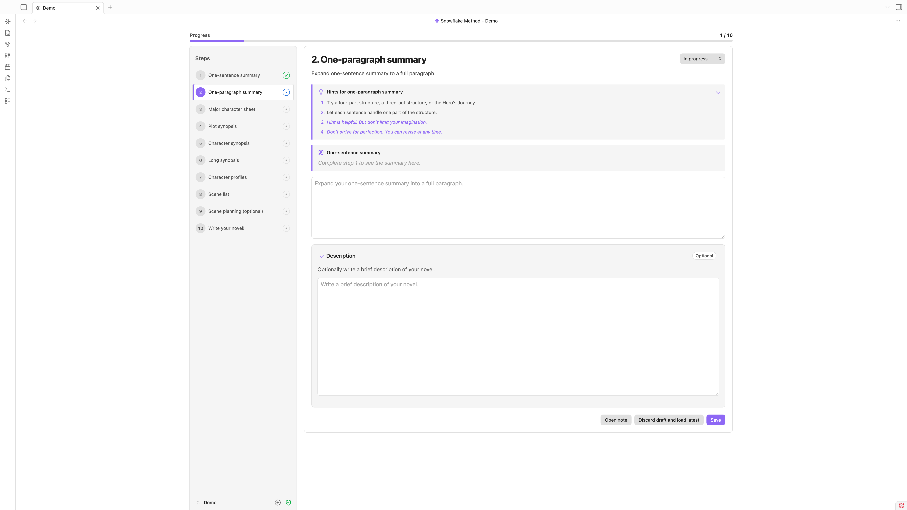</a><br />
      <strong>2. One-paragraph summary</strong><br />
      <sub>Expand the premise into a compact structure and optional description.</sub>
    </td>
  </tr>
  <tr>
    <td width="50%" valign="top">
      <a href="assets/screenshots/step_03_en.png">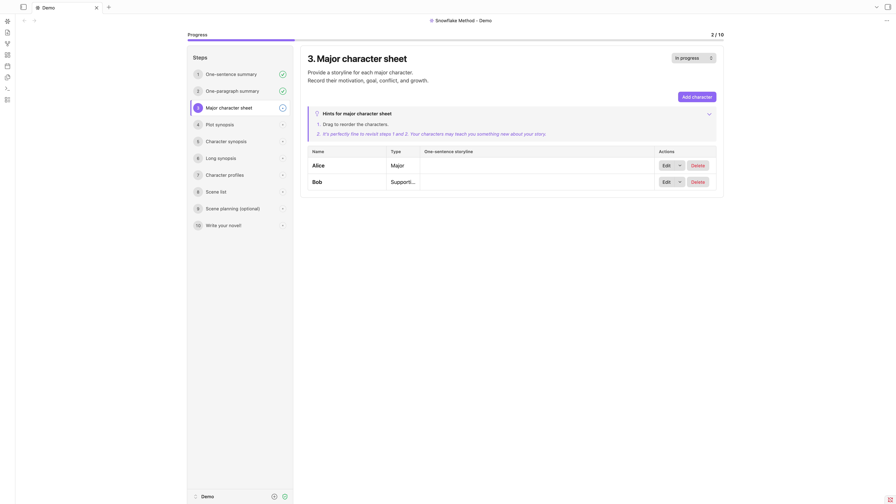</a><br />
      <strong>3. Major character sheet</strong><br />
      <sub>Capture each major character's storyline, motivation, conflict, and growth.</sub>
    </td>
    <td width="50%" valign="top">
      <a href="assets/screenshots/step_04_en.png">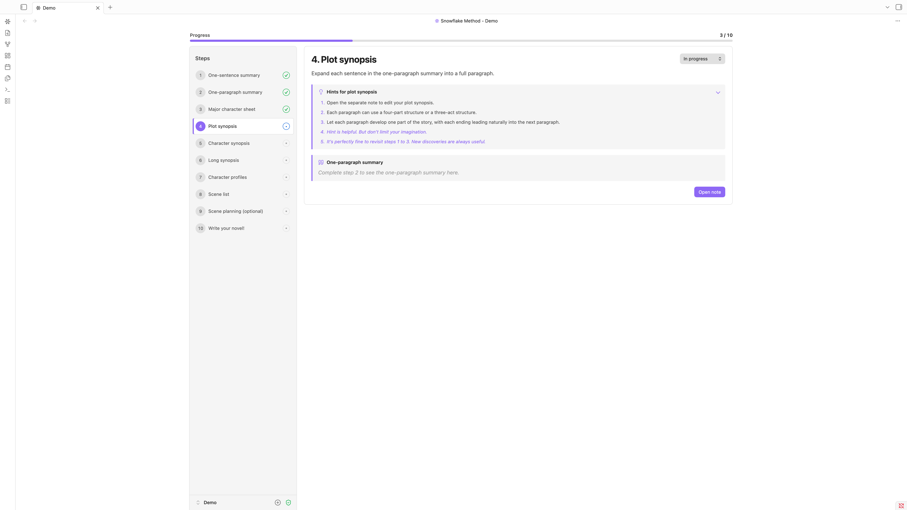</a><br />
      <strong>4. Plot synopsis</strong><br />
      <sub>Turn the one-paragraph summary into a fuller, connected plot.</sub>
    </td>
  </tr>
  <tr>
    <td width="50%" valign="top">
      <a href="assets/screenshots/step_05_en.png">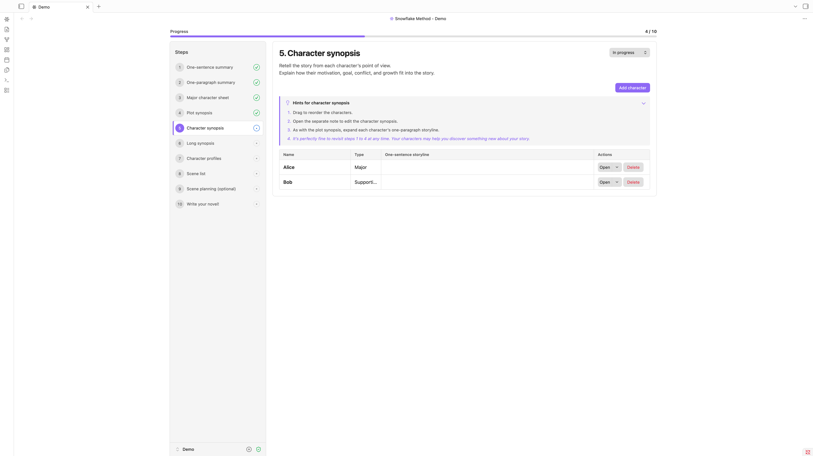</a><br />
      <strong>5. Character synopsis</strong><br />
      <sub>Retell the story from each character's point of view.</sub>
    </td>
    <td width="50%" valign="top">
      <a href="assets/screenshots/step_06_en.png">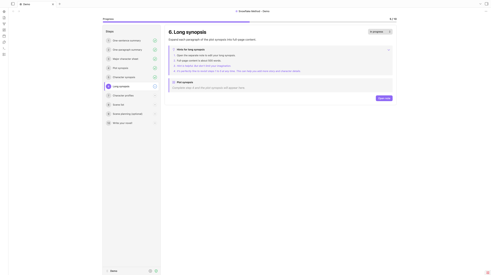</a><br />
      <strong>6. Long synopsis</strong><br />
      <sub>Develop each plot paragraph into full-page material in a dedicated note.</sub>
    </td>
  </tr>
  <tr>
    <td width="50%" valign="top">
      <a href="assets/screenshots/step_07_en.png">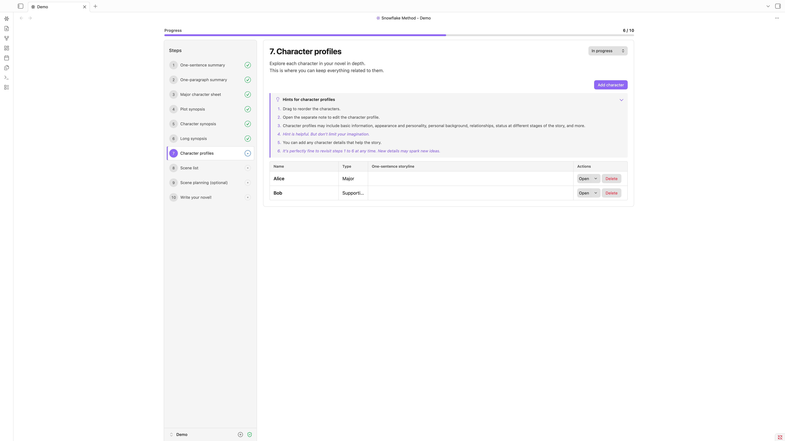</a><br />
      <strong>7. Character profiles</strong><br />
      <sub>Keep detailed, reusable profiles for every character in the novel.</sub>
    </td>
    <td width="50%" valign="top">
      <a href="assets/screenshots/step_08_en.png">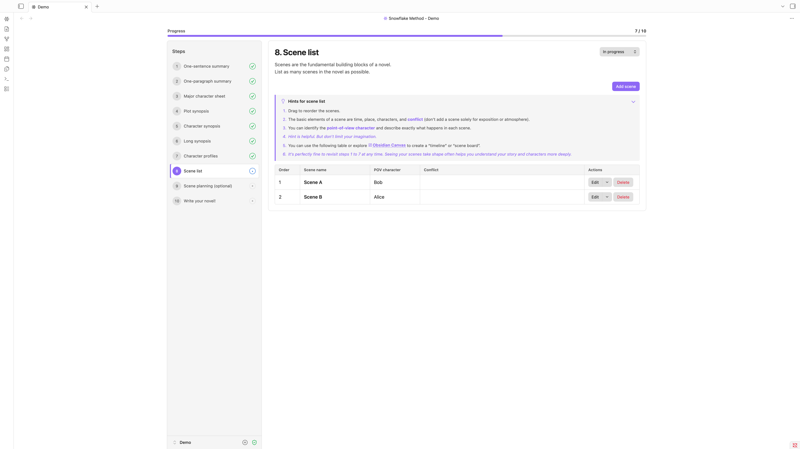</a><br />
      <strong>8. Scene list</strong><br />
      <sub>Map, reorder, and connect scenes with point-of-view characters and conflict.</sub>
    </td>
  </tr>
  <tr>
    <td width="50%" valign="top">
      <a href="assets/screenshots/step_09_en.png">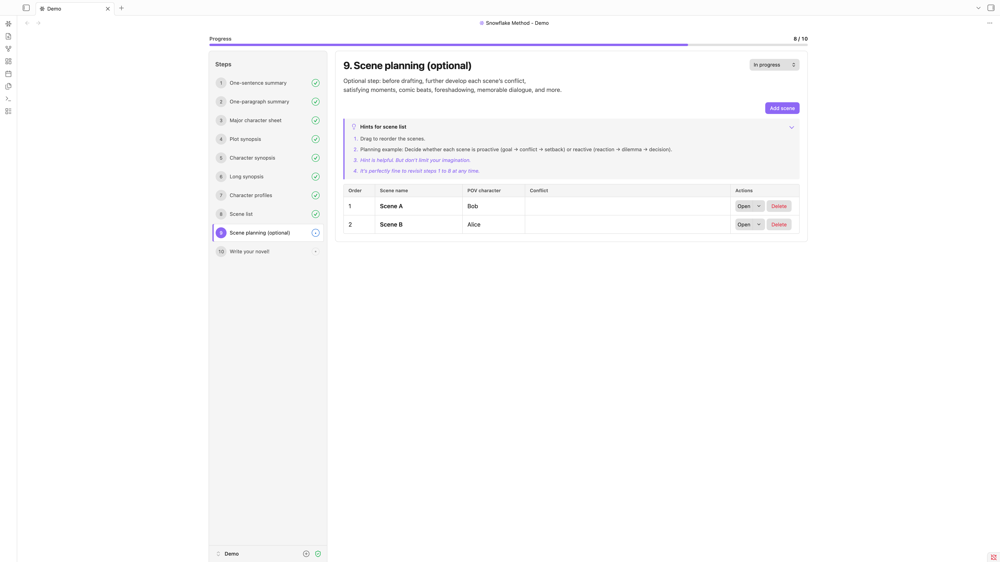</a><br />
      <strong>9. Scene planning <em>(optional)</em></strong><br />
      <sub>Develop each scene's conflict, turning points, beats, and memorable details.</sub>
    </td>
    <td width="50%" valign="top">
      <a href="assets/screenshots/step_10_en.png">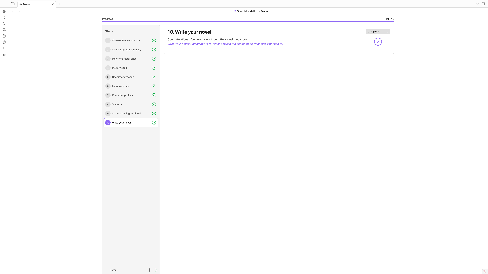</a><br />
      <strong>10. Write your novel!</strong><br />
      <sub>Move into drafting with a complete plan while keeping every earlier step editable.</sub>
    </td>
  </tr>
</table>

</details>

### Worldbuilding

Characters and scenes rarely act alone. Time, location, and item notes live beside them as members of the project, with the same tables, forms, and base views. Any member can carry **world status** and **relationship** record lines: sentences whose terms are links, stored as ordinary Markdown callouts in the note. A relationship also names the note it is with, so there is always a link to follow between the two.

Time, location, and item are only the kinds every project begins with. You can add your own for whatever else the story keeps track of: a faction, a language, a piece of technology. An authored kind gets its own folder, rail pane, table, base view, and icon of your choosing, and behaves like the built-in three everywhere else.

The words those record lines use come from three vocabularies for every kind: categories, world statuses, and relationships. Each vocabulary grows as a folder tree whose entries are notes, so links to them resolve like any other link and the graph shows each entry under its own name. Three rail panes browse, rename, and prune the trees, and every reference is kept true along the way.

Beyond the fields every member shares, a note can carry **custom fields** of your own. Each is a title and whatever you write under it, edited from the member's form and stored in its own block in the note. Save a set of them as a template and it becomes a note in that kind's template folder, ready to seed the next character, scene, or faction you create. The custom field pane in the rail manages those templates, and the export button on any form turns the fields you just typed into one.

### Manuscript stream

A novel is easier to write in chapters and easier to read as a book. The manuscript stream gives you both at once: every chapter stays its own Markdown note on disk, and the whole draft reads as a single continuous page. If you have used Scrivener, this is its Scrivenings mode, now living in Obsidian.

<p align="center">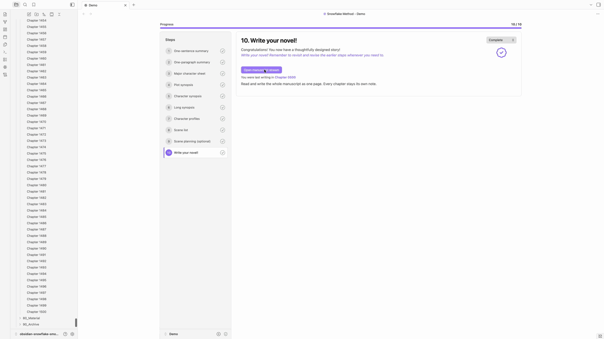</p>

In the manuscript stream, click any chapter and it becomes an editing view, and it returns to reading view when you move to another chapter. You can *(i) insert a chapter between two others, (ii) cut one in two at the caret, or (iii) merge it into the next one.*

**Typewriter scrolling** keeps the line being written at the middle of the page. **Focus mode** fades everything except the paragraph being written, and its deepest level, solo, shows only the manuscript in full screen. Each has a button in every chapter's header, and the arrow keys walk the caret from one chapter into the next.

**All actions stay quick when the book is long (under 20ms on average).** Measured on a vault of more than 9000 notes: two projects of 1500 chapters, each chapter with more than 2000 English words or Chinese characters, and a third holding 300 characters, 3000 scenes and 1500 more chapters.

<a id="installation"></a>

## Installation

### Community plugins

1. Open **Settings → Community plugins** in Obsidian.
2. Select **Browse** and search for **Snowflake Method**.
3. Select **Snowflake Method**, choose **Install**, and then enable it.

### BRAT

1. Install [BRAT](https://github.com/TfTHacker/obsidian42-brat).
2. Choose **Add beta plugin** and enter `ZzPoLariszZ/obsidian-snowflake-method`.
3. Enable **Snowflake Method** under **Community plugins**.

### Manual installation

1. Download `main.js`, `manifest.json`, and `styles.css` from the [latest release](https://github.com/ZzPoLariszZ/obsidian-snowflake-method/releases/latest).
2. Create `<vault>/.obsidian/plugins/snowflake-method/`.
3. Copy the three files into that folder.
4. Reload Obsidian and enable **Snowflake Method** under **Community plugins**.

### Upgrading

Updating the plugin never rewrites your notes by itself. The files the plugin generates keep themselves current: the system templates under `00_System` and the version stamp on the project metadata note are brought up to date quietly the first time a dashboard shows the project. Notes you write change only behind one button. When any of them was written by an older release, the dashboard shows **Older project format** with a count, and **Update** brings them all current in one safe, repeatable pass.

<a id="guide"></a>

## Guide

1. Open the Command palette and run **Snowflake Method: Open project manager**.
2. In the project manager, choose the project root and language, enter a project name, and create the project.
3. Open the project dashboard and begin with the target-reader prompts and one-sentence summary.
4. Mark steps complete when they are useful to you, and revisit them whenever the story changes.
5. Open long-form notes beside the dashboard or in regular tabs.
6. When the plan is ready, open the manuscript stream from step 10 and write the novel as one continuous page.

<a id="commands"></a>

## Commands

| Command | Purpose |
|---|---|
| Add character | Add a shared character note to the current project. |
| Add scene | Add a shared scene note to the current project. |
| Close manuscript stream | Close the manuscript stream in the current pane. |
| Create project | Create a new Markdown-native Snowflake project. |
| Go back to where the stream opened | Return to the note the manuscript stream was opened at. |
| Go to the next manuscript note | Move one note further into the manuscript. |
| Go to the previous manuscript note | Move one note back through the manuscript. |
| Insert a manuscript note after this one | Add a note directly after the one being read. |
| Insert a manuscript note before this one | Add a note directly before the one being read. |
| Open character base | Open the Bases view of the current project's characters. |
| Open dashboard | Open or reveal the current project dashboard. |
| Open health checker | Inspect project structure and repair safe issues. |
| Open manuscript stream | Open the manuscript, at the note last written in. |
| Open project manager | Create, rename, open, or trash projects. |
| Open scene base | Open the Bases view of the current project's scenes. |
| Set focus mode to off / on / deep / solo | Set how far focus mode reaches, one command per level. |
| Split manuscript note at the cursor | Divide the note being written in, at the caret. |
| Toggle managed boundary protection | Temporarily change protection for managed section markers. |
| Toggle note paths in the manuscript | Show or hide where each manuscript note is stored. |
| Toggle notes beside dashboard | Choose between a companion pane and regular tabs. |
| Toggle opening a form for new notes from a field | Choose whether a note created from a picker field opens its form first. |
| Toggle order numbers in the manuscript | Show or hide each manuscript note's stored position. |
| Toggle progress status in tables | Show or hide the progress status column. |
| Toggle reduced animations | Switch between animated and reduced-motion visuals. |
| Toggle the actions column in tables | Show or hide each row's actions column. |
| Toggle typewriter scrolling | Hold the line being written at the middle of the page. |
| Update notes in older format | Update every note an older release wrote. |

Commands that act on the manuscript are offered only while a manuscript stream is the current view, and **Split manuscript note at the cursor** only while a note in it is open for writing.

<a id="settings"></a>

## Settings

| Setting | Default | Purpose |
|---|---|---|
| Project root folder | Vault root | Choose the Vault-relative parent folder for projects. |
| Interface language | Follow project | Follow the current project, Obsidian, English, or Simplified Chinese. |
| Default project language | System language | Set the language used when creating projects. |
| Open notes beside dashboard | On | Reuse a companion pane for notes. |
| Reduce animations | Off | Replace animations with static visuals. |
| Protect managed boundaries | On | Prevent accidental edits to synchronization markers. |
| Show progress status in tables | Off | Add a progress status column to the member tables. |
| Show the actions column in tables | On | Keep each row's actions visible beside it. |
| New notes from a field | Open its form | Choose whether a note created from a picker field opens its form first or is created directly. |
| Notes to keep loaded | 5 | Hold this many manuscript notes on each side of the one being read. |
| Show note paths | On | Show where a manuscript note is stored, above the note itself. |
| Show order numbers | Off | Show the stored position that decides where a note is read. |
| Typewriter scrolling | On | Keep the line being written at the middle of the page. |
| Focus mode | Off | Fade all but the paragraph being written. The solo level shows only the manuscript in full screen. |

<a id="privacy"></a>

## Privacy

Snowflake Method for Obsidian is local-first. Project files and plugin settings remain in your Vault, and the plugin does not transmit your writing or configuration.

- No account, subscription, or external service is required.
- The plugin makes no network requests and includes no AI service, telemetry, or analytics.
- Projects use ordinary Obsidian-compatible files that remain readable and editable when the plugin is disabled.

<a id="structure"></a>

## Structure

Each project is stored as a direct child of the configured project root. Its folders, filenames, and starter notes are localized to the language selected when the project is created.

<details>
<summary>Example English project layout</summary>

```text
<project root>/
└── My Novel/
    ├── 00_System/
    │   ├── 001_Project_Metadata.md
    │   └── ...
    ├── 10_Summary/
    │   ├── 11_One_Sentence_Summary.md
    │   └── ...
    ├── 20_Character/
    │   ├── 21_Category/
    │   │   └── Major/
    │   │       └── Major.md
    │   ├── 24_Custom_Field/
    │   │   └── Age.md
    │   └── Characters.base
    ├── 30_Synopsis/
    ├── 40_Scene/
    │   └── Scenes.base
    ├── 50_Manuscript/
    │   ├── Draft.md
    │   └── Part One/
    │       └── Chapter One.md
    ├── 60_Worldbuilding/
    │   ├── 61_Time/
    │   ├── 62_Location/
    │   ├── 63_Item/
    │   └── 64_Faction/
    └── ...
```

</details>

A manuscript may be one note or many, arranged in whatever folders suit you. Each note records its place with `snowflake-manuscript-sequence`, so moving or renaming one never changes where it is read, and the manuscript stream presents them in that order as a single page.

The dashboard synchronizes only the text enclosed by paired managed section boundaries:

```markdown
<!-- snowflake:section:one-sentence-summary:start -->
Your writing remains editable here.
<!-- snowflake:section:one-sentence-summary:end -->
```

These HTML comments are structural markers rather than story content. Boundary protection is enabled by default to prevent accidental edits to the marker lines. Text inside the pair is synchronized with the dashboard. Markdown outside it remains under your control and is not replaced by the plugin. If markers are missing, duplicated, reversed, or overlapping, the plugin reports the problem and avoids an unsafe write.

<a id="roadmap"></a>

## Roadmap

- Obtain written permission from Randy Ingermanson or Advanced Fiction Writing before adding the writing example from Chapter 20 of *How to Write a Novel Using the Snowflake Method*.
- Use Obsidian's native Canvas to build timelines and scene boards.
- ...

<a id="development"></a>

## Development

### Requirements

- Node.js 20 or later
- npm with lockfile support
- A development Vault for testing the packaged plugin in Obsidian 1.13.0 or later

Continuous integration currently verifies the project on Node.js 20, 22, and 24 under Ubuntu.

### Setup

```sh
git clone https://github.com/ZzPoLariszZ/obsidian-snowflake-method.git
cd obsidian-snowflake-method
npm ci
```

`npm ci` installs the exact dependency versions recorded in `package-lock.json`. The generated `main.js` is a build artifact and should not be edited directly.

### Commands

| Command | Purpose |
|---|---|
| `npm run dev` | Watch the TypeScript sources and rebuild `main.js` with an inline source map. |
| `npm test` | Run the complete Vitest suite once. |
| `npm run test:watch` | Run Vitest in watch mode during development. |
| `npm run build` | Type-check the project and create a minified production bundle without a source map. |
| `npm run lint` | Run ESLint across the repository. |
| `npm run check` | Run the required test, production build, and lint sequence. |

Run `npm run check` before every commit intended for review. For local Obsidian testing, place the generated `main.js` together with `manifest.json` and `styles.css` in `<vault>/.obsidian/plugins/snowflake-method/`, then reload Obsidian. Use a separate development Vault rather than production writing data.

### Continuous integration

Every push and pull request runs the test, build, and lint jobs on each supported Node.js version. A change is ready to merge only after the full matrix succeeds. CI builds the distributable bundle from source. Local build output is not treated as verification evidence.

### Release procedure

1. Start from `main` with a clean working tree and confirm that `npm run check` succeeds.
2. Select the appropriate semantic version increment and run `npm version patch -m "chore: release %s"`, or the same with `minor` or `major`. The message matters, because npm would otherwise write the bare number as the commit subject.
3. The version script updates `package.json`, `package-lock.json`, `manifest.json`, and `versions.json`, then creates the release commit. It also tags the commit with a `v` prefix, `v0.9.0` for that release, and this project does not use that form. Replace it with the bare number before pushing anything, `git tag -d v0.9.0 && git tag 0.9.0` in that example. Tags here are lightweight and must not use a `v` prefix.
4. Push the commit and the tag as two steps: `git push origin main`, then `git push origin` with the tag you just made. `--follow-tags` will not carry these tags, because it pushes annotated tags only and leaves a lightweight one behind without saying so. Confirm the tag arrived with `git ls-remote --tags origin`, since the release workflow starts from the tag and nothing runs without it.
5. GitHub Actions verifies that the tag exactly matches `manifest.json`, installs dependencies with `npm ci`, and repeats the test, production build, and lint checks.
6. After verification, the workflow attests `main.js`, `manifest.json`, and `styles.css`, then attaches them to a draft GitHub release with generated release notes.
7. Review the draft release and its assets before publishing it.

The distributable plugin consists of exactly `main.js`, `manifest.json`, and `styles.css`. Do not include source files, development dependencies, or a containing directory in the release assets.

## License

[MIT License](LICENSE). The Snowflake Method name and source material belong to their respective owners.

---

<a id="简体中文"></a>

###### 简体中文

<div align="center">


<h1>Obsidian 雪花写作法</h1>

**[English](#english)** · **简体中文**

[](https://github.com/ZzPoLariszZ/obsidian-snowflake-method/releases) [](https://github.com/ZzPoLariszZ/obsidian-snowflake-method/actions/workflows/ci.yml) [](LICENSE) [](https://obsidian.md)

**从一句话灵感到可动笔的小说方案，一步步完成雪花写作法。**

一个中英双语、以 Markdown 为原生存储格式的 Obsidian 小说规划工作台。所有项目均保存在本地，即使停用插件，笔记依然可读、可编辑。

<br />

[安装](#安装) · [指南](#指南) · [隐私](#隐私) · [路线图](#路线图) · [开发](#开发)

<br /><br />

</div>

## 什么是雪花写作法？

Randy Ingermanson 的雪花写作法得名于[科赫雪花](https://baike.baidu.com/item/%E7%A7%91%E8%B5%AB%E6%9B%B2%E7%BA%BF)：这种分形从等边三角形开始，通过在每条边上反复添加更小的三角形结构而逐层生长。他把这种由简入繁的过程借作小说设计的比喻：先用一句话抓住故事全貌，再通过十个可以反复修订的步骤逐层扩展情节、角色与场景，直到可以开始初稿。雪花写作法旨在组织创意，而非强加必须照搬的规则：你可以保留有用的部分、跳过不合适的部分，并随着理解加深返回前序步骤修订。完整方法见[雪花写作法原文](https://www.advancedfictionwriting.com/articles/snowflake-method/)。

## 为什么选择本插件？

本插件把这种迭代流程整理为专注的 Markdown 原生工作区。梗概、角色资料和场景规划不必散落在不同文档与表格中：你既可以在统一工作台中逐步推进，也可以把每项内容作为普通 Obsidian 笔记单独打开。所有创作内容都保存在本地，可以链接、迁移，并且停用插件后仍可编辑。工作流只提供结构而不强制限制：提示不会阻止进度，任何步骤都能返回修改。

**这是一个独立的开源社区项目，与 Randy Ingermanson 或 Advanced Fiction Writing *没有* 隶属、授权或背书关系。**

## 功能

| 功能 | 说明 |
|---|---|
| 十步引导工作台 | 浏览完整流程并自主控制进度，不使用阻塞式校验。 |
| Obsidian 原生项目 | 概述、角色、场景与初稿均保存为普通本地笔记。 |
| 世界观 | 在角色与场景旁管理时间、地点与物品，也可以自建种类，并为每类成员配置类别、状态与关系。 |
| 自定义字段 | 为任意笔记添加故事需要的字段，并把常用的一组字段保存为该种类的模板。 |
| 正文流 | 把整部正文当作一页连续读写，而每一章仍是各自独立的笔记。 |
| 打字机滚动 | 让正在写的一行保持在页面中部。 |
| 专注模式 | 分四档淡化正在写的段落之外的一切。 |
| 修订提醒 | 上游材料变化时给出不打断写作的复核提示。 |
| 安全修复 | 检测项目结构问题并补齐安全项目，不覆盖正文。 |
| 中英双语 | 界面语言与每个项目的模板语言可分别选择。 |

## 流程

从精炼的核心构思逐步发展到场景级规划。每个阶段都会保留前序材料供你参考，让扩展与修订始终围绕故事整体进行。

<p align="center">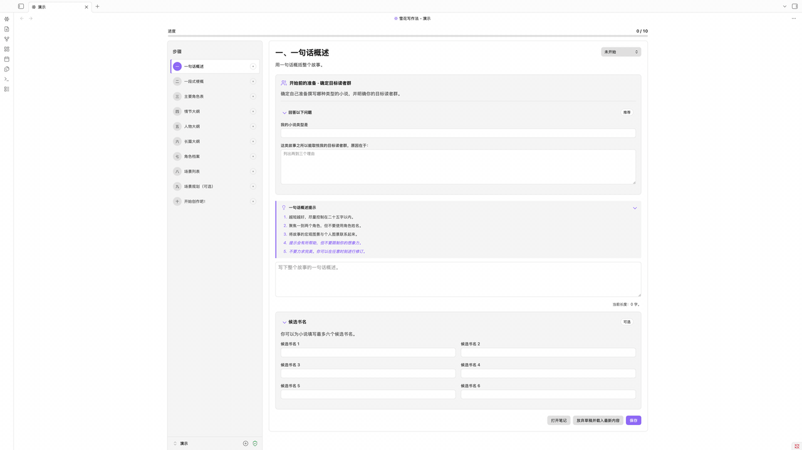</p>

<details>
<summary><strong>截图</strong></summary>

<p align="center"><sub>点击任意截图可查看完整分辨率原图。</sub></p>

<table>
  <tr>
    <td width="50%" valign="top">
      <a href="assets/screenshots/step_01_cn.png">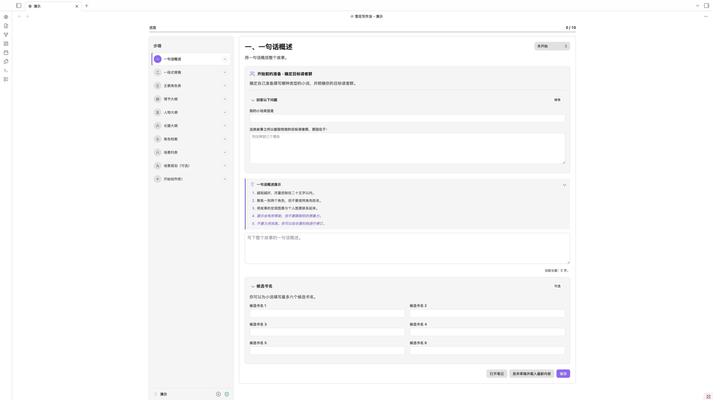</a><br />
      <strong>一、一句话概述</strong><br />
      <sub>确定目标读者，用一句话概括完整故事。</sub>
    </td>
    <td width="50%" valign="top">
      <a href="assets/screenshots/step_02_cn.png">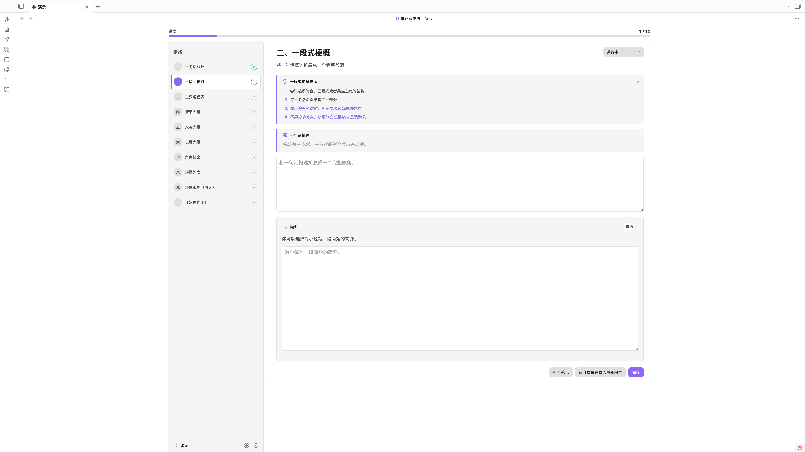</a><br />
      <strong>二、一段式梗概</strong><br />
      <sub>将核心构思扩展为紧凑的故事结构，并可补充小说简介。</sub>
    </td>
  </tr>
  <tr>
    <td width="50%" valign="top">
      <a href="assets/screenshots/step_03_cn.png">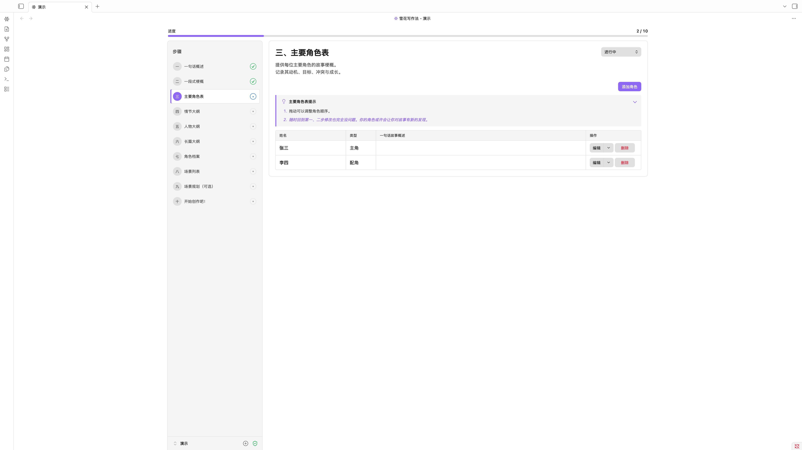</a><br />
      <strong>三、主要角色表</strong><br />
      <sub>记录主要角色的故事线、动机、冲突与成长。</sub>
    </td>
    <td width="50%" valign="top">
      <a href="assets/screenshots/step_04_cn.png">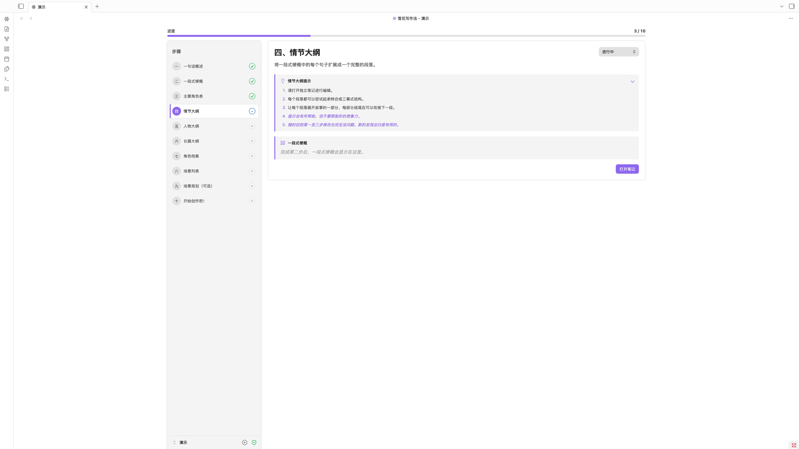</a><br />
      <strong>四、情节大纲</strong><br />
      <sub>将一段式梗概扩展为更加完整、连贯的故事情节。</sub>
    </td>
  </tr>
  <tr>
    <td width="50%" valign="top">
      <a href="assets/screenshots/step_05_cn.png">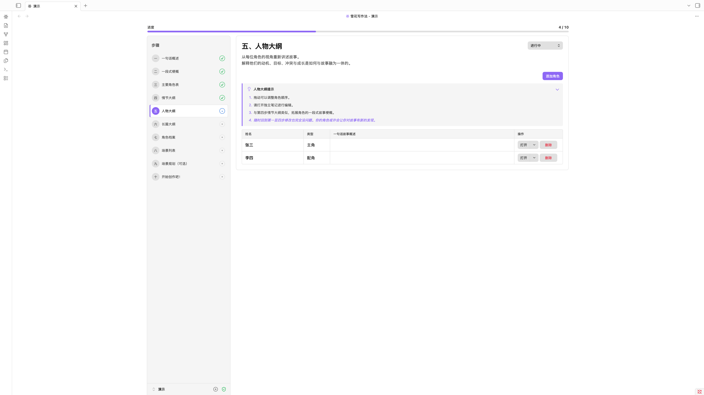</a><br />
      <strong>五、人物大纲</strong><br />
      <sub>从每位角色的视角重新讲述故事。</sub>
    </td>
    <td width="50%" valign="top">
      <a href="assets/screenshots/step_06_cn.png">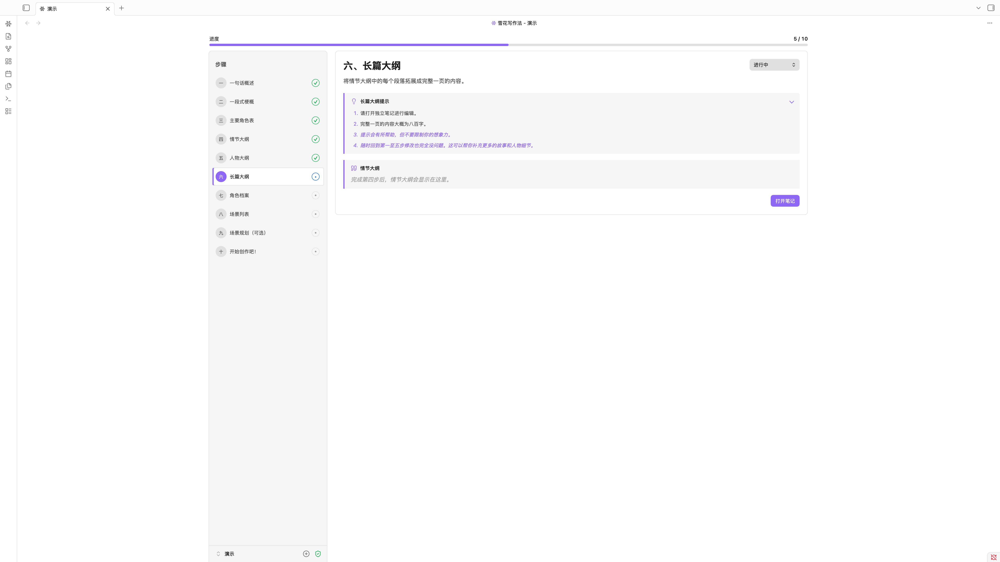</a><br />
      <strong>六、长篇大纲</strong><br />
      <sub>在独立笔记中把每个情节段落扩展为长篇内容。</sub>
    </td>
  </tr>
  <tr>
    <td width="50%" valign="top">
      <a href="assets/screenshots/step_07_cn.png">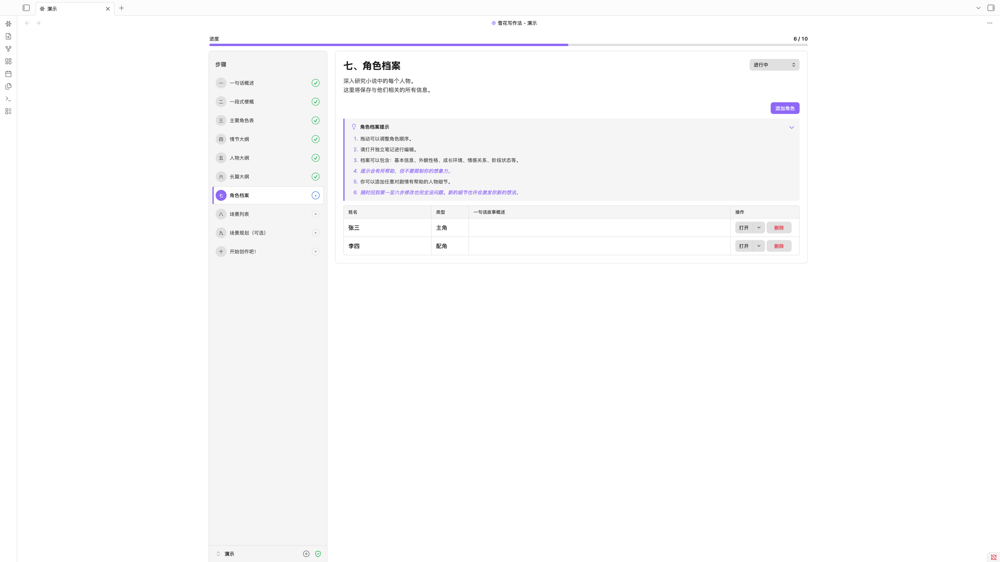</a><br />
      <strong>七、角色档案</strong><br />
      <sub>为小说中的每个人物维护详细、可复用的完整档案。</sub>
    </td>
    <td width="50%" valign="top">
      <a href="assets/screenshots/step_08_cn.png">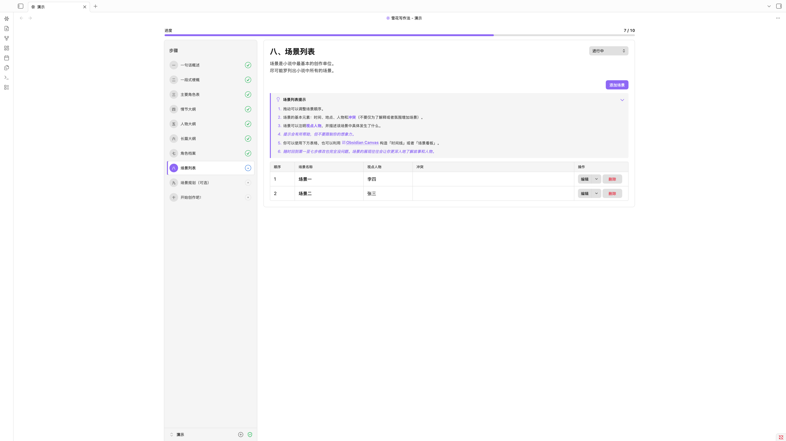</a><br />
      <strong>八、场景列表</strong><br />
      <sub>排列故事场景，并为它们关联视点人物与核心冲突。</sub>
    </td>
  </tr>
  <tr>
    <td width="50%" valign="top">
      <a href="assets/screenshots/step_09_cn.png">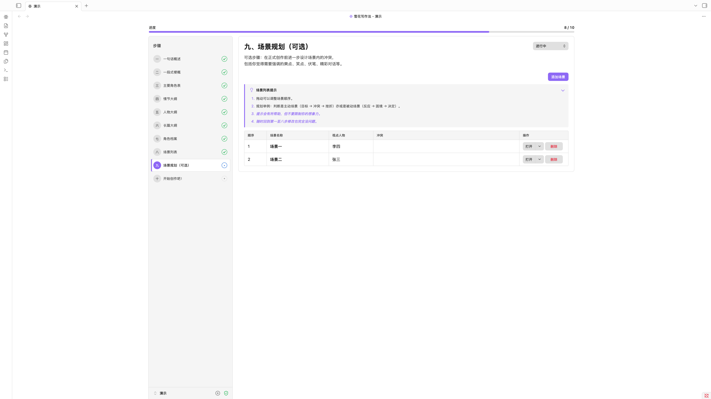</a><br />
      <strong>九、场景规划<em>（可选）</em></strong><br />
      <sub>进一步设计冲突、转折、节奏与令人难忘的场景细节。</sub>
    </td>
    <td width="50%" valign="top">
      <a href="assets/screenshots/step_10_cn.png">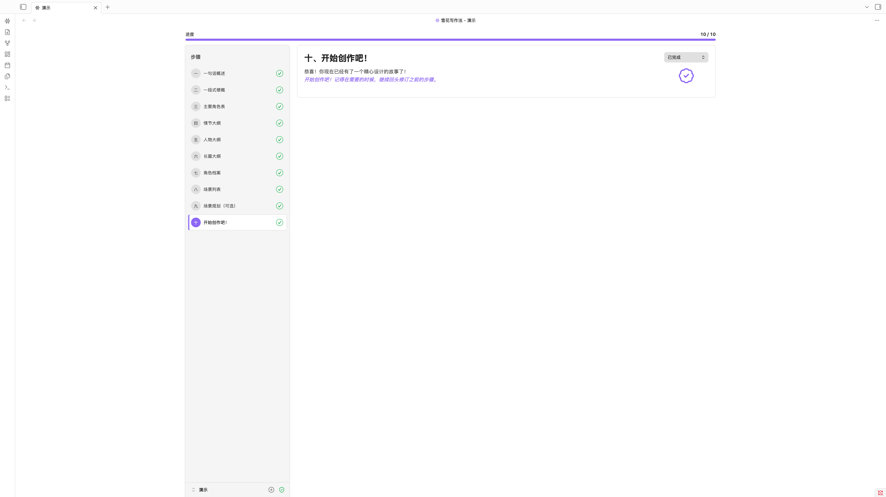</a><br />
      <strong>十、开始创作吧！</strong><br />
      <sub>带着完整计划进入初稿，同时保留随时修改前面步骤的自由。</sub>
    </td>
  </tr>
</table>

</details>

### 世界观

角色与场景很少独自行动。时间、地点与物品笔记作为项目成员与它们并肩存在，共用同样的表格、表单与数据库视图。任何成员都可以书写**状态**与**关系**记录行：以链接为词项的句子，以普通 Markdown 标注块存放在笔记里。每条关系还会写明它指向的那篇笔记，因此两者之间始终有一条可以跟随的链接。

时间、地点与物品只是每个项目自带的种类。故事还要记住什么，你都可以自建，比如门派、语言或某项技术。自建的种类拥有自己的文件夹、侧栏面板、表格、数据库视图与自选图标，其余行为与三个内置种类完全一致。

记录行使用的词来自每类成员的三份词表：类别、状态与关系。每份词表都以文件夹树生长，每个词条都是一篇笔记，因此指向词条的链接与其他链接一样解析，关系图中的词条也以自己的名字出现。侧栏的三个词表面板可以浏览、重命名与修剪这些树，所有引用都会随之保持有效。

除了每类成员共有的字段，笔记还可以带上你自己的**自定义字段**。每个字段由一个标题和你在其下写的内容组成，在成员表单中编辑，并存放在笔记自己的区段里。把一组字段保存为模板，它就成为该种类模板文件夹中的一篇笔记，可用于预填下一个角色、场景或门派。侧栏的自定义字段面板管理这些模板，任意表单上的导出按钮则可以把刚刚填好的字段直接存成模板。

### 正文流

长篇按章节写更顺手，成篇阅读才像一本书。正文流可以让两者兼得：每一章仍是本地各自独立的 Markdown 笔记，而整部正文读起来像是连续的一页。如果你用过 Scrivener，这就是它的 Scrivenings 模式，如今就在 Obsidian 里。

<p align="center">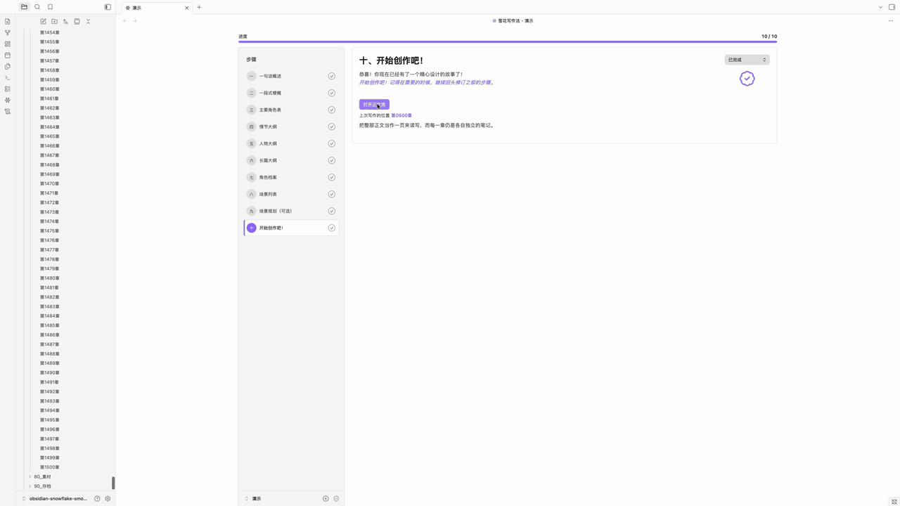</p>

在正文流中，点击任意一章，它就变成编辑视图；当你转到另一章时，它又回到阅读视图。你可以*（一）在两章之间插入新的一章，（二）在光标处把一章拆成两章，或（三）把它并入下一章。*

**打字机滚动**让正在写的一行保持在页面中部。**专注模式**淡化正在写的段落之外的一切；最深的一档「仅正文」会全屏只显示正文。两者在每一章的标题栏里各有一个按钮，方向键也可以带着光标从一章移动到下一章。

**书籍再长，各项操作也依然利落，平均不到 20 毫秒。** 实测环境为一个超过 9000 篇笔记的库：其中两个项目各有 1500 章，每章都在 2000 个英文单词或中文字以上，另一个项目包含 300 个角色、3000 个场景与另外 1500 章。

## 安装

### 社区插件市场

1. 在 Obsidian 中打开 **设置 → 第三方插件**。
2. 选择 **浏览**，搜索 **Snowflake Method（雪花写作法）**。
3. 选择 **Snowflake Method**，点击 **安装**，然后启用插件。

### BRAT

1. 安装 [BRAT](https://github.com/TfTHacker/obsidian42-brat)。
2. 选择 **Add beta plugin**，输入 `ZzPoLariszZ/obsidian-snowflake-method`。
3. 在 **第三方插件** 中启用 **Snowflake Method（雪花写作法）**。

### 手动安装

1. 从[最新发布](https://github.com/ZzPoLariszZ/obsidian-snowflake-method/releases/latest)下载 `main.js`、`manifest.json` 和 `styles.css`。
2. 创建 `<仓库>/.obsidian/plugins/snowflake-method/`。
3. 将三个文件复制到该目录。
4. 重载 Obsidian，然后在 **第三方插件** 中启用 **Snowflake Method（雪花写作法）**。

### 升级

更新插件本身绝不会改写你的笔记。插件生成的文件会自行保持最新：`00_系统` 下的系统模板与项目元数据笔记上的版本戳，会在工作台首次显示项目时静默更新到当前版本。你写下的笔记只会在一个按钮之后改变。当其中任何一篇出自旧版本时，工作台会显示「较旧的项目格式」及数量，「更新」会以一次安全、可重复的操作把它们全部带到当前版本。

## 指南

1. 打开命令面板，执行 **打开项目管理器** 命令。
2. 在项目管理器中选择项目根目录和语言，输入项目名称并创建项目。
3. 打开项目工作台，从目标读者问题和一句话概述开始。
4. 当某一步对你已经足够有用时，将其标记为完成；故事变化后可随时返回修改。
5. 长篇笔记可以在工作台旁的固定分栏或普通标签页中打开。
6. 计划就绪后，在第十步打开正文流，把整部小说当作一页连续写作。

## 命令

| 命令 | 用途 |
|---|---|
| 添加角色 | 为当前项目添加共享角色笔记。 |
| 添加场景 | 为当前项目添加共享场景笔记。 |
| 创建项目 | 创建新的 Markdown 原生雪花写作项目。 |
| 打开工作台 | 打开或显示当前项目的工作台。 |
| 打开健康检查器 | 检查项目结构并修复安全问题。 |
| 更新旧格式的笔记 | 更新旧版本写下的所有笔记。 |
| 打开项目管理器 | 创建、重命名、打开或移入回收站。 |
| 打开角色数据库 | 打开当前项目角色的 Bases 视图。 |
| 打开场景数据库 | 打开当前项目场景的 Bases 视图。 |
| 打开正文流 | 打开正文，并定位到上次写作的笔记。 |
| 关闭正文流 | 关闭当前分栏中的正文流。 |
| 前往上一篇正文笔记 | 在正文中向前移动一篇。 |
| 前往下一篇正文笔记 | 在正文中向后移动一篇。 |
| 回到打开正文流的位置 | 返回打开正文流时所在的笔记。 |
| 在这一篇之前插入正文笔记 | 在正在阅读的这一篇之前新增一篇。 |
| 在这一篇之后插入正文笔记 | 在正在阅读的这一篇之后新增一篇。 |
| 在光标处拆分正文笔记 | 在光标处把正在写作的笔记一分为二。 |
| 将专注模式设为关／开／深度／仅正文 | 直接切到指定的专注深度，每档一条命令。 |
| 切换打字机滚动 | 让正在写的一行保持在页面中部。 |
| 切换正文中的笔记路径 | 显示或隐藏每篇正文笔记的存放位置。 |
| 切换正文中的顺序编号 | 显示或隐藏每篇正文笔记所存的位置。 |
| 切换托管区段边界保护 | 临时调整同步标记的编辑保护。 |
| 切换在工作台旁打开笔记 | 选择固定分栏或普通标签页。 |
| 切换从字段新建笔记时是否打开表单 | 选择从字段新建的笔记是先打开表单还是直接创建。 |
| 切换表格中的进度状态 | 显示或隐藏进度状态列。 |
| 切换表格中的操作列 | 显示或隐藏每行的操作列。 |
| 切换减少动画模式 | 在动画效果和减少动态效果之间切换。 |

与正文相关的命令仅在当前视图为正文流时提供，其中**在光标处拆分正文笔记**还需要其中有一篇笔记正处于写作状态。

## 设置

| 设置 | 默认值 | 用途 |
|---|---|---|
| 项目根目录 | Vault 根目录 | 选择存放项目的 Vault 相对父目录。 |
| 界面语言 | 跟随项目 | 可跟随当前项目、Obsidian，或固定为英文／简体中文。 |
| 默认项目语言 | 系统语言 | 设置新建项目所使用的模板语言。 |
| 在工作台旁打开笔记 | 开启 | 长篇笔记复用工作台旁的固定分栏。 |
| 减少动画 | 关闭 | 使用静态视觉效果替代动画。 |
| 保护托管区段边界 | 开启 | 防止意外修改同步标记。 |
| 在表格中显示进度状态 | 关闭 | 为成员表格增加进度状态列。 |
| 在表格中显示操作列 | 开启 | 让每一行的操作按钮保持可见。 |
| 从字段新建笔记 | 打开表单 | 选择从字段新建的笔记是先打开表单还是直接创建。 |
| 保持载入的笔记数 | 5 | 在正在阅读的笔记前后各保留这么多篇正文笔记。 |
| 显示笔记路径 | 开启 | 在正文笔记上方显示它的存放位置。 |
| 显示顺序编号 | 关闭 | 显示决定笔记阅读位置的所存编号。 |
| 打字机滚动 | 开启 | 让正在写的一行保持在页面中部。 |
| 专注模式 | 关 | 淡化正在写的段落之外的一切。仅正文一档会全屏只显示正文。 |

## 隐私

Obsidian 雪花写作法采用本地优先设计。项目文件和插件设置均保留在 Vault 中，插件不会传输你的创作内容或配置。

- 无需注册账号、订阅或连接外部服务。
- 插件不发起网络请求，也不包含 AI 服务、遥测或数据分析。
- 项目使用 Obsidian 兼容文件；停用插件后，内容依然可以正常阅读和编辑。

## 结构

每个项目都作为所选项目根目录的直接子文件夹保存。文件夹、文件名和初始笔记会根据创建项目时选择的语言进行本地化。

<details>
<summary>中文项目结构示例</summary>

```text
<项目根目录>/
└── 我的小说/
    ├── 00_系统/
    │   ├── 001_项目元数据.md
    │   └── ...
    ├── 10_概述/
    │   ├── 11_一句话概述.md
    │   └── ...
    ├── 20_角色/
    │   ├── 21_类别/
    │   │   └── 主角/
    │   │       └── 主角.md
    │   ├── 24_自定义字段/
    │   │   └── 年龄.md
    │   └── 角色总览.base
    ├── 30_大纲/
    ├── 40_场景/
    │   └── 场景总览.base
    ├── 50_正文/
    │   ├── 初稿.md
    │   └── 第一部/
    │       └── 第一章.md
    ├── 60_世界观/
    │   ├── 61_时间/
    │   ├── 62_地点/
    │   ├── 63_物品/
    │   └── 64_门派/
    └── ...
```

</details>

正文可以只有一篇笔记，也可以有许多篇，文件夹如何组织都可以。每篇笔记都用 `snowflake-manuscript-sequence` 记录自己的位置，因此移动或重命名笔记都不会改变它的阅读顺序；正文流会按该顺序把它们呈现为一整页。

工作台只同步一对托管区段边界之间的文字：

```markdown
<!-- snowflake:section:one-sentence-summary:start -->
这里的创作内容可以正常编辑。
<!-- snowflake:section:one-sentence-summary:end -->
```

这些 HTML 注释是结构标记，并非正文内容。边界保护默认开启，用于防止意外修改标记行。标记之间的内容会与工作台同步；标记之外的 Markdown 始终由作者管理，插件不会替换。如果标记缺失、重复、顺序颠倒或相互重叠，插件会报告问题并停止不安全的写入。

## 路线图

- 取得 Randy Ingermanson 或 Advanced Fiction Writing 的书面授权后，加入《How to Write a Novel Using the Snowflake Method》第 20 章中的创作示例。
- 使用 Obsidian 原生 Canvas 构建时间线与场景看板。
- ……

## 开发

### 环境要求

- Node.js 20 或更高版本
- 支持 lockfile 的 npm
- 用于测试打包插件的独立开发 Vault，以及 Obsidian 1.13.0 或更高版本

当前持续集成会在 Ubuntu 环境下分别使用 Node.js 20、22 和 24 验证项目。

### 初始化

```sh
git clone https://github.com/ZzPoLariszZ/obsidian-snowflake-method.git
cd obsidian-snowflake-method
npm ci
```

`npm ci` 会严格按照 `package-lock.json` 安装依赖。生成的 `main.js` 属于构建产物，不应直接编辑。

### 命令

| 命令 | 用途 |
|---|---|
| `npm run dev` | 监听 TypeScript 源文件，并生成包含内联 source map 的 `main.js`。 |
| `npm test` | 单次运行完整的 Vitest 测试套件。 |
| `npm run test:watch` | 在开发过程中以监听模式运行 Vitest。 |
| `npm run build` | 执行类型检查，并生成不含 source map 的压缩生产构建。 |
| `npm run lint` | 对整个仓库运行 ESLint。 |
| `npm run check` | 依次运行提交前必须通过的测试、生产构建和 lint。 |

所有准备提交审核的 commit 都应先通过 `npm run check`。在 Obsidian 中进行本地测试时，将生成的 `main.js` 与 `manifest.json`、`styles.css` 一同放入 `<仓库>/.obsidian/plugins/snowflake-method/`，然后重载 Obsidian。请使用独立的开发 Vault，不要直接使用存放正式创作内容的 Vault。

### 持续集成

每次 push 和 pull request 都会在所有受支持的 Node.js 版本上执行测试、构建和 lint。只有完整矩阵全部通过后，修改才适合合并。CI 会从源代码重新生成分发包，本地生成的构建产物不作为验证依据。

### 发布流程

1. 从 `main` 分支的干净工作区开始，并确认 `npm run check` 已通过。
2. 根据语义化版本规则，运行 `npm version patch -m "chore: release %s"`，或将 `patch` 换成 `minor`、`major`。这里的信息不能省略，否则 npm 会把纯版本号写成 commit 标题。
3. 版本脚本会同步更新 `package.json`、`package-lock.json`、`manifest.json` 和 `versions.json`，随后创建发布 commit。它还会给这次提交打上带 `v` 前缀的标签，例如 `v0.9.0`，而本项目不使用这种形式。推送之前先把它换成纯数字，在该例中即 `git tag -d v0.9.0 && git tag 0.9.0`。本项目的标签是轻量标签，且不得带有 `v` 前缀。
4. 分两步推送 commit 与标签：先 `git push origin main`，再用 `git push origin` 推送刚才创建的标签。`--follow-tags` 不会带上这里的标签，因为它只推送附注标签，遇到轻量标签会默不作声地略过。推送后用 `git ls-remote --tags origin` 确认标签已经到达，因为发布工作流由标签触发，没有标签就什么都不会运行。
5. GitHub Actions 会验证标签与 `manifest.json` 中的版本完全一致，通过 `npm ci` 安装依赖，并重新执行测试、生产构建和 lint。
6. 验证通过后，工作流会为 `main.js`、`manifest.json` 和 `styles.css` 生成构建来源证明，并将它们与自动生成的发布说明附加到 GitHub 草稿发布。
7. 检查草稿发布及其附件无误后，再正式发布。

正式分发的插件仅包含 `main.js`、`manifest.json` 和 `styles.css`。发布附件中不要加入源代码、开发依赖或外层目录。

## 许可证

源代码采用 [MIT License](LICENSE)。“雪花写作法”名称及原始方法资料的相关权利归各自权利人所有。
