<a id="english"></a>

###### English

<div align="center">


<h1>Snowflake Method for Obsidian</h1>

**English** · **[简体中文](#简体中文)**

[](https://github.com/ZzPoLariszZ/obsidian-snowflake-method/releases) [](https://github.com/ZzPoLariszZ/obsidian-snowflake-method/actions/workflows/ci.yml) [](LICENSE) [](https://obsidian.md)

**Turn a story idea into a draft-ready plan, one Snowflake step at a time.**

A bilingual, Markdown-native fiction planning workspace for Obsidian. Your projects stay local, portable, and readable even when the plugin is disabled.

<br />

[Installation](#installation) · [Guide](#guide) · [Privacy](#privacy) · [Roadmap](#roadmap) · [Development](#development)

<br /><br />

</div>

## What is the Snowflake Method?

Randy Ingermanson's Snowflake Method takes its name from the [Koch Snowflake](https://en.wikipedia.org/wiki/Koch_snowflake). This fractal grows from an equilateral triangle by repeatedly adding smaller triangular details to every side. Ingermanson uses that step-by-step growth as a metaphor for designing a novel. You begin with a one-sentence summary. Then you expand the plot, characters, and scenes through ten revisable steps until the story is ready to draft. The method organizes creativity rather than imposing a rigid rulebook. You can keep what helps, skip what doesn't, and return to earlier steps as the story develops. Read Ingermanson's [original Snowflake Method article](https://www.advancedfictionwriting.com/articles/snowflake-method/) for the complete method.

## Why this plugin?

This plugin turns that iterative workflow into a focused, Markdown-native workspace. Instead of scattering summaries, character sheets, and scene plans across separate documents and spreadsheets, you develop them together in one guided dashboard. Every piece still opens as an ordinary Obsidian note.

Your writing stays local, linkable, portable, and editable without the plugin. The workflow gives you structure without enforcing it. Hints never block your progress, and you can revisit every step.

**This is an independent, open-source community project. It is NOT affiliated with or endorsed by Randy Ingermanson or Advanced Fiction Writing.**

<br />

<p align="center"><strong>🎉 Great news! Randy Ingermanson has kindly given his permission! 🎉<br />🎉 This plugin proudly carries the Snowflake Method name! 🎉</strong></p>

<br />

## Features

| Feature | What it provides |
|---|---|
| Obsidian-native projects | Store summaries, characters, scenes, and drafts as ordinary local notes. |
| Guided dashboard | Move through all ten steps and mark your own progress, with no validation rules to block you. Fold the dashboard's rail down to its numbers and icons whenever you need more room. |
| Freeform mode | Set the ten steps aside and work straight from characters, scenes, and worldbuilding. |
| Worldbuilding | Track times, locations, and items beside characters and scenes. Add kinds of your own, and grow a category, world-status, and relationship vocabulary for each. |
| Custom fields | Give any note the fields your story needs, and keep reusable sets of them as templates for each kind. |
| Project archive | Put a project you are done with out of the way, and bring it back whenever you want it. |
| Story structure | See every scene as a card in narrative order, and reorder and edit it right on the card. Place the same scenes on timelines to see when they happen, or under the acts and beats of a beat sheet. Or spread them across a freeform canvas with anything else in the project. Export any of the three as an Obsidian Canvas file. |
| Manuscript stream | Read and write the whole manuscript as one continuous page, while every chapter stays its own note. |
| Custom typography | Set the font, size, line height, column width, paragraph spacing, first-line indent, alignment and hyphenation. Add a background tint and grid lines to write along. |
| Typewriter scrolling | Keep the line you are writing in the middle of the page. |
| Focus mode | Fade everything except the paragraph you are writing, with four levels to choose from. |
| Word milestones | Mark the word count in the margin every so many words, across the whole manuscript or starting over in each chapter. |
| Automatic chapter numbers | Number a new chapter from the one before it, in a Chinese or English style or with a rule of your own. Renumber the chapters after it to make room. |
| Plain-text export | Export the manuscript, or one chapter, as plain text into the Vault, or copy a chapter to the clipboard, with every mark taken out. |
| Writing sessions | Time each sitting, aim for a daily goal, and look back at where the words and the hours went. |
| Prose analysis | See the draft's reading time, sentences, dialogue share, and the words you use most. |
| Entity tracking | Follow every character, place, and thing through the manuscript, and mark their mentions in the text. |
| Task board | Put everything that's waiting on one Kanban board: your own tasks and the ones the plugin derives from your writing. |
| Revision | Propose a replacement, a deletion or an insertion beside the manuscript. The chapter only changes once you accept the proposal. |
| Revision awareness | Get reminders that never block you when the material a step builds on changes. |
| Foreshadowing | Follow a thread from its plant to its payoff. Each of its passages is marked in the text, and they're all listed together. |
| Sticky notes | Keep an idea or a reminder on a colored note, on the dashboard, in a sidebar of its own, or floating over the workspace. |
| Safe repair tools | Detect damaged structure and repair missing managed files without overwriting prose. |
| Bilingual workspace | Choose English or Simplified Chinese separately for the interface and for each project. |

## Workflow

Work from a compact premise toward a scene-level plan. Each stage keeps the earlier material visible, so you can expand or revise without losing the shape of the story.

<p align="center">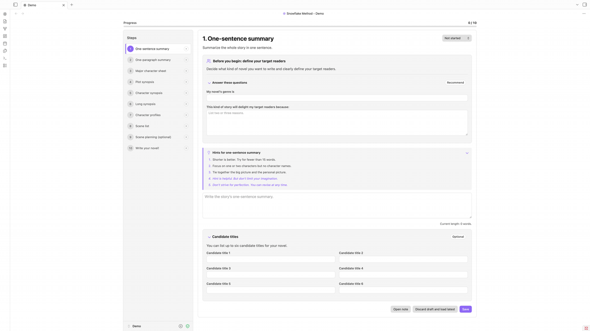</p>

<details>
<summary><strong>Screenshots</strong></summary>

<p align="center"><sub>Click any screenshot to open the full-resolution view.</sub></p>

<table>
  <tr>
    <td width="50%" valign="top">
      <a href="assets/screenshots/step_01_en.png">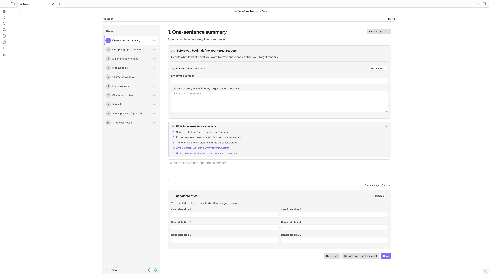</a><br />
      <strong>1. One-sentence summary</strong><br />
      <sub>Define your target readers and distill the whole story into one sentence.</sub>
    </td>
    <td width="50%" valign="top">
      <a href="assets/screenshots/step_02_en.png">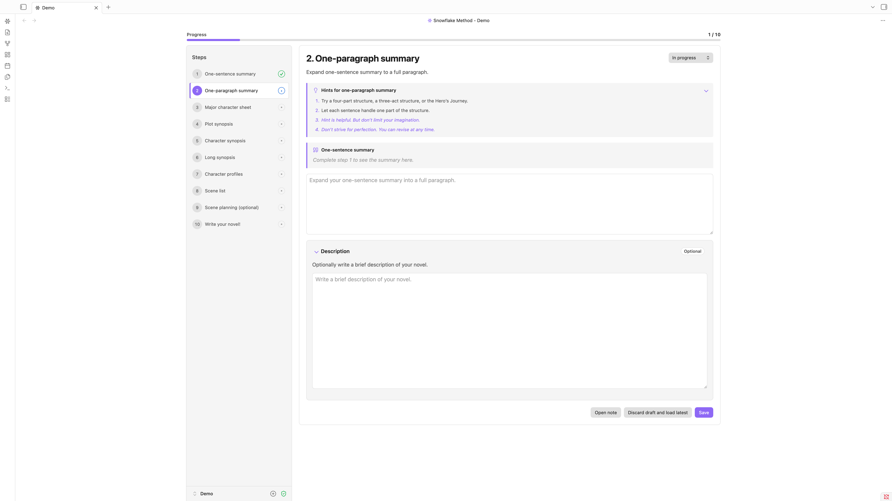</a><br />
      <strong>2. One-paragraph summary</strong><br />
      <sub>Expand the premise into a compact structure and an optional description.</sub>
    </td>
  </tr>
  <tr>
    <td width="50%" valign="top">
      <a href="assets/screenshots/step_03_en.png">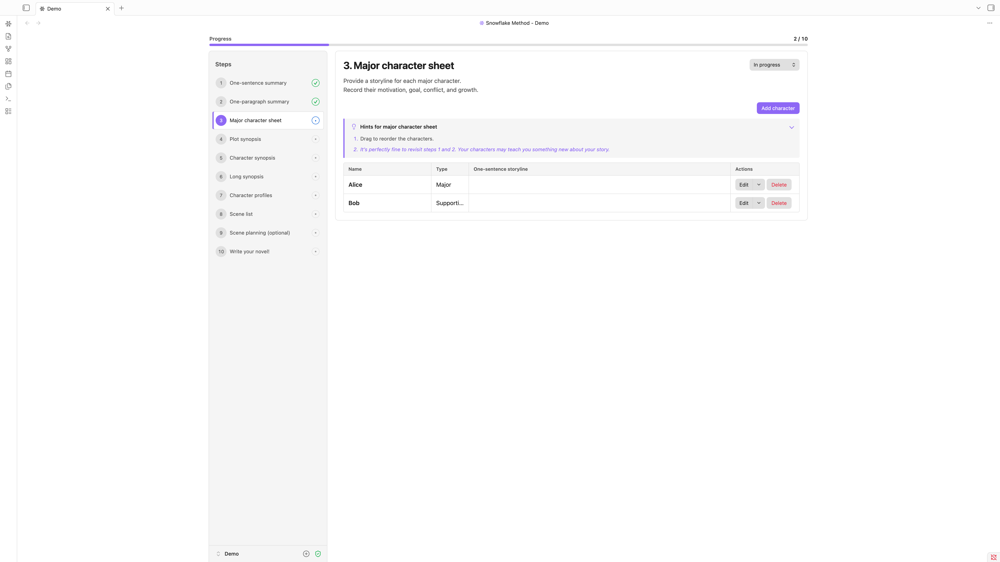</a><br />
      <strong>3. Major character sheet</strong><br />
      <sub>Capture each major character's storyline, motivation, conflict, and growth.</sub>
    </td>
    <td width="50%" valign="top">
      <a href="assets/screenshots/step_04_en.png">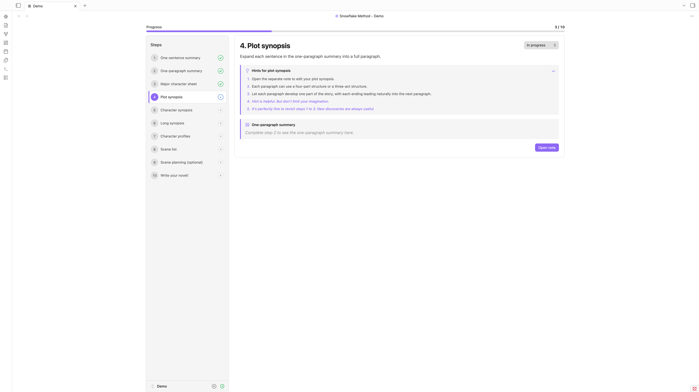</a><br />
      <strong>4. Plot synopsis</strong><br />
      <sub>Turn the one-paragraph summary into a fuller, connected plot.</sub>
    </td>
  </tr>
  <tr>
    <td width="50%" valign="top">
      <a href="assets/screenshots/step_05_en.png">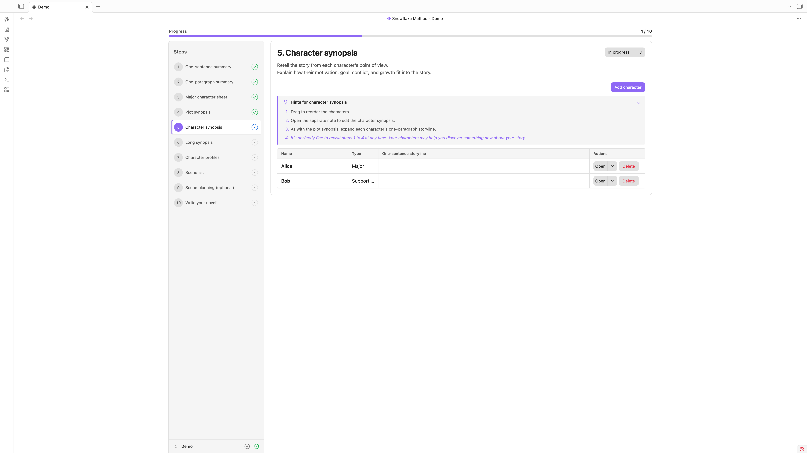</a><br />
      <strong>5. Character synopsis</strong><br />
      <sub>Retell the story from each character's point of view.</sub>
    </td>
    <td width="50%" valign="top">
      <a href="assets/screenshots/step_06_en.png">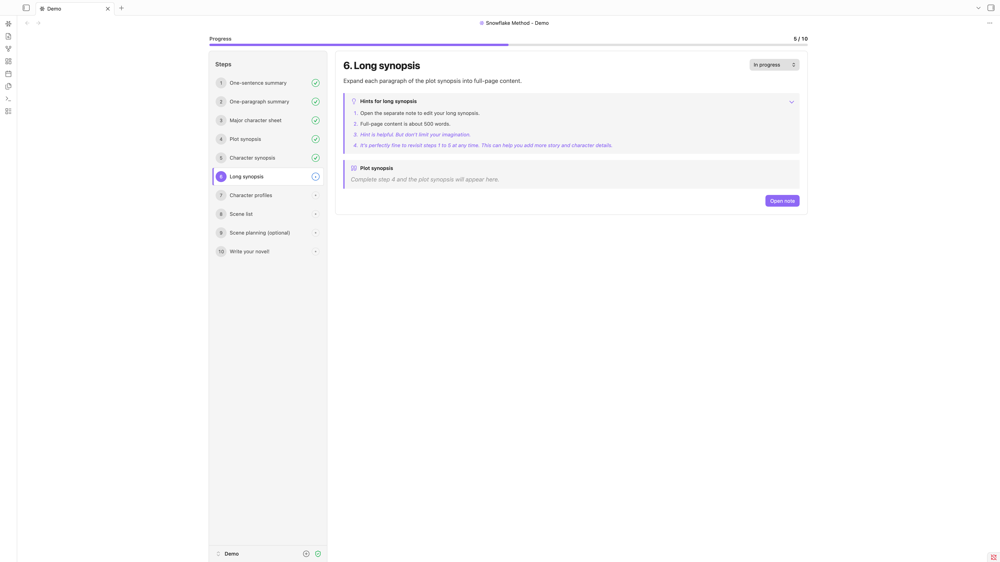</a><br />
      <strong>6. Long synopsis</strong><br />
      <sub>Develop each plot paragraph into a full page, in a note of its own.</sub>
    </td>
  </tr>
  <tr>
    <td width="50%" valign="top">
      <a href="assets/screenshots/step_07_en.png">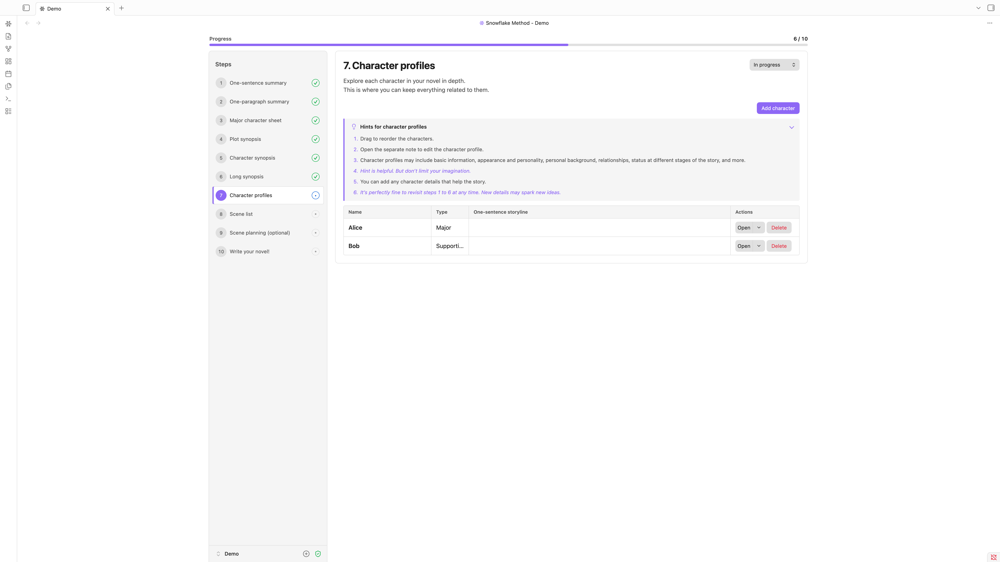</a><br />
      <strong>7. Character profiles</strong><br />
      <sub>Keep detailed, reusable profiles for every character in the novel.</sub>
    </td>
    <td width="50%" valign="top">
      <a href="assets/screenshots/step_08_en.png">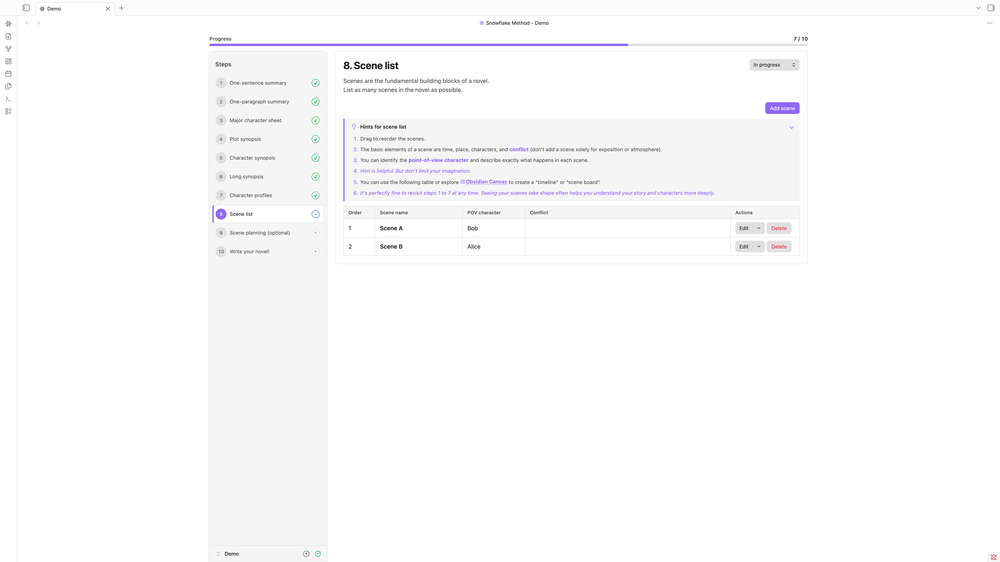</a><br />
      <strong>8. Scene list</strong><br />
      <sub>Map, reorder, and connect scenes with point-of-view characters and conflict.</sub>
    </td>
  </tr>
  <tr>
    <td width="50%" valign="top">
      <a href="assets/screenshots/step_09_en.png">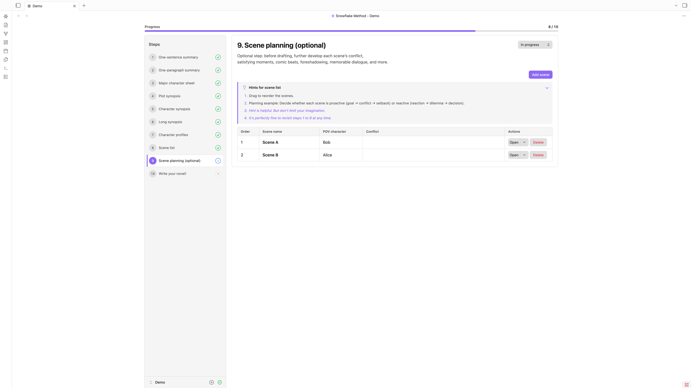</a><br />
      <strong>9. Scene planning <em>(optional)</em></strong><br />
      <sub>Develop each scene's conflict, turning points, beats, and memorable details.</sub>
    </td>
    <td width="50%" valign="top">
      <a href="assets/screenshots/step_10_en.png">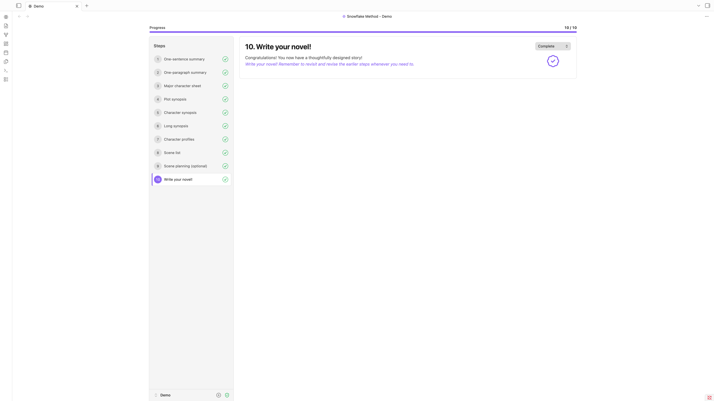</a><br />
      <strong>10. Write your novel!</strong><br />
      <sub>Start drafting with a complete plan, and keep every earlier step editable.</sub>
    </td>
  </tr>
</table>

</details>

### Worldbuilding

Characters and scenes rarely act alone. Time, location, and item notes live beside them as members of the project, with the same tables, forms, and base views. Any member can have **world status** and **relationship** record lines. These are sentences whose terms are links, saved as ordinary Markdown callouts in the note. A relationship also names the note it is with, so there is always a link to follow between the two.

Time, location, and item are just the kinds every project starts with. You can add your own for anything else the story keeps track of, such as a faction, a language, or a piece of technology. A kind you add gets its own folder, rail pane, table, base view, and an icon of your choice. Everywhere else, it works just like the three built-in kinds.

Every kind has three vocabularies that supply the words for those record lines: categories, world statuses, and relationships. Each vocabulary grows as a folder tree, and every entry in it is a note. So links to entries resolve like any other link, and the graph shows each entry under its own name. Three rail panes let you browse, rename, and prune the trees, and every reference is kept up to date along the way.

Beyond the fields every member shares, a note can have **custom fields** of your own. Each one is a title and whatever you write under it. You edit them in the member's form, and they're saved in their own block in the note. Save a set of them as a template, and it becomes a note in that kind's template folder. It's then ready to use for the next character, scene, or faction you create. The custom field pane in the rail manages those templates. The export button on any form turns the fields you just typed into a template.

### Story structure

Scenes are easier to judge when you can see them all at once. The **Visualization workspace** has a tab of its own. You can open it from the row of links at the bottom of the dashboard's Creation tools, or from the Command palette. It brings together a family of views of the scenes you planned in steps 8 and 9. **Corkboard**, **Freeform**, **Timeline** and **Beat sheet** appear side by side in its tab strip, and each asks a different question about the same scenes.

<p align="center"><a href="assets/screenshots/workspace_corkboard_en.png">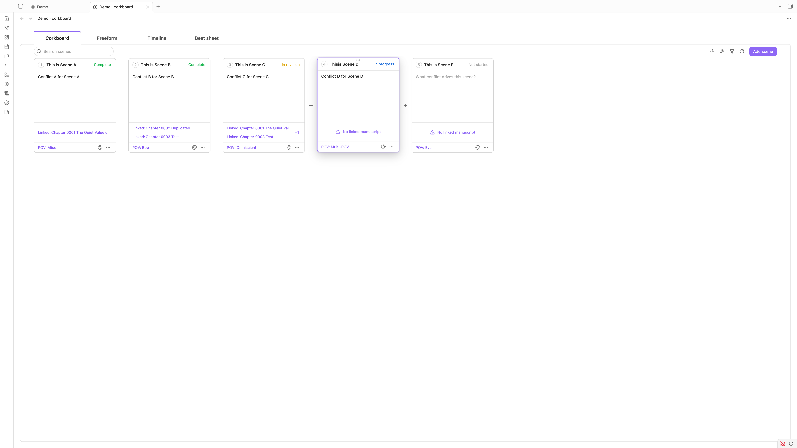</a></p>

The corkboard lays out every scene as a numbered card in narrative order, and you work right on the card. Edit the name in place, and pick the point of view and the progress status from dropdowns. Type the conflict into its text box, and use the swatch to tint the card in one of eight colors. From the card you can also open the manuscript chapters its scene links to. While the board is in plain order, drag a card to move its scene. A **+** between two cards inserts a scene at exactly that point, and **Add scene** puts one at the end. The search box and the funnel filter the board. **Display** sets the size of the cards and groups them by any of eight fields. The direction button shows the whole board in reverse.

<p align="center"><a href="assets/screenshots/workspace_freeform_en.png"></a></p>

**Freeform** drops the grid altogether. Each view is a blank canvas, and a project can have as many as you like. The project's own notes and records go onto it as cards: characters, scenes, times, places, items, tasks, foreshadowing, revisions and sticky notes. Each card looks the way it does in its own workspace. Beside them you can add text you type right on the canvas, any file in the project, and web links. Draw a line from one card to another to connect them. A line can have an arrow at either end and a solid, dashed, dotted or dash-dot stroke. A **frame** gathers whatever you drop into it and takes it along when you move the frame. Drag to move and resize, use the wheel to pan, and hold Ctrl or Cmd with the wheel to zoom. The quick-add bar along the bottom adds a card of any kind. Every gesture also has a menu item or a key that does the same, and undo covers every change. Double-click a card to open the note, record or file behind it. The canvas saves where things are placed and the text you type on it, never the words of your notes. The canvas button at the end of the toolbar writes the view you're looking at as an Obsidian Canvas file.

<p align="center"><a href="assets/screenshots/workspace_timeline_en.png"></a></p>

**Timeline** asks the other question: not what order the scenes are read in, but when they happen. Each timeline is a column of its own. When it follows a character or a worldbuilding note, it's bound to that note. They all line up with the shared time column on the left, whose rows are your Time notes. Inside a cell you write **sub-descriptions** for what that timeline does at that time. The scenes come from the **scene pool** on the right, which holds whatever the active timeline hasn't placed yet. Drag a card onto a sub-description and it leaves the pool. Drag it back and it returns. Every move is also a menu item, so nothing here needs a mouse. A **view** sets which timelines appear side by side. The toolbar can hide the sub-descriptions and stack the scenes behind one card. It can also show the latest times first and fold the time column and the pool away. The canvas button at the end of the toolbar writes the view as an Obsidian Canvas file.

<p align="center"><a href="assets/screenshots/workspace_beat_sheet_en.png"></a></p>

**Beat sheet** asks a third question: what each scene is for in the shape of the story. You can have as many sheets in a project as you like, and you see one at a time. A new sheet starts blank or from a template. Three Act, Kishōtenketsu, Story Circle, Save the Cat, Hero's Journey and Romancing the Beat are built in. Each comes with its acts, its beats and a line on what every beat is there to do. Acts are numbered by their order, and you can give any of them a label. A beat has no note behind it, so its name and description are kept in the sheet itself. Under a beat you write sub-descriptions and place scenes from the pool, just as on a timeline. Acts, beats, rows and scenes all move by drag or by menu. The toolbar can hide the sub-descriptions, stack the scenes, and show the last act first. It can also save the sheet you're viewing as a template of your own. The canvas button writes the sheet as an Obsidian Canvas file.

**Export as Obsidian Canvas** writes the view you're looking at as a `.canvas` file that Obsidian's own Canvas opens. The file goes next to the workspace's own file: `732_Freeform/<view name>.canvas`, `733_Timeline/<view name>.canvas` or `734_Beat_Sheet/<sheet name>.canvas`. Notes become file cards and keep their colors. Frames, timelines and acts become groups. The text you typed, the sub-descriptions and the beats become text cards. The toolbar's display switches, which hide the words, stack the scenes or reverse the order, change only the screen. The canvas always writes the words, puts the scenes beside them and keeps the stored order. Tasks, foreshadowing and revisions are not notes, so each becomes a text card that names it, and every line between cards is kept with its arrows and label. The canvas opens as soon as it's written. If a file of that name is already there and differs, you're asked before it's replaced. If it says the same, nothing is written and the canvas just opens. The file is a copy that the plugin never reads back, so you can rearrange it in Canvas or delete it without changing the workspace.

### Manuscript stream

A novel is easier to write in chapters and easier to read as a book. The manuscript stream gives you both at once. Every chapter stays its own Markdown note on disk, and the whole draft reads as one continuous page. If you have used Scrivener, this is its Scrivenings mode, now in Obsidian.

<p align="center">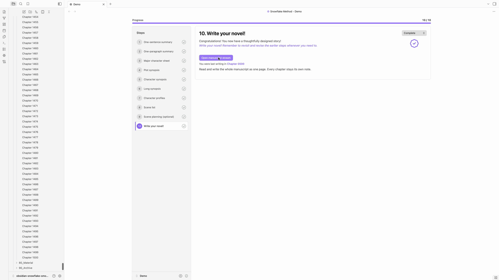</p>

In the manuscript stream, click any chapter and it switches to an editing view. It goes back to reading view when you move to another chapter. You can *(i) insert a chapter between two others, (ii) cut one in two at the cursor, or (iii) merge the next one into it.*

**Typewriter scrolling** keeps the line you're writing in the middle of the page. **Focus mode** fades everything except the paragraph you're writing. Its deepest level, solo, shows only the manuscript, in full screen. Each has a button in every chapter's header. The arrow keys move the cursor from one chapter into the next.

**The page is yours to set.** Font, size, line height, column width, paragraph spacing, first-line indent, alignment and hyphenation are all settings. So are a background tint for light and dark mode and grid lines to write along. Reading and writing follow the same layout rules, so a chapter is laid out the same whether you're reading it or writing in it. The typography button in the toolbar opens the same controls right over the page.

<p align="center"><a href="assets/screenshots/manuscript_typography_en.png">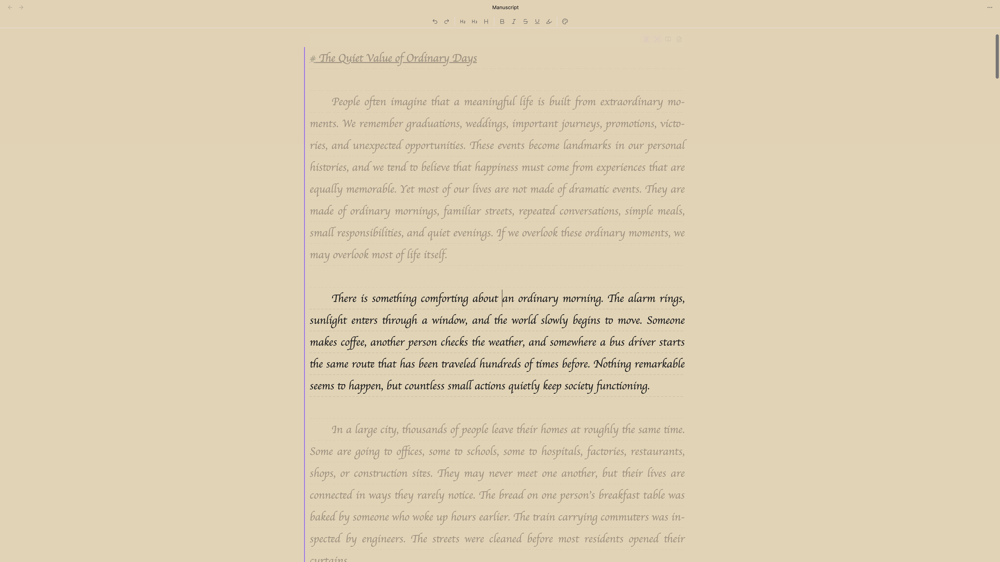</a></p>

**Word milestones** put the running word count in the margin, beside the line that reaches each interval. The interval is five hundred words by default. Milestones use the same counting rule as the status bar. They count across the whole manuscript in reading order, or start again in every chapter. They also follow your typing. As a chapter grows, its marks move, and in whole-manuscript mode so do the marks of every chapter after it. Switch them on under **Word milestone** in the settings.

**Automatic chapter numbers** offer each new chapter the number after the one before it. Choose a style under **Automatic chapter number**: `第一章`, `第 1 章` or `Chapter 1`. You can also write a rule of your own, as a simplified format such as `第{nnnn}章` or `Chapter {n}:`, or as a regular expression. With a style on, the naming form has two fields: the number, already filled in, and the name you type. It also has a switch that moves every numbered chapter after the new one up by one. Merging a numbered chapter away offers the reverse: the chapters after it move down by one, so there's no gap in the numbers. A chapter whose name doesn't match the rule is left as it is. A chapter whose heading you've rewritten keeps that heading.

**Plain-text export** writes the manuscript into the Vault with every Markdown and Obsidian mark taken out. Headings keep just their words, and links just their text. Comments and block IDs are removed, and HTML entities become the characters they stand for. The export button in the toolbar writes the whole book. You can export it as one file, with a blank line, a line of dashes or three asterisks between chapters. Or you can export one file per chapter, numbered in reading order, inside a folder. Every chapter's header has a button that exports just that chapter. Another button copies it to the clipboard as the same text. Files go to `Snowflake Export` beside the projects, unless you name another folder in the settings. They get a `.txt` or `.md` extension, with the same text inside either way. Each line of prose becomes a paragraph, indented or not as you choose. You also choose whether to keep or drop the blank lines between paragraphs. If a file is already at the destination, it's only overwritten after you agree.

**All actions stay quick when the book is long (under 20ms on average).** This was measured on a vault of more than 9000 notes. Two projects had 1500 chapters each, and every chapter had more than 2000 English words or Chinese characters. A third project had 300 characters, 3000 scenes and another 1500 chapters.

### Task management

The work around the writing has a pane of its own. The dashboard's **Task management** pane has four tabs, each holding a different kind of note to yourself.

**Tasks** puts everything that's waiting on one board of six columns, from To do to Done. Your own tasks are cards you write. Each one holds a title, a description, a priority, a due date and the entities the task is about. Make one with **Add task** on the tab or **New task** in the Command palette. Drag a card within a column to reorder it, or into another column to change its status. Edit, archive and delete are on the card's own menu. The plugin fills in the rest of the board itself, and works it out afresh every time the board loads. It shows your daily, weekly and monthly writing goals, which move through the columns as the words come in. It adds foreshadowing and revisions that are still open, and the ones whose words have changed underneath them. It also adds mentions no single entity can claim, your sensitive words, and sticky notes waiting to be read. Click one of these cards to open the tab it was counted from, filtered to what it counted. A command in the Command palette hides them all. The bar above the board searches every card, and filters the board by kind, priority and due date. **Archived** folds away underneath, with a search of its own, where you can restore or delete a card.

<p align="center"><a href="assets/screenshots/task_kanban_en.png">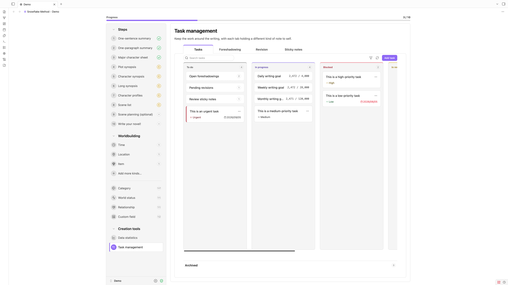</a></p>

**Foreshadowing** follows one thread from its plant to its payoff. Click into a chapter of the manuscript stream, select the words that plant the thread, and choose **Create foreshadowing** from the right-click menu. Later passages join the same thread through **Add to existing foreshadowing**. Each passage is marked as a plant, a reinforcement or the payoff. The thread itself is planned, active, resolved or abandoned. Every occurrence is marked in the prose and has a card in the margin to the right of the chapter. The card shows the role, the thread's status, its name and description, the marked words and a note of your own. An occurrence stays with its words as you write above and around them. If you rewrite those words directly, the occurrence isn't lost. It becomes unresolved, and you can put it back on the passage that replaced them. The tab gives every occurrence a row. You can search the rows by name, and filter them by status, by role, or to show only the unresolved ones.

<p align="center"><a href="assets/screenshots/foreshadowing_en.png">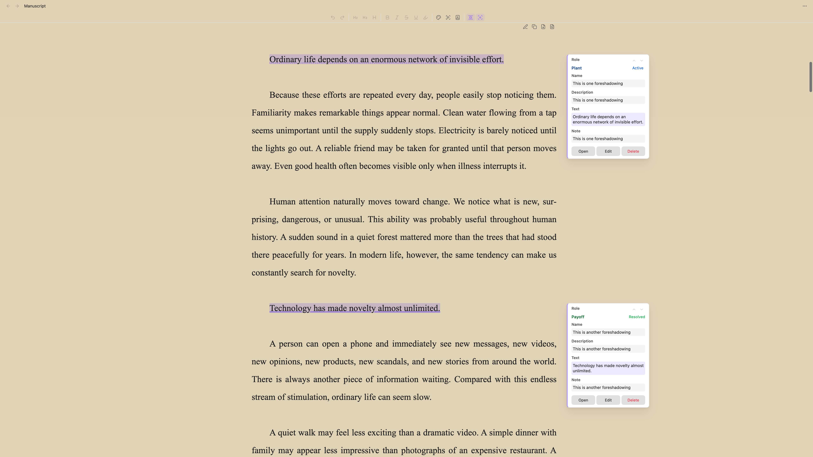</a></p>

**Revision** makes a change easier to judge before it is made. Select the words in question and choose **Create revision** from the same menu. The selection becomes a replacement, or a deletion if you leave the proposed text empty. With just the cursor and nothing selected, you get an insertion at that point. The words a proposal would take out are struck through in place. But the chapter itself doesn't change, and nothing is counted, analyzed or tracked until the proposal is accepted. Each proposal is a card in the margin, with the original text, the proposed text and a comment. **Accept** writes the change into the chapter as if you had typed it. **Reject** leaves the text as it was, and **Edit** changes the proposal or the comment. A proposal stays with its words as you write around them. If you change its words directly, it's shown as a conflict, and you can only discard it, not apply it.

<p align="center"><a href="assets/screenshots/revision_en.png">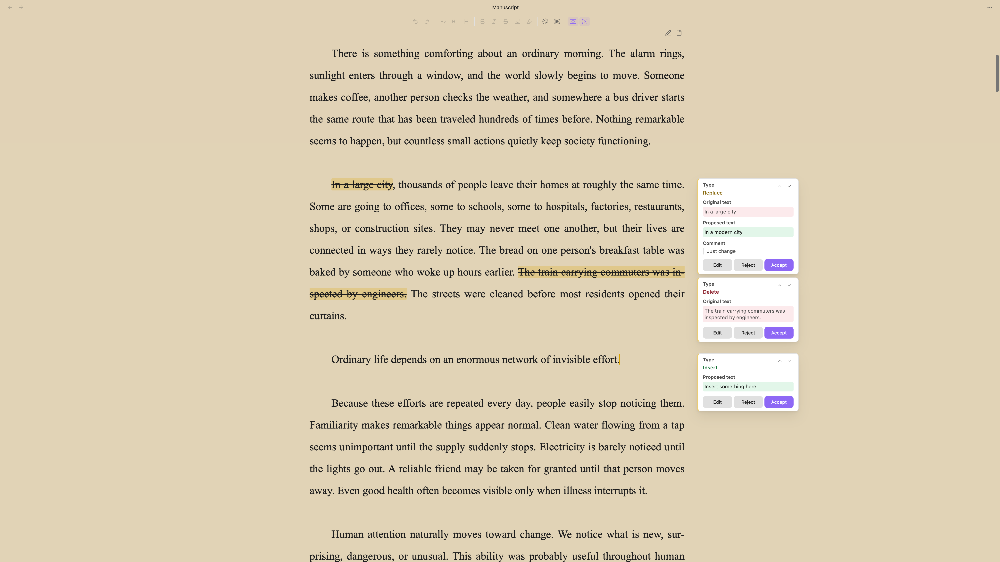</a></p>

**Sticky notes** hold what doesn't belong in a record: an idea, a reminder, or a question to come back to. To make one, use **New sticky note** in the Command palette, the sticker icon in the ribbon, or **Add sticky note** on the tab. The new note opens ready for writing. A note has two faces. Click its text to write in it with the plugin's own editor, and press Escape to read it back as rendered Markdown. The same file shows in three places at once. It's a card on the dashboard, a compact card in a sidebar of its own, and a floating panel over the workspace. You can drag the panel by its header, resize it from any edge and pin it in place. You can also make it translucent so the page shows through. The same button on the card opens the panel and closes it again. Each device remembers where you put a panel, and focus mode never fades it, not even in solo. Eight colors tell the notes apart at a glance. **Archive** moves a note into a folded section under the board and closes all its panels. There you can read, restore, or delete it.

<p align="center"><a href="assets/screenshots/sticky_note_en.png">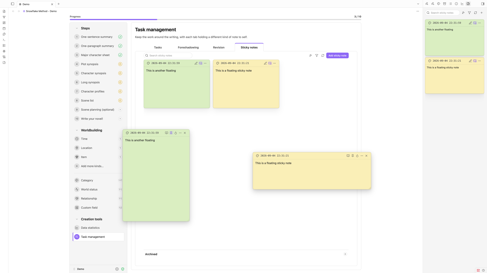</a></p>

### Data statistics

Writing is easier to keep up when you can see it. The dashboard's **Data statistics** pane turns a project into numbers, with one tab for each question. **Writing sessions** measures the time, **Prose analysis** measures the prose, and **Entity tracking** follows who and what that prose names.

**Writing sessions** is where the clock lives. A sitting starts when you start it, or by itself when you turn on focus mode. Words you write with no sitting running still count. So a morning at the manuscript still belongs to that day, whether or not you remembered to start the clock. You only need a sitting to record the time.

<p align="center"><a href="assets/screenshots/data_statistics_01_en.png">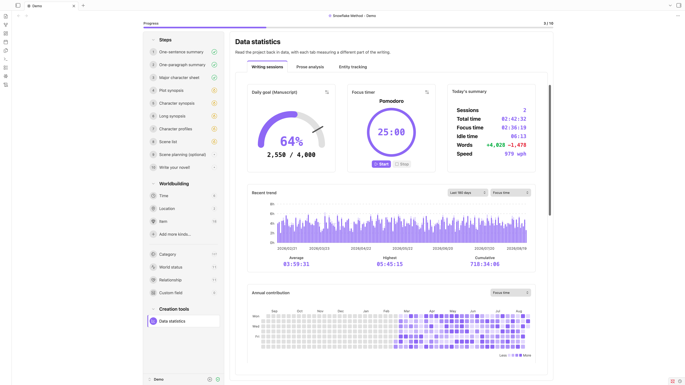</a></p>

<p align="center"><a href="assets/screenshots/data_statistics_02_en.png">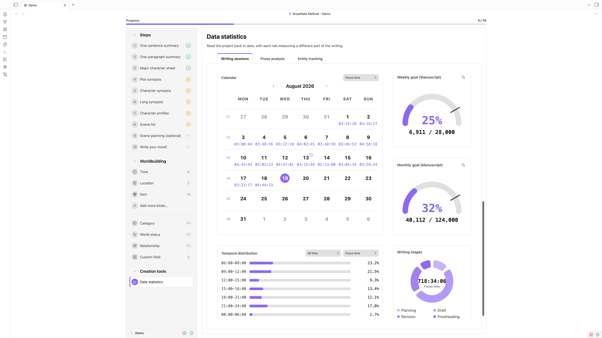</a></p>

**Prose analysis** looks at the draft as prose. At the top are total reading time, reading time per chapter, sentences per chapter, words per sentence and the share of dialogue. Below them, every chapter has a row of its own. You can search the rows by title and filter them by length. **Word frequency** counts the words themselves and ranks them, with a word cloud of the ones you use most. Stopwords and the names of your own characters and places are left out of the count until you ask for them. Chinese is read as words rather than as single characters.

<p align="center"><a href="assets/screenshots/prose_analysis_en.png">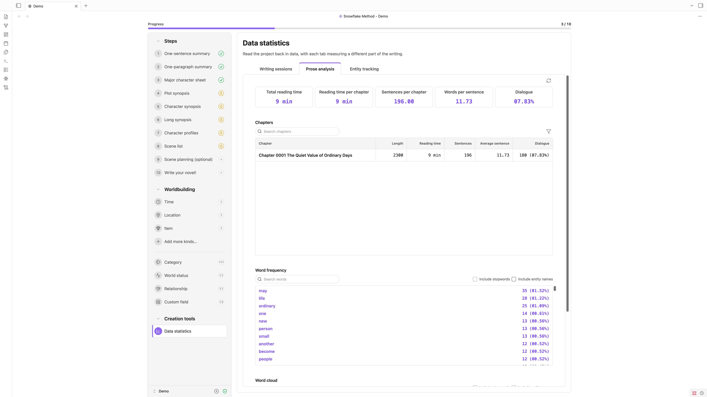</a></p>

**Entity tracking** follows the cast through the draft. Every character, scene, time, location, item and kind of your own that the manuscript names gets a row. The row shows how often it's mentioned, how many of those mentions are already links, and the first and last chapter to name it. There's also a distribution that shows the whole book as one line. Open a row to see every mention, grouped by chapter with the sentence around it. Choose one to jump to that spot in the manuscript. Sensitive words you've listed and dialogue by chapter each have a section of their own. So do mentions no single member can claim, and the ignore rules you've written.

<p align="center"><a href="assets/screenshots/entity_tracking_1_en.png">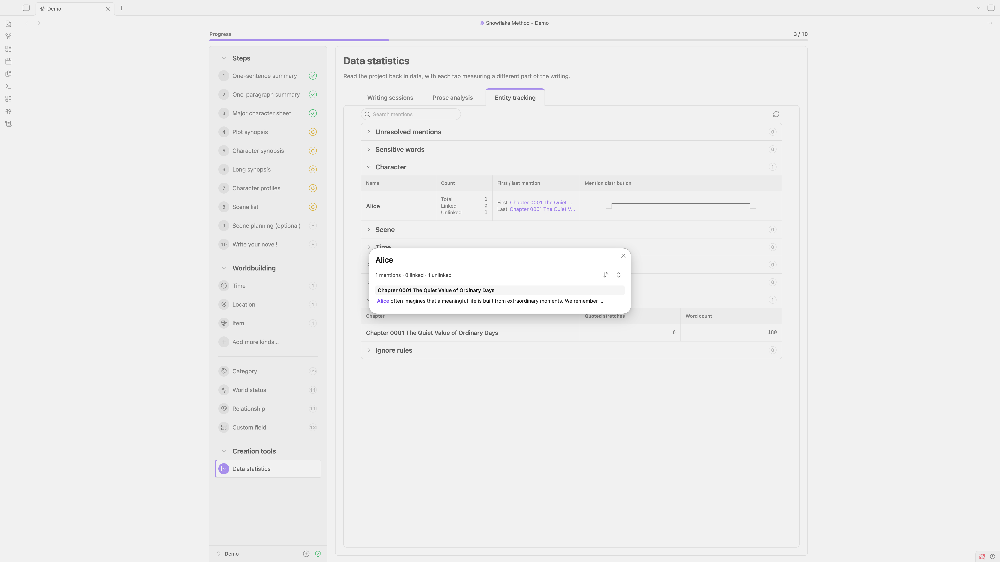</a></p>

**The same reading marks up the manuscript itself.** A name written as plain text is marked in place, and a name already written as a link is marked as a link. Right-click a plain name to turn it into a link, or to leave it alone here, in this chapter, or anywhere it appears. The switches are in the toolbar's highlight menu. For entities, you can mark the first mention, unlinked mentions or all mentions. There's also one switch each for sensitive words, dialogue and your own **custom highlight rules**. A rule can be literal text or a regular expression, drawn in the color and decoration you choose.

<p align="center"><a href="assets/screenshots/entity_tracking_2_en.png">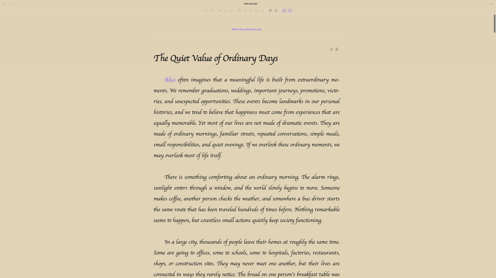</a></p>

<a id="installation"></a>

## Installation

Install from the community plugin browser unless you have a reason not to. The browser offers the reviewed release and keeps up with Obsidian's own updates. BRAT and manual installation are there for beta builds, and for vaults that don't install anything on their own.

### Community plugins (recommended)

1. Open **Settings → Community plugins** in Obsidian.
2. Select **Browse** and search for **Snowflake Method**.
3. Select **Snowflake Method**, choose **Install**, and then enable it.

### BRAT

1. Install [BRAT](https://github.com/TfTHacker/obsidian42-brat).
2. Choose **Add beta plugin** and enter `ZzPoLariszZ/obsidian-snowflake-method`.
3. Enable **Snowflake Method** under **Community plugins**.

### Manual installation

1. Download `main.js`, `manifest.json`, and `styles.css` from the [latest release](https://github.com/ZzPoLariszZ/obsidian-snowflake-method/releases/latest).
2. Create the folder `<vault>/.obsidian/plugins/snowflake-method/`.
3. Copy the three files into that folder.
4. Reload Obsidian and enable **Snowflake Method** under **Community plugins**.

### Upgrading

Updating the plugin never rewrites your notes on its own. The files the plugin generates keep themselves up to date. These are the system templates under `00_System` and the version stamp on the project metadata note. They are quietly updated the first time a dashboard shows the project. The notes you write change only when you click one button. If any of them was written by an older release, the dashboard shows **Older project format** with a count. **Update** then brings them all up to date in one safe pass, and you can repeat it.

<a id="guide"></a>

## Guide

1. Open the Command palette and run **Snowflake Method: Open project manager**.
2. In the project manager, choose the project root and language, enter a project name, and create the project.
3. Open the project dashboard and start with the target-reader prompts and the one-sentence summary.
4. Mark steps complete when they are useful to you, and go back to them whenever the story changes.
5. Open long-form notes beside the dashboard or in regular tabs.
6. When the plan is ready, open the manuscript stream from step 10 and write the novel as one continuous page.

<a id="commands"></a>

## Commands

| Command | Purpose |
|---|---|
| Add category | Add a category to a kind's vocabulary. |
| Add character | Add a shared character note to the current project. |
| Add foreshadowing | Add a foreshadowing thread to the current project. |
| Add relationship | Add a relationship to a kind's vocabulary. |
| Add scene | Add a shared scene note to the current project. |
| Add world status | Add a world status to a kind's vocabulary. |
| Add worldbuilding note | Add a note to a worldbuilding kind you choose. |
| Close manuscript stream | Close the manuscript stream in the current pane. |
| Copy the current manuscript note as plain text | Copy the note at the center of the page to the clipboard, with every mark removed. |
| Count project words | Show the current project's word count, for the whole project and for the manuscript alone. |
| Create project | Create a new Markdown-native Snowflake project. |
| Create worldbuilding kind | Add a new kind of worldbuilding note with its own folder, pane, and vocabularies. |
| Export the current manuscript note as plain text | Save the note at the center of the page as plain text in the export folder. |
| Export the manuscript as plain text | Save the whole manuscript as plain text in the export folder. |
| Go back to where the stream opened | Return to the note where you opened the manuscript stream. |
| Go to the next manuscript note | Move one note forward in the manuscript. |
| Go to the previous manuscript note | Move one note back in the manuscript. |
| Insert a manuscript note after this one | Add a note right after the one you are reading. |
| Insert a manuscript note before this one | Add a note right before the one you are reading. |
| New sticky note | Add a sticky note to the current project and open it as a floating panel. |
| New task | Add a task to the current project's board. |
| Open beat sheet workspace | Open the visualization workspace to its beat sheet, with the scenes placed under its acts and beats. |
| Open character base | Open the Bases view of the current project's characters. |
| Open corkboard workspace | Open the visualization workspace to its corkboard, with the scenes shown as cards in narrative order. |
| Open freeform workspace | Open the visualization workspace to its freeform canvas, where notes, records, files and text become cards you can connect and frame. |
| Open dashboard | Open the current project's dashboard, or bring it into view. |
| Open health checker | Check the project's structure and fix any issues that are safe to fix. |
| Open manuscript stream | Open the manuscript at the note you last wrote in. |
| Open project manager | Create, rename, open, archive, or trash projects. |
| Open scene base | Open the Bases view of the current project's scenes. |
| Open sticky note sidebar | Open the current project's sticky notes in their own sidebar. |
| Open timeline workspace | Open the visualization workspace to its timeline, with each scene placed at the time it happens. |
| Open visualization workspace | Open the current project's story structure in its own workspace. |
| Open worldbuilding base | Open the Bases view of a worldbuilding kind you choose. |
| Open writing session sidebar | Open today's writing numbers in their own sidebar. |
| Pause or resume the writing session | Pause the running session's clock, or start it again. |
| Set focus mode to off / on / deep / solo | Set how far focus mode reaches, with one command for each level. |
| Split manuscript note at the cursor | Split the note open for writing in two at the caret. |
| Start a countdown writing session | Begin a session that ends when its clock runs out. |
| Start a pomodoro writing session | Begin a session that alternates work periods with breaks. |
| Start a stopwatch writing session | Begin a session that runs until you stop it. |
| Start a writing session with options | Choose the timer, its length, and the writing stage before the session starts. |
| Stop editing the current manuscript note | Leave the note at the center of the page and return it to reading view. |
| Stop the writing session | End the running session and save its record. |
| Switch statistics scope | Switch the statistics between the whole project and the manuscript alone. |
| Toggle custom highlights | Turn your own highlight rules on or off in the manuscript. |
| Toggle derived tasks on the task board | Show or hide the cards the plugin derives from your writing. |
| Toggle freeform mode | Hide the ten steps and their progress, or bring them back. |
| Toggle managed boundary protection | Temporarily turn protection for managed section markers on or off. |
| Toggle note paths in the manuscript | Show or hide where each manuscript note is stored. |
| Toggle opening a form for new notes from a field | Choose whether a note created from a picker field opens its form first. |
| Toggle opening notes beside the dashboard | Choose between a companion pane and regular tabs. |
| Toggle order numbers in the manuscript | Show or hide each manuscript note's stored position. |
| Toggle progress status in tables | Show or hide each note's progress status under its name in the tables. |
| Toggle reduced animations | Switch between animated and reduced-motion visuals. |
| Toggle the actions column in tables | Show or hide each row's actions column. |
| Toggle the dashboard rail | Collapse the rail beside the dashboard so only its marks show, or expand it again. |
| Toggle typewriter scrolling | Keep the line you are writing at the middle of the page. |
| Toggle writing count outside sessions | Start or stop recording the words you write while no session is running. |
| Update notes in older format | Update every note written by an older release. |

Commands that act on the manuscript are available only while a manuscript stream is the current view. **Split manuscript note at the cursor** also needs a note in the stream to be open for writing. The two commands that copy or export the current note use the note at the center of the page.

<a id="settings"></a>

## Settings

| Setting | Default | Purpose |
|---|---|---|
| Project root folder | Vault root | Choose the folder that holds your projects, as a path relative to the Vault. |
| Interface language | Follow project | Use the current project's language, Obsidian's language, English, or Simplified Chinese. |
| Default project language | System language | Set the language for new projects. |
| Freeform mode | Off | Hide the ten steps and their progress. Characters and scenes join the worldbuilding list. |
| Open notes beside the dashboard | On | Reuse one companion pane for the notes you open. |
| Reduce animations | Off | Replace animations with static visuals. |
| Protect managed boundaries | On | Prevent accidental edits to synchronization markers. |
| Show progress status in tables | Off | Show each note's progress status under its name in the member tables. |
| Show the actions column in tables | On | Keep each row's actions visible beside it. |
| New notes from a field | Open its form | Choose whether a note created from a picker field opens its form first or is created directly. |
| Notes to keep loaded | 5 | Keep this many manuscript notes loaded on each side of the one you are reading. |
| Show note paths | On | Show where each manuscript note is stored, just above the note. |
| Show order numbers | Off | Show the stored position that decides where a note comes in the reading order. |
| Typewriter scrolling | On | Keep the line you are writing at the middle of the page. |
| Focus mode | Off | Fade everything except the paragraph you are writing. The solo level shows only the manuscript, in full screen. |
| Highlight mentions | Entities and dialogue off, the rest on | Mark entity names and aliases, sensitive words, dialogue, and text that matches your own rules. Each of the four has its own switch. Entities can be marked at their first mention, only where they are not yet links, or everywhere. |
| Auto-pair brackets and quotes | On | Typing brackets or quotes in the manuscript closes the pair. |
| Auto-pair Markdown syntax | On | Typing bold, italic or other markers in the manuscript closes the pair. |
| Enter starts a new paragraph | On | Pressing Enter puts an extra blank line between paragraphs. Pressing Shift+Enter breaks the line inside the paragraph. |
| Show word milestones | Off | Mark the word count beside the line that reaches each interval. |
| Milestone mode | Per chapter | Count across the whole manuscript, or start the count again in each note. |
| Milestone interval | 500 | The number of words between milestones. |
| Numbering style | Off | Number each new chapter by counting on from the one before it. Choose Chinese (第一章), Chinese with Arabic numerals (第 1 章), or English (Chapter 1). You can also write rules of your own as a simplified format or a regular expression. |
| Font family | Theme default | Choose the font for manuscript text. Restart Obsidian to see fonts you have just installed. |
| Font size | Theme default | Adjust the size of manuscript text. |
| Line height | Theme default | Adjust the spacing between lines of manuscript text. |
| Content width | Theme default | Set the maximum width of manuscript content. |
| Paragraph spacing | 1 line | Adjust the space between paragraphs. |
| First-line indent | None | Set the indent at the start of each paragraph. |
| Text alignment | Justified | Choose how paragraph text is aligned. |
| Automatic hyphenation | Off | Break long words at the end of a line automatically. |
| Background in light mode | Theme default | Choose the manuscript background color in light mode. |
| Background in dark mode | Theme default | Choose the manuscript background color in dark mode. |
| Grid lines | None | Show guide lines behind manuscript content. |
| Word count rule | MS Word | Choose which tool the word count matches. |
| Count headings | Skip the first H1 only | Choose whether heading lines count as writing. |
| Focus timer type | Pomodoro | The timer a new session starts with. |
| Idle after | 60 seconds | How many seconds without editing before focus turns to idle. |
| Writing stage | Draft | The writing stage a new session starts in. |
| Start stopwatch session when focus mode is enabled | On | Start a session automatically whenever focus mode turns on. |
| Track writing count outside sessions | On | Record the words you write while no session is running. Time-related figures still come only from sessions. |
| Statistics scope | Whole project | Choose which words the writing statistics show. |
| Daily goal: whole project | 6000 | Net words to write each day across the whole project. Set it to zero to turn the goal off. |
| Daily goal: only manuscript | 4000 | Net words to write each day in the manuscript. Set it to zero to turn the goal off. |
| Week starts on | Monday | The first day of each week in the writing statistics. |
| Date format | YYYY/MM/DD | How dates are written in the writing statistics. |
| Reading speed, words per minute | 250 | How fast the prose analysis assumes you read words. |
| Reading speed, CJK characters per minute | 400 | How fast the prose analysis assumes you read CJK characters. |
| Custom stopwords | None | Words to leave out of the frequency count, on top of the built-in lists. One per line. |
| Custom sensitive words | None | Terms that entity tracking looks for and counts. One per line. |
| Dialogue quote styles | All four on | Which quote marks open dialogue: “ ”, " ", 「 」 and 『 』. |
| Custom highlight rules | None | Your own rules, as literal text or regular expressions, each shown in the color and decoration you choose. |
| Export folder | Snowflake Export beside the projects | The folder where exported files are saved. A folder inside a project is not accepted. |
| Export format | Plain text (.txt) | Markdown (.md) or plain text (.txt). Both contain the same plain text, with every Markdown and Obsidian mark removed. |
| Preserve first-line indentation | On | Keep the first-line indent on paragraphs. |
| Preserve extra paragraph spacing | Off | Keep blank lines between paragraphs. |
| Layout | One file | Export the manuscript as one file or as one file per note. |
| Between notes | Blank line | What goes between notes when you export the manuscript as one file: a blank line, a line of dashes or three asterisks. |

<a id="privacy"></a>

## Privacy

Snowflake Method for Obsidian is local-first. Your project files and plugin settings stay in your Vault. The plugin does not send your writing or your settings anywhere.

- You don't need an account, a subscription, or any outside service.
- The plugin makes no network requests and includes no AI service, telemetry, or analytics. A web link on the freeform canvas shows its address and loads nothing.
- Projects are made of ordinary files that work in Obsidian. You can still read and edit them when the plugin is turned off.

<a id="structure"></a>

## Structure

Each project is stored directly inside the project root you set. Its folders, file names, and starter notes are in the language you chose when you created the project.

<details>
<summary>Example English project layout</summary>

```text
<project root>/
└── My Novel/
    ├── 00_System/
    │   ├── 001_Project_Metadata.md
    │   └── ...
    ├── 10_Summary/
    │   ├── 11_One_Sentence_Summary.md
    │   └── ...
    ├── 20_Character/
    │   ├── 21_Category/
    │   │   └── Major/
    │   │       └── Major.md
    │   ├── 24_Custom_Field/
    │   │   └── Age.md
    │   └── Characters.base
    ├── 30_Synopsis/
    ├── 40_Scene/
    │   └── Scenes.base
    ├── 50_Manuscript/
    │   ├── Draft.md
    │   └── Part One/
    │       └── Chapter One.md
    ├── 60_Worldbuilding/
    │   ├── 61_Time/
    │   ├── 62_Location/
    │   ├── 63_Item/
    │   └── 64_Faction/
    ├── 70_Tool/
    │   ├── 71_Data_Statistics/
    │   │   ├── 711_Writing_Session/
    │   │   │   └── 2026/
    │   │   │       └── 2026_08_<device>_writing_session.json
    │   │   ├── 712_Prose_Analysis/
    │   │   │   └── <device>_analysis_stats.json
    │   │   └── 713_Entity_Tracking/
    │   │       ├── mention_ignores.json
    │   │       └── <device>_mention_index.json
    │   ├── 72_Task_Management/
    │   │   ├── 721_Task/
    │   │   │   └── tasks.json
    │   │   ├── 722_Foreshadowing/
    │   │   │   └── foreshadowing.json
    │   │   ├── 723_Revision/
    │   │   │   └── revisions.json
    │   │   └── 724_Sticky_Note/
    │   │       └── 20260904T223121.847+0800.md
    │   └── 73_Visualization/
    │       ├── 732_Freeform/
    │       │   ├── freeform-view-<id>.json
    │       │   ├── freeform.json
    │       │   └── <view name>.canvas
    │       ├── 733_Timeline/
    │       │   ├── timeline.json
    │       │   └── <view name>.canvas
    │       └── 734_Beat_Sheet/
    │           ├── beat-sheet.json
    │           └── <sheet name>.canvas
    └── ...
```

</details>

Writing sessions are recorded per device, so two machines never write to the same file when you sync. The ignore rules you write while tracking entities, the revisions you propose and your foreshadowing threads are each kept in one shared file. These files travel with the Vault. A sticky note is a Markdown file of its own. The position of its floating panel is remembered on each device, not written into the note. Unlike these records, the entity index and prose statistics stored beside them are caches. The plugin rebuilds them from the manuscript whenever they are missing or out of date. So deleting them costs nothing but the time it takes to read the book again.

Archiving a project moves its whole folder into `Snowflake Archive`. That folder is next to your projects, not inside any of them. Nothing in the notes changes. A project keeps every reference inside its own folder, so no link breaks while it is archived. The project manager lists what is in the archive and can restore any of it. If its old name has been taken in the meantime, the project comes back under a free name. Moving a folder in or out by hand works the same way, so the archive is a place, not a mechanism.

Exporting writes plain-text files into `Snowflake Export`, a folder next to your projects like the archive. You can pick another folder in the settings, as long as it is outside the project. If a note has left the manuscript since an earlier export, its exported file is never deleted. A workspace exported as an Obsidian Canvas is the one exception. Its file goes next to the workspace's own file inside the project, as the layout above shows.

A manuscript can be one note or many, in whatever folders suit you. Each note records its place with `snowflake-manuscript-sequence`, so moving or renaming a note never changes where it is read. The manuscript stream shows the notes in that order as a single page.

The dashboard syncs only the text between a pair of managed section boundaries:

```markdown
<!-- snowflake:section:one-sentence-summary:start -->
Your writing remains editable here.
<!-- snowflake:section:one-sentence-summary:end -->
```

These HTML comments are structural markers, not story content. Boundary protection is on by default, to stop accidental edits to the marker lines. The text inside the pair stays in sync with the dashboard. Markdown outside it stays under your control, and the plugin does not replace it. If markers are missing, duplicated, reversed, or overlapping, the plugin reports the problem instead of making an unsafe write.

<a id="roadmap"></a>

## Roadmap

- [x] Obtain written permission from Randy Ingermanson or Advanced Fiction Writing to use the Snowflake Method name for this plugin (granted by email, September 2026)
- [ ] Add the writing example from Chapter 20 of *How to Write a Novel Using the Snowflake Method* (a later conversation)
- [x] Guided dashboard (0.1.0)
- [x] Obsidian-native projects (0.1.0)
- [x] Bilingual workspace (0.1.0)
- [x] Revision awareness (0.1.0)
- [x] Safe repair tools (0.1.0)
- [x] Bases views (0.2.0)
- [x] Manuscript stream (0.4.0)
- [x] Typewriter scrolling (0.5.0)
- [x] Focus mode (0.5.0)
- [x] Fields in the note body (0.7.0)
- [x] Worldbuilding (0.8.0)
- [x] Custom fields (0.9.0)
- [x] Project archive (0.10.0)
- [x] Freeform mode (0.10.0)
- [x] Writing sessions (0.11.0)
- [x] Data statistics (0.11.0)
- [x] Custom typography (0.13.0)
- [x] Entity tracking (0.14.0)
- [x] Prose analysis (0.14.0)
- [x] Revision (0.15.0)
- [x] Task management pane (0.15.0)
- [x] Word milestones (0.16.0)
- [x] Automatic chapter numbers (0.16.0)
- [x] Plain-text export (0.16.0)
- [x] Foreshadowing (0.17.0)
- [x] Sticky notes (0.17.0)
- [x] Task board (0.18.0)
- [x] Visualization workspace (0.19.0)
- [x] Corkboard (0.19.0)
- [x] Timeline (0.20.0)
- [x] Beat sheet (0.21.0)
- [x] Freeform (0.22.0)
- [x] Export visualization workspace as Obsidian Canvas (0.23.0)

<a id="development"></a>

## Development

### Requirements

- Node.js 20 or later
- npm with lockfile support
- A development Vault to test the packaged plugin in Obsidian 1.13.0 or later

Continuous integration currently checks the project on Node.js 20, 22, and 24 under Ubuntu.

### Setup

```sh
git clone https://github.com/ZzPoLariszZ/obsidian-snowflake-method.git
cd obsidian-snowflake-method
npm ci
```

`npm ci` installs the exact dependency versions recorded in `package-lock.json`. The generated `main.js` is a build artifact, so don't edit it directly.

### Commands

| Command | Purpose |
|---|---|
| `npm run dev` | Watch the TypeScript sources and rebuild `main.js` with an inline source map. |
| `npm test` | Run the full Vitest suite once. |
| `npm run test:watch` | Run Vitest in watch mode during development. |
| `npm run build` | Type-check the project and build a minified production bundle with no source map. |
| `npm run lint` | Run ESLint on the whole repository. |
| `npm run check` | Run the required sequence: tests, then the production build, then lint. |

Run `npm run check` before every commit you mean to send for review. To test in Obsidian on your own machine, put the generated `main.js` together with `manifest.json` and `styles.css` in `<vault>/.obsidian/plugins/snowflake-method/`, then reload Obsidian. Use a separate development Vault rather than one with your real writing in it.

### Continuous integration

Every push and pull request runs the test, build, and lint jobs on each supported Node.js version. A change is ready to merge only after the whole matrix passes. CI builds the distributable bundle from source. Output from a local build does not count as verification.

### Release procedure

1. Start from `main` with a clean working tree, and make sure `npm run check` passes.
2. Choose the right semantic version increment and run `npm version patch -m "chore: release %s"`, or the same command with `minor` or `major`. The message matters, because without it npm writes the bare number as the commit subject.
3. The version script updates `package.json`, `package-lock.json`, `manifest.json`, and `versions.json`, then makes the release commit. It also tags the commit with a `v` prefix, such as `v0.9.0`, which this project does not use. Before you push anything, replace that tag with the bare number. In the example above, that means `git tag -d v0.9.0 && git tag 0.9.0`. Tags here are lightweight and must not use a `v` prefix.
4. Push the commit and the tag in two steps: `git push origin main`, then `git push origin` with the tag you just made. `--follow-tags` will not push these tags. It pushes annotated tags only, and silently leaves a lightweight one behind. Check that the tag arrived with `git ls-remote --tags origin`. The release workflow starts from the tag, and nothing runs without it.
5. GitHub Actions confirms that the tag exactly matches `manifest.json`, installs dependencies with `npm ci`, and runs the test, production build, and lint checks again.
6. Once those pass, the workflow attests `main.js`, `manifest.json`, and `styles.css`. It then attaches them to a draft GitHub release with generated release notes.
7. Review the draft release and its assets before publishing it.

The distributable plugin is exactly three files: `main.js`, `manifest.json`, and `styles.css`. Do not add source files, development dependencies, or a containing folder to the release assets.

## License

[MIT License](LICENSE). The Snowflake Method name and source material belong to their respective owners.

The Freeform tab's canvas is built on [React Flow](https://reactflow.dev) (MIT, webkid GmbH), [React](https://react.dev) (MIT, Meta) and the [d3](https://d3js.org) modules React Flow uses (ISC, Mike Bostock). The word cloud in Data statistics uses [d3-cloud](https://github.com/jasondavies/d3-cloud) (BSD-3-Clause, Jason Davies). Their notices come with their packages.

---

<a id="简体中文"></a>

###### 简体中文

<div align="center">


<h1>Obsidian 雪花写作法</h1>

**[English](#english)** · **简体中文**

[](https://github.com/ZzPoLariszZ/obsidian-snowflake-method/releases) [](https://github.com/ZzPoLariszZ/obsidian-snowflake-method/actions/workflows/ci.yml) [](LICENSE) [](https://obsidian.md)

**从一句话灵感到可动笔的小说方案，一步步完成雪花写作法。**

一个中英双语、以 Markdown 为原生存储格式的 Obsidian 小说规划工作台。所有项目均保存在本地，即使停用插件，笔记依然可读、可编辑。

<br />

[安装](#安装) · [指南](#指南) · [隐私](#隐私) · [路线图](#路线图) · [开发](#开发)

<br /><br />

</div>

## 什么是雪花写作法？

Randy Ingermanson 的雪花写作法，名字来自[科赫雪花](https://baike.baidu.com/item/%E7%A7%91%E8%B5%AB%E6%9B%B2%E7%BA%BF)。这是一种分形，从一个等边三角形开始，在每条边上反复加上更小的三角形，一层层生长。他借这种由简入繁的过程，来比喻小说的设计。先用一句话抓住故事全貌，再经过十个可以反复修订的步骤，逐层扩展情节、角色与场景，直到可以开始写初稿。雪花写作法是用来组织创意的，并不强加必须照搬的规则。你可以保留有用的部分，跳过不合适的部分，随着理解加深，再回到前面的步骤修订。完整的方法请看[雪花写作法原文](https://www.advancedfictionwriting.com/articles/snowflake-method/)。

## 为什么选择本插件？

本插件把这套迭代流程整理成一个专注的 Markdown 原生工作区。梗概、角色资料和场景规划不必再散落在各个文档与表格里。你可以在统一的工作台中一步步推进，也可以把每一项内容当作普通的 Obsidian 笔记单独打开。所有创作内容都保存在本地，可以链接、迁移，停用插件后也照样能编辑。工作流只提供结构，不强加限制：提示不会阻止你往下走，任何步骤都可以回头修改。

**这是一个独立的开源社区项目，与 Randy Ingermanson 或 Advanced Fiction Writing *没有* 隶属或背书关系。**

<br />

<p align="center"><strong>🎉 好消息！Randy Ingermanson 已经点头授权！🎉<br />🎉 本插件可以名正言顺地使用「雪花写作法」这个名字啦！🎉</strong></p>

<br />

## 功能

| 功能 | 说明 |
|---|---|
| Obsidian 原生项目 | 概述、角色、场景与初稿都保存为普通的本地笔记。 |
| 十步引导工作台 | 浏览完整流程，自己掌握进度，不会被校验拦住。需要空间时，可以把旁边的导航栏收成一列图标。 |
| 自由模式 | 把十个步骤放到一边，直接从角色、场景与世界观入手。 |
| 世界观 | 在角色与场景之外，还能管理时间、地点与物品，也可以自建种类。每类成员都可以配置类别、状态与关系。 |
| 自定义字段 | 给任意笔记加上故事需要的字段，常用的一组字段可以存为该种类的模板。 |
| 项目归档 | 把暂时写完的项目收起来，需要时再取回。 |
| 故事结构 | 每个场景都是一张卡片，按叙事顺序排列，可以拖动调整次序，也能直接在卡片上编辑。同一批场景还能放上时间线，看清它们何时发生。也可以排进节拍表的幕与节拍，或者和项目里的其他内容一起铺在自由画布上。三者都可以导出为 Obsidian 白板文件。 |
| 正文流 | 把整部正文当作连续的一页来读写，每一章仍是独立的笔记。 |
| 自定义排版 | 设置字体、字号、行高、正文宽度、段间距、首行缩进、对齐方式与连字符，还有背景底色和可以照着写的网格线。 |
| 打字机滚动 | 让正在写的一行保持在页面中部。 |
| 专注模式 | 分四档淡化正在写的段落以外的一切。 |
| 字数里程碑 | 每隔若干字就在页边标出字数，可以在整部正文中连续累计，也可以按章节重新计数。 |
| 自动章节编号 | 新章节接着前一章编号，样式可选中文、英文或自定义规则，后面的章节会随之顺延。 |
| 纯文本导出 | 把整部正文或单独一章导出为 Vault 里的纯文本文件，也可以把一章去掉所有标记后复制到剪贴板。 |
| 写作时段 | 为每次写作计时，设定每日目标，回看字数与时间都花在了哪里。 |
| 正文分析 | 从草稿中算出阅读时间、句数和对话占比，并找出你最常用的那些词。 |
| 实体追踪 | 追踪每个角色、地点与物品在正文中的足迹，并在原处标出对它们的提及。 |
| 任务看板 | 把待办的事情放上看板，既有你自己写下的任务，也有插件根据你的写作派生出的任务。 |
| 修订 | 在正文旁提出替换、删除或插入的建议，只有接受后才会改动正文。 |
| 修订提醒 | 上游材料有变化时给出复核提示，不会打断写作。 |
| 伏笔 | 追踪一条线索从埋设到回收，在每一处落点上标出，并把它们汇总列出。 |
| 便签 | 把想法或提醒写在一张彩色便签上。便签可以放在工作台或独立侧栏里，也可以悬浮在工作区上方。 |
| 安全修复 | 检测项目结构问题，安全地补齐缺失的托管文件，不会覆盖正文。 |
| 中英双语 | 界面语言与每个项目的模板语言可分别选择。 |

## 流程

从一个精炼的核心构思出发，逐步发展成具体到每个场景的规划。每个阶段都会把前面的材料留给你参考，让扩展与修订始终围绕整个故事进行。

<p align="center">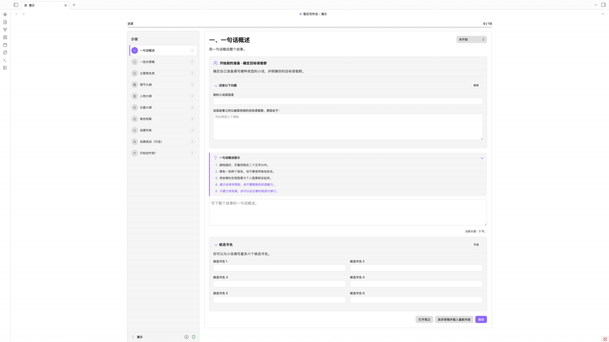</p>

<details>
<summary><strong>截图</strong></summary>

<p align="center"><sub>点击任意截图，即可查看完整分辨率的原图。</sub></p>

<table>
  <tr>
    <td width="50%" valign="top">
      <a href="assets/screenshots/step_01_cn.png">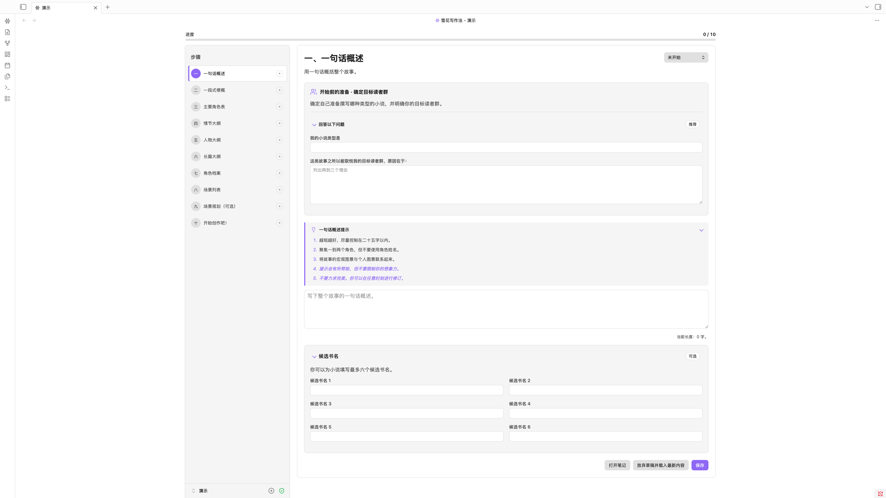</a><br />
      <strong>一、一句话概述</strong><br />
      <sub>确定目标读者，用一句话概括整个故事。</sub>
    </td>
    <td width="50%" valign="top">
      <a href="assets/screenshots/step_02_cn.png">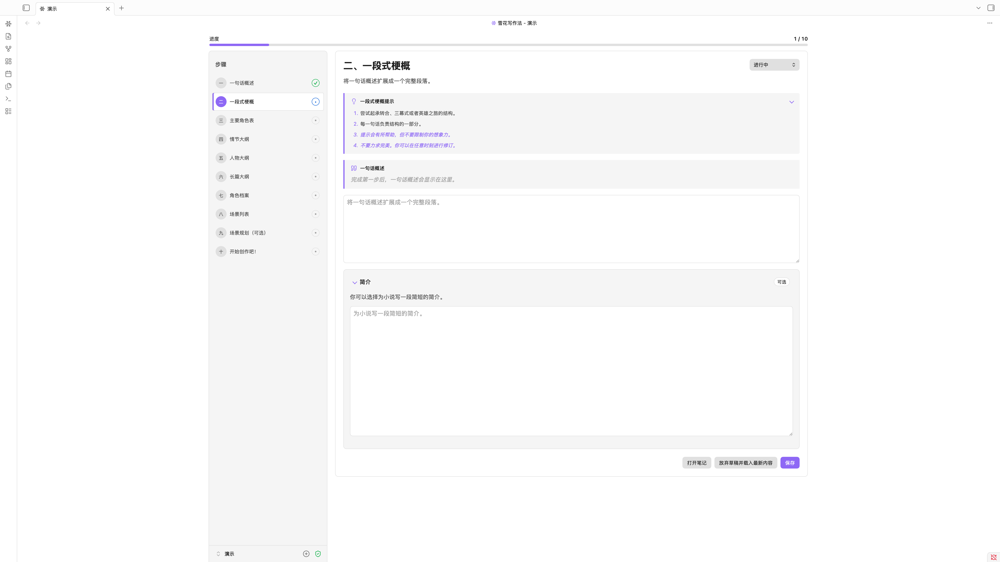</a><br />
      <strong>二、一段式梗概</strong><br />
      <sub>把核心构思扩展成紧凑的故事结构，还可以补充小说简介。</sub>
    </td>
  </tr>
  <tr>
    <td width="50%" valign="top">
      <a href="assets/screenshots/step_03_cn.png">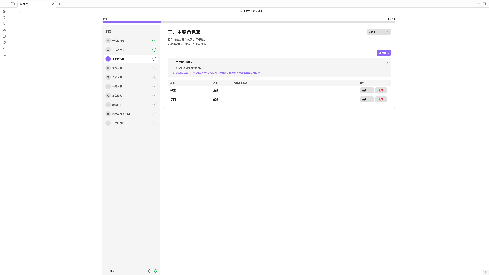</a><br />
      <strong>三、主要角色表</strong><br />
      <sub>记录主要角色的故事线、动机、冲突与成长。</sub>
    </td>
    <td width="50%" valign="top">
      <a href="assets/screenshots/step_04_cn.png">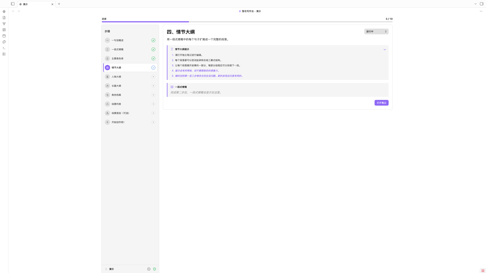</a><br />
      <strong>四、情节大纲</strong><br />
      <sub>把一段式梗概扩展成更完整、更连贯的故事情节。</sub>
    </td>
  </tr>
  <tr>
    <td width="50%" valign="top">
      <a href="assets/screenshots/step_05_cn.png">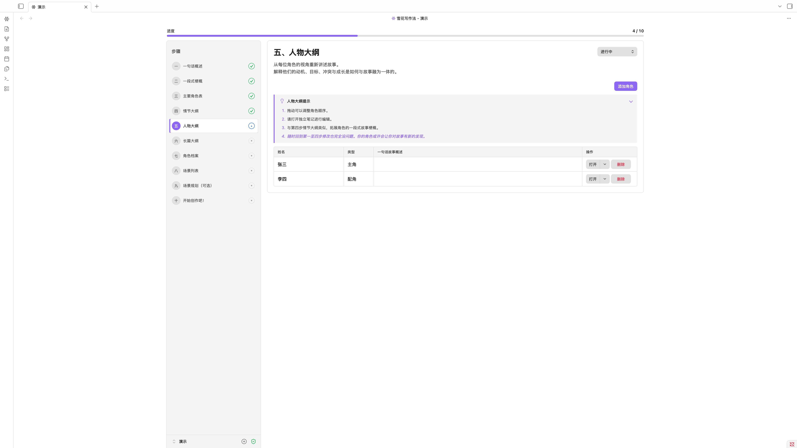</a><br />
      <strong>五、人物大纲</strong><br />
      <sub>从每位角色的视角重新讲述故事。</sub>
    </td>
    <td width="50%" valign="top">
      <a href="assets/screenshots/step_06_cn.png">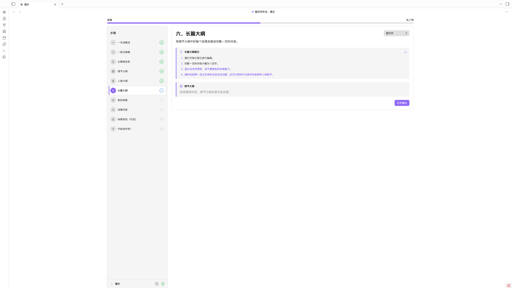</a><br />
      <strong>六、长篇大纲</strong><br />
      <sub>在单独的笔记里，把每个情节段落扩展成长篇内容。</sub>
    </td>
  </tr>
  <tr>
    <td width="50%" valign="top">
      <a href="assets/screenshots/step_07_cn.png">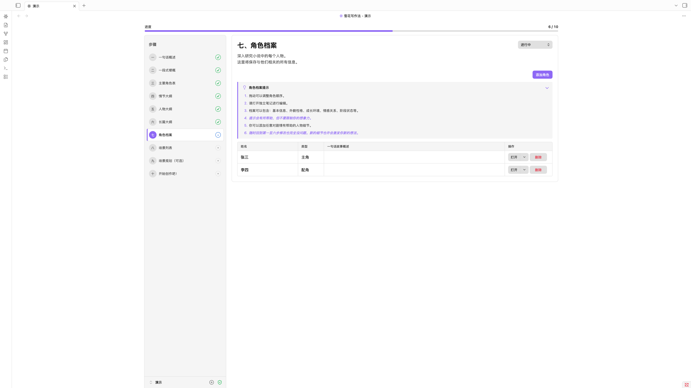</a><br />
      <strong>七、角色档案</strong><br />
      <sub>为小说里的每个人物维护一份详细、可复用的完整档案。</sub>
    </td>
    <td width="50%" valign="top">
      <a href="assets/screenshots/step_08_cn.png">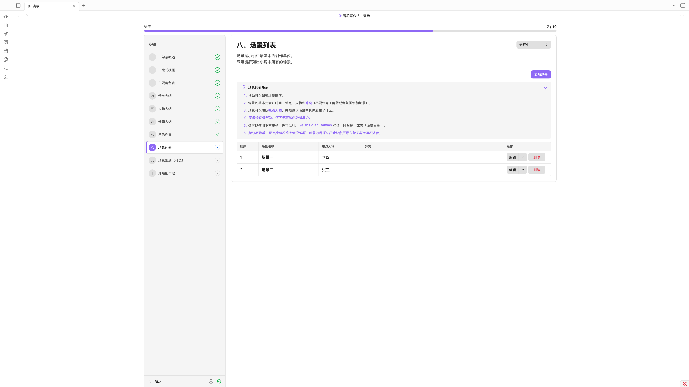</a><br />
      <strong>八、场景列表</strong><br />
      <sub>排好故事的场景，并为每个场景关联视点人物与核心冲突。</sub>
    </td>
  </tr>
  <tr>
    <td width="50%" valign="top">
      <a href="assets/screenshots/step_09_cn.png">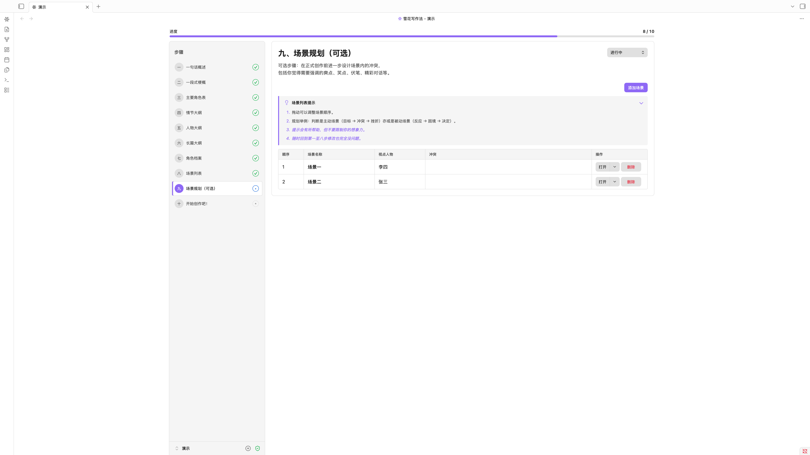</a><br />
      <strong>九、场景规划<em>（可选）</em></strong><br />
      <sub>进一步设计冲突、转折、节奏与令人难忘的场景细节。</sub>
    </td>
    <td width="50%" valign="top">
      <a href="assets/screenshots/step_10_cn.png">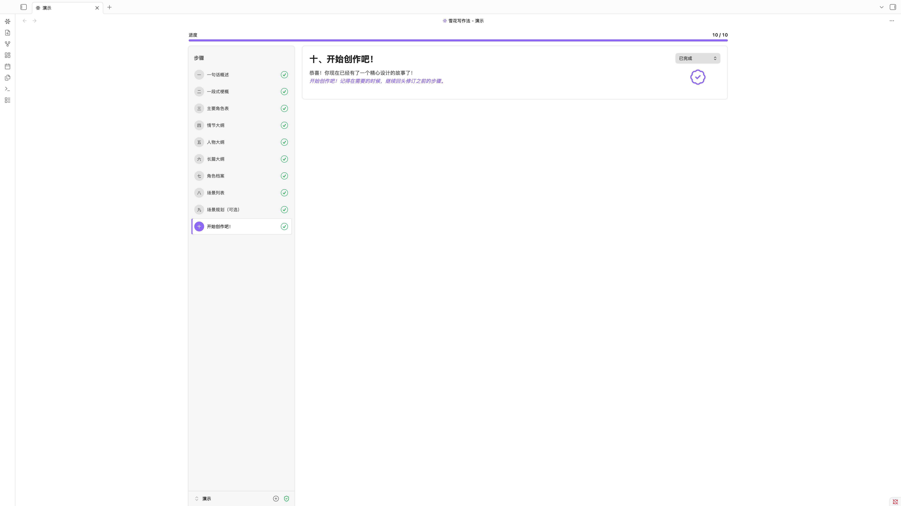</a><br />
      <strong>十、开始创作吧！</strong><br />
      <sub>带着完整的计划开始写初稿，前面的步骤也随时可以回去修改。</sub>
    </td>
  </tr>
</table>

</details>

### 世界观

角色和场景很少单独行动。时间、地点与物品笔记同样是项目成员，和角色、场景放在一起，共用同样的表格、表单与数据库视图。任何成员都可以写**状态**与**关系**记录行。记录行就是一句话，里面的关键词都是链接，以普通的 Markdown 标注块保存在笔记里。每条关系还会写明它指向哪篇笔记，因此两篇笔记之间始终有一条可以跳转的链接。

时间、地点与物品只是每个项目自带的种类。故事里还有什么需要记住，你都可以为它自建一个种类，比如门派、语言或某项技术。自建的种类有自己的文件夹、侧栏面板、表格、数据库视图，图标也由你挑选。除此之外，它和三个内置种类用起来完全一样。

记录行用到的词，来自每类成员的三份词表：类别、状态与关系。每份词表都以文件夹树的形式不断生长，每个词条都是一篇笔记。因此，指向词条的链接和其他链接一样正常解析，关系图里的词条也以自己的名字出现。侧栏的三个词表面板可以浏览、重命名和修剪这些树，所有引用都会随之保持有效。

除了每类成员共有的字段，笔记还可以带上你自己的**自定义字段**。每个字段由一个标题和标题下你写的内容组成，在成员表单里编辑，保存在笔记自己的区段里。把一组字段存为模板，它就会成为该种类模板文件夹里的一篇笔记，可以用来预填下一个角色、场景或门派。这些模板在侧栏的自定义字段面板里管理。任何表单上的导出按钮，都能把刚刚填好的字段直接存成模板。

### 故事结构

把所有场景摊开在眼前，才好判断它们的次序。**可视化工作区**会在单独的标签页中打开。你可以从工作台创作工具一组末尾的链接行进入，也可以用命令面板打开它。这里汇集了一组视图，展示的都是同一批场景，也就是你在第八步和第九步规划的那些。**场景看板**、**自由画布**、**时间线**与**节拍表**并列在标签栏上，每个视图都对这批场景提出一个不同的问题。

<p align="center"><a href="assets/screenshots/workspace_corkboard_cn.png">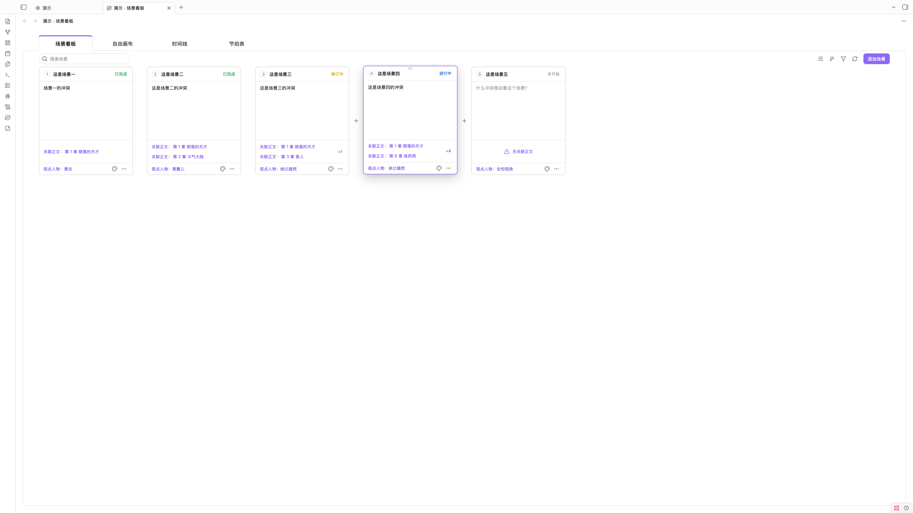</a></p>

场景看板把每个场景摆成一张卡片，按叙事顺序编号。卡片本身就是编辑的地方：名称直接在卡片上修改，视点人物和进度用下拉框选择，冲突写在文本框里。色板可以给卡片涂上八种颜色之一，场景关联的正文章节也能从卡片上打开。看板按普通顺序排列时，拖动卡片就能移动场景。两张卡片之间的 **+** 会恰好在那个位置插入新场景，**添加场景**则把新场景加在末尾。搜索框和漏斗用来筛选看板。**显示**可以调整卡片大小，也可以按八个字段中的任意一个分组。方向按钮则把整块看板按倒序显示。

<p align="center"><a href="assets/screenshots/workspace_freeform_cn.png">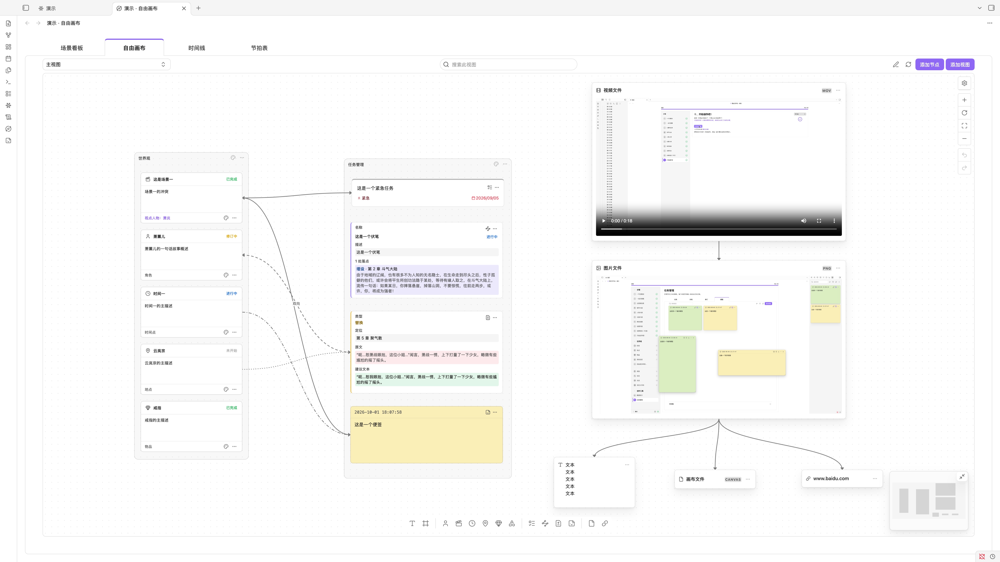</a></p>

**自由画布**则不再把卡片排成网格。一个视图就是一块空白画布，一个项目可以建任意多个。项目里的笔记与记录都能作为卡片放上去：角色、场景、时间、地点、物品、任务、伏笔、修订与便签。每种卡片都按它在自己工作区里的样子绘制。旁边还可以放直接在画布上输入的文字、项目里的任意文件，以及网页链接。从一张卡片拖到另一张，就连成一条线。线的两端都可以带箭头，线型有实线、虚线、点线与点划线。**分组**会把放进去的卡片收在一起，移动分组时，里面的卡片会跟着一起移动。拖动即可移动和调整大小。滚轮用来平移，按住 Ctrl 或 Cmd 再滚动则是缩放。底部一栏可以添加任何一种卡片。每个手势都有对应的菜单项或按键，每一步改动都可以撤销。双击卡片，就能打开它背后的笔记、记录或文件。画布只记下每样东西摆在哪里，以及你在画布上输入的文字，从不保存笔记的内容。工具栏末尾的白板按钮，会把当前视图导出为 Obsidian 白板文件。

<p align="center"><a href="assets/screenshots/workspace_timeline_cn.png">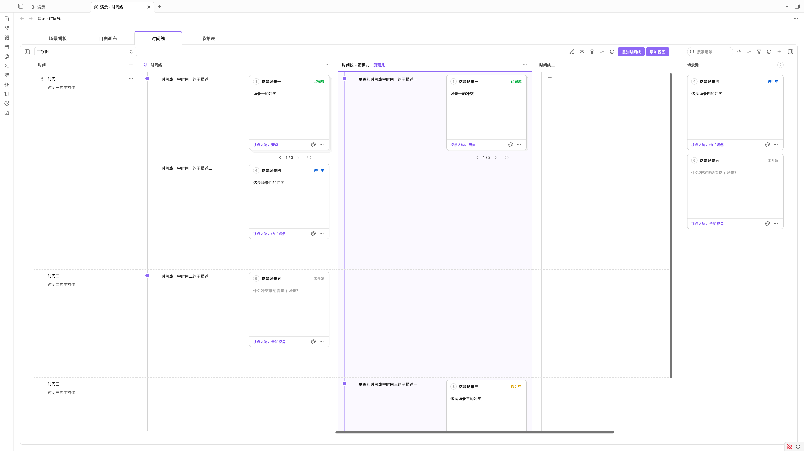</a></p>

**时间线**问的是另一个问题：不是场景按什么顺序读，而是它们在什么时候发生。每条时间线单独占一列。它跟随某个角色或世界观笔记时，就会绑定到那篇笔记上。左侧的时间列由所有时间线共用，它的每一行就是你写好的一篇时间笔记。在单元格里写下**子描述**，记下这条时间线在那个时间做了什么。场景则来自右侧的**场景池**，池里是当前时间线还没放置的场景。把卡片拖到某条子描述上，它就离开场景池，拖回去又会回到池中。每一次移动也都能用菜单完成，这里没有哪件事非用鼠标不可。**视图**决定哪些时间线并排显示。工具栏可以隐藏子描述、把场景堆叠成一张卡片、让最晚的时间排在最前，还能把时间列和场景池收进角落。工具栏末尾的白板按钮，会把当前视图导出为 Obsidian 白板文件。

<p align="center"><a href="assets/screenshots/workspace_beat_sheet_cn.png">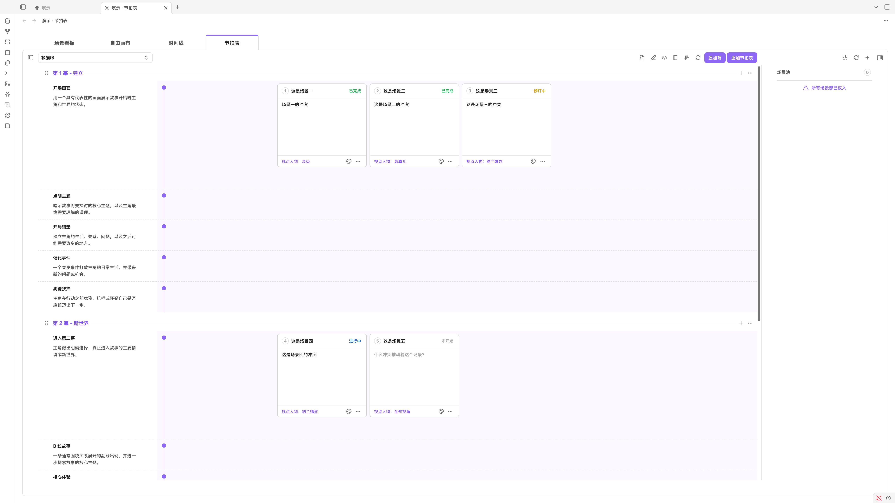</a></p>

**节拍表**问的是第三个问题：每个场景在故事的整体结构里起什么作用。一个项目可以保存任意多张节拍表，每次显示一张。新的节拍表可以从空白开始，也可以从模板开始。内置的模板有三幕式、起承转合、故事圈、救猫咪、英雄之旅和言情节拍。每个模板都带着幕和节拍，还有一句话说明每个节拍是做什么用的。幕按次序自动编号，你愿意的话，还可以再给它一个标签。节拍背后没有笔记，所以它的名称与描述就保存在节拍表里。在节拍下面，同样可以写子描述，并从场景池里放入场景，和时间线上完全一样。幕、节拍、子描述和场景都可以拖动，也都可以用菜单移动。工具栏可以隐藏子描述、堆叠场景、让最后一幕排在最前，还能把当前的节拍表存为你自己的模板。白板按钮会把当前节拍表导出为 Obsidian 白板文件。

**导出为 Obsidian 白板**会把你正在看的视图写成一个 `.canvas` 文件，用 Obsidian 自带的白板打开。文件放在工作区自己的文件旁边：`732_自由画布/<视图名称>.canvas`、`733_时间线/<视图名称>.canvas` 或 `734_节拍表/<节拍表名称>.canvas`。笔记会变成文件卡片，并保留各自的颜色。分组、时间线与幕会变成白板的分组。画布上输入的文字、子描述与节拍则变成文本卡片。工具栏上隐藏子描述、堆叠场景与倒序这几个开关只改变屏幕上的显示。白板里始终写出子描述，把场景放在它们旁边，并保持原本的顺序。任务、伏笔与修订不是笔记，所以各自变成一张写着名称的文本卡片，卡片之间的连线连同箭头与标签都会保留。写入后白板会立即打开。如果同名文件已经存在且内容不同，会先征求你的同意再替换。内容相同时不会重复写入，只会直接打开白板。这个文件是一份副本，插件不会读取它。你可以在白板里随意调整或删除它，工作区不受影响。

### 正文流

长篇小说按章节写更顺手，连起来读才像一本书。正文流让你两者兼得：每一章仍是本地一篇独立的 Markdown 笔记，整部正文读起来却像连续的一页。如果你用过 Scrivener，这就是它的 Scrivenings 模式，如今在 Obsidian 里也能用了。

<p align="center">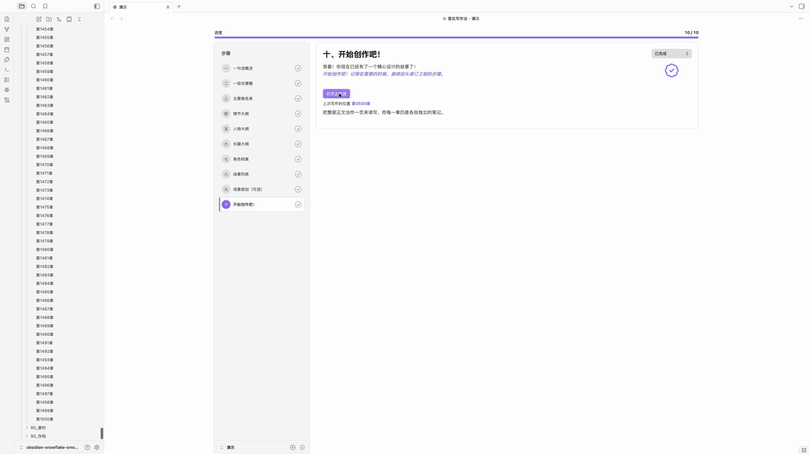</p>

在正文流里点击任意一章，它就会变成编辑视图。转到另一章时，它又回到阅读视图。你可以<em>（一）在两章之间插入新的一章，（二）在光标处把一章拆成两章，或（三）把下一章并入这一章。</em>

**打字机滚动**让正在写的那一行保持在页面中部。**专注模式**会淡化正在写的段落以外的一切，最深的一档「仅正文」会全屏只显示正文。两者在每一章的标题栏里各有一个按钮。用方向键也能让光标从一章移到下一章。

**版面由你来定。** 字体、字号、行高、正文宽度、段间距、首行缩进、对齐方式与自动连字符都可以设置。浅色和深色模式的背景底色可以分别指定，另外还有可以照着写的网格线。阅读和写作共用同一套排版，所以无论你是在读一章还是在写一章，版面都一样。工具栏里的排版按钮，会在正文上方直接打开同样的这些控件。

<p align="center"><a href="assets/screenshots/manuscript_typography_cn.png">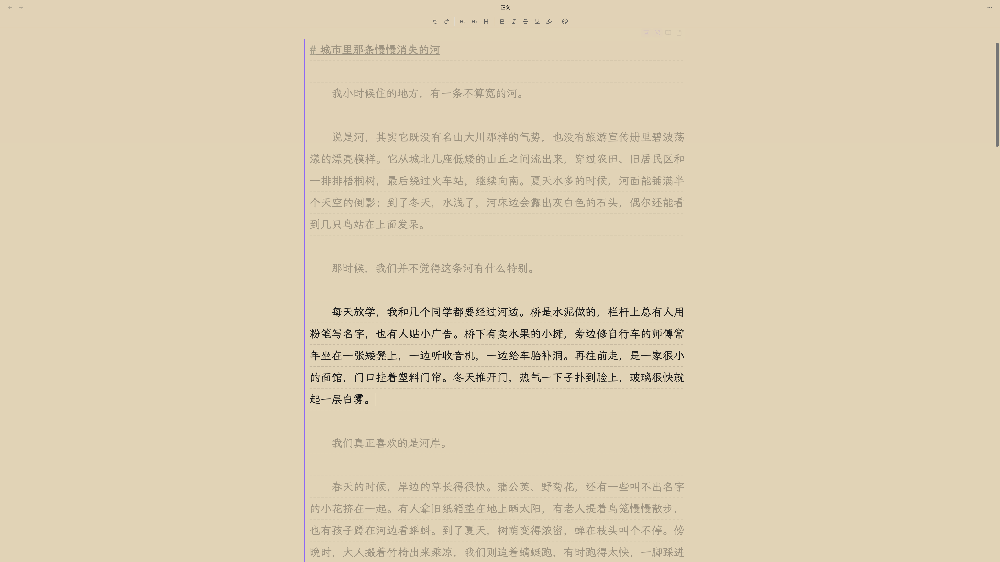</a></p>

**字数里程碑**会在页边标出累计字数，就标在达到每个间隔的那一行旁边，默认每五百字一处。它和状态栏使用同一套字数规则。可以按阅读顺序在整部正文中连续累计，也可以每章重新计数。里程碑会跟着你的写作走。一章变长时，它的里程碑随之移动。在整部正文模式下，后面每一章的里程碑也会一起移动。在设置的**字数里程碑**一节中开启。

**自动章节编号**会给新章节接上前一章之后的编号。在**自动章节编号**一节中选择样式：`第一章`、`第 1 章`或`Chapter 1`。也可以自己写一条规则，用简化格式（如`第{nnnn}章`或`Chapter {n}:`）或正则表达式都行。开启样式后，命名表单有两个字段：编号已经填好，名称由你来写。表单里还有一个开关，可以把新章节之后所有带编号的章节顺延一号。把带编号的一章并入前一章时，会给出相反的选项：把后面的章节各减一号，让编号重新连续。规则读不出编号的章节保持不动，你改写过标题的章节也会保留你的标题。

**纯文本导出**会把正文写入 Vault，并去掉所有 Markdown 与 Obsidian 标记。标题只留文字，链接只留显示文本，注释与块 ID 一并去除，HTML 实体还原成它所代表的字符。工具栏的导出按钮会导出整部正文。可以合成一个文件，章节之间用空行、一行短横线或三个星号分隔。也可以每章一个文件，放在按阅读顺序编号的文件夹里。每一章的标题栏各有两个按钮：一个只导出这一章，一个把同样的文本复制到剪贴板。文件默认保存到项目旁的 `Snowflake Export`，除非你在设置里另外指定了文件夹。扩展名为 `.txt` 或 `.md`，两者内容相同。每一行文字都是一个段落，是否缩进由你选择，段落之间的空行也由你决定保留还是去掉。目标位置已有文件时，只有在你同意后才会覆盖。

**书籍再长，各项操作也依然利落，平均不到 20 毫秒。** 实测环境是一个超过 9000 篇笔记的库。其中两个项目各有 1500 章，每章都在 2000 个英文单词或汉字以上。另一个项目有 300 个角色、3000 个场景，以及另外 1500 章。

### 任务管理

写作之外的事务，交给一块专门的面板。工作台的**任务管理**面板有四个标签页，每个标签页放一类写给自己的记录。

**任务**标签页把所有待办的事情放在一块看板上。看板共有六列，从待处理一直到已完成。你自己的任务是一张张卡片，写着标题、描述、优先级、截止日期，以及关联的实体。用标签页上的**添加任务**或命令面板中的**新建任务**来新建。卡片可以在同一列中拖动排序，也可以拖到另一列来改变状态。编辑、归档与删除都在卡片自己的菜单里。看板上的其余卡片由插件自动填写，每次读取都会重新算出。其中有每日、每周与每月的写作目标，会随着你写下的字数在各列之间推进。还有尚未了结的伏笔与修订，以及所指文字已被改动过的那些。此外还有无法归到某个实体名下的提及、你列出的敏感词，以及等着查看的便签。点击其中任意一张，就会打开它的来源标签页，并只显示它统计的那些内容。也可以用命令面板把这些卡片全部隐藏。看板上方的搜索会搜遍每一张卡片，也可以按类型、优先级与截止日期筛选。**已归档**折叠在看板下方，有自己的搜索，可以在那里恢复或删除卡片。

<p align="center"><a href="assets/screenshots/task_kanban_cn.png">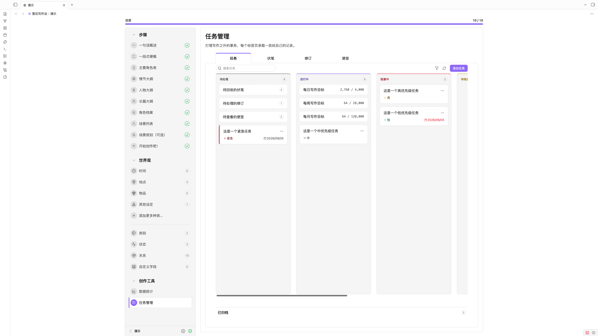</a></p>

**伏笔**追踪一条线索，从埋设一直到回收。在正文流中点进一章，选中埋下线索的文字，在右键菜单里选择**新建伏笔**。之后的段落用**加入已有伏笔**并入同一条线索。每一处都标为埋设、强化或回收，线索本身的状态则是计划中、进行中、已回收或已放弃。每一处落点都会在正文原处标出，并在章节右侧的页边留下一张卡片。卡片上写着环节、伏笔的状态、名称与描述、所标的文字，以及你自己的备注。落点会跟着它所指的文字走，你在它前后继续写作，它也不会走丢。如果你直接改写了那段文字，它只是变成锚点失效，而不会丢失，之后还可以接到替换后的段落上。标签页里每一处落点各占一行，可以按名称搜索，也可以按状态、环节或「仅锚点失效」筛选。

<p align="center"><a href="assets/screenshots/foreshadowing_cn.png">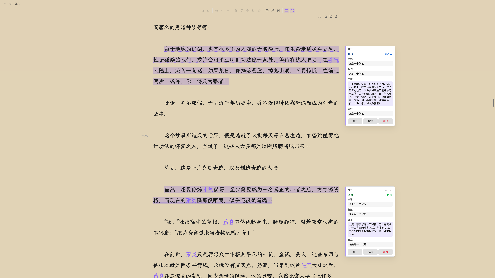</a></p>

**修订**让改动先摆在眼前看清楚，再落到纸上。选中要改的文字，在同一个右键菜单里选择**新建修订**。所选文字会成为一处替换，建议文本留空则成为一处删除，只放一个光标就在那里插入。将被改掉的文字会在原处划去，但这一章本身不会改变。在接受之前，这处修订也不计入字数、分析与追踪。每一处修订都是页边的一张卡片，写着原文、建议文本与备注。**接受**会把改动写进这一章，就像你亲手打出来的一样。**拒绝**会移除修订，让正文保持原样。**编辑**可以修改建议文本与备注。修订会跟着它所指的文字走。如果你直接改动了那段文字，它就会被标为冲突，只能丢弃，不能应用。

<p align="center"><a href="assets/screenshots/revision_cn.png">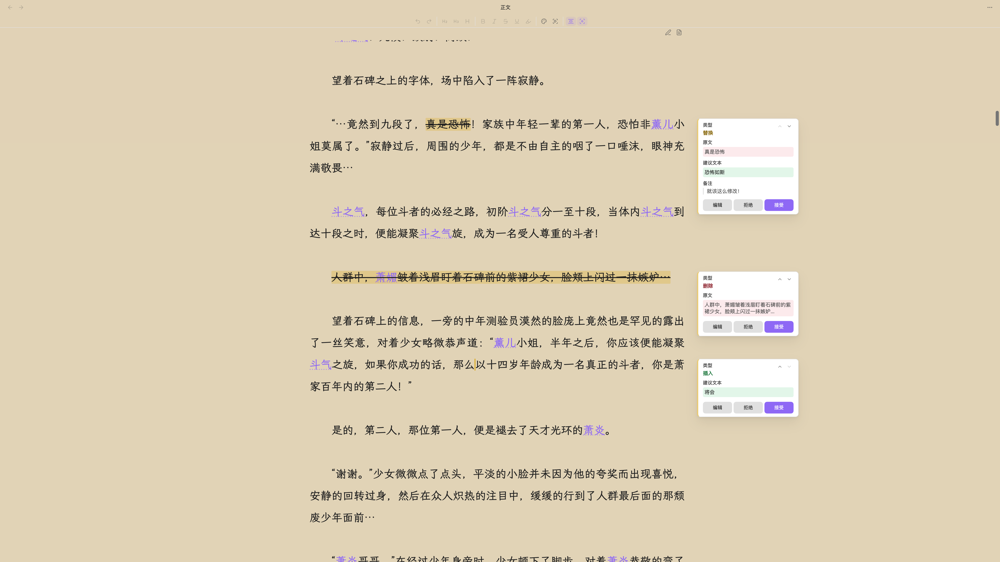</a></p>

**便签**用来放不必写进记录的东西：一个想法、一句提醒，或者一个稍后再回头看的问题。命令面板中的**新建便签**、功能区的便签图标和标签页上的**添加便签**，都会新建一张便签并立刻打开，可以直接写。每张便签都有两面：点击正文，就能用插件自带的编辑器书写，按 Escape 则切回渲染后的 Markdown 来阅读。同一个文件会同时以三种样子出现：工作台上的卡片、独立侧栏中的紧凑卡片，以及悬浮在工作区上方的面板。悬浮面板可以拖动标题栏来移动，可以从任意边缘调整大小，可以固定位置，也可以调淡，让底下的页面透出来。卡片上的同一个按钮，既能让便签浮起来，也能把它收回去。面板停在哪里，会按设备分别记住。专注模式从不淡化它，「仅正文」一档也一样。便签有八种颜色，一眼就能分辨。**归档**会把便签收进面板下方的折叠区，同时关闭它所有的悬浮面板。在折叠区里，可以阅读、恢复或删除便签。

<p align="center"><a href="assets/screenshots/sticky_note_cn.png">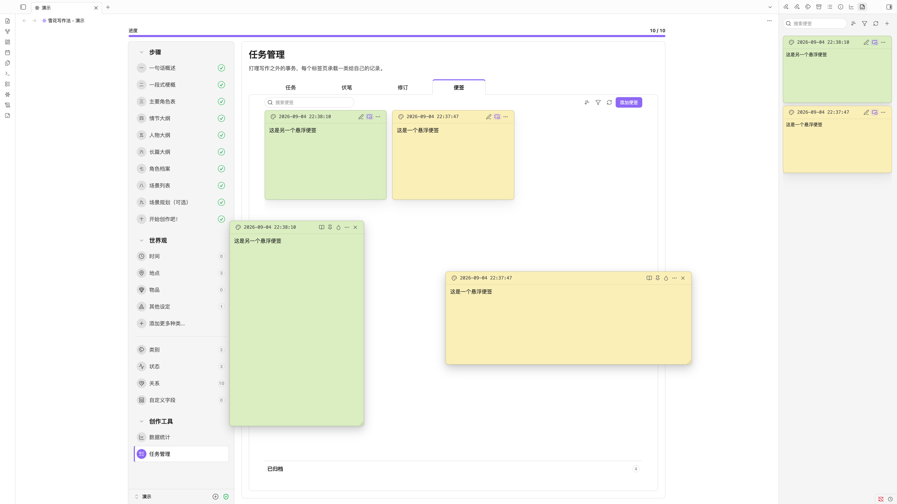</a></p>

### 数据统计

写作看得见，才更容易坚持下去。工作台的**数据统计**面板用数据回看项目，每个标签页回答一个问题。**写作时段**衡量时间，**正文分析**衡量正文本身，**实体追踪**则追踪正文写到了谁、写到了什么。

**写作时段**这一页负责计时。时段可以由你开启，也可以在进入专注模式时自动开始。没有开启时段时写下的字，同样会被记下。所以在正文里写了一上午，无论你是否记得开始计时，这些字都会算进这一天。只有写作时长，仍然只按时段计算。

<p align="center"><a href="assets/screenshots/data_statistics_01_cn.png">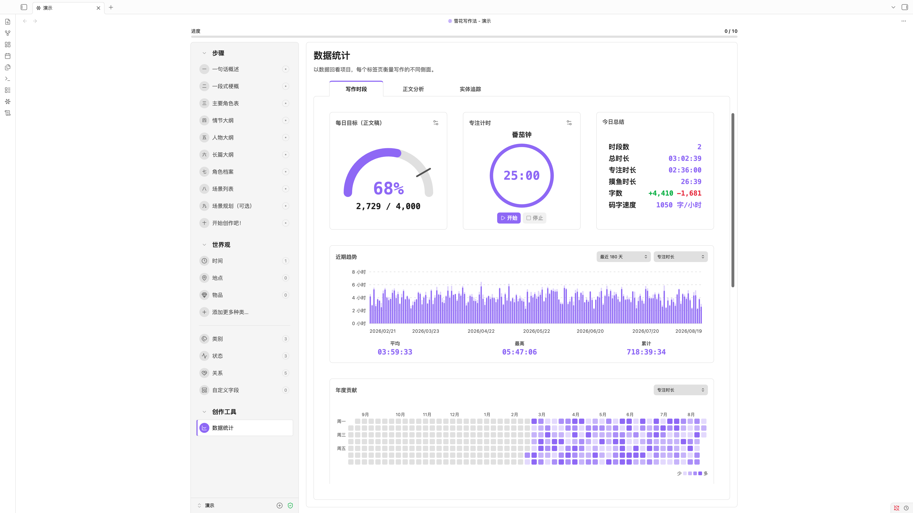</a></p>

<p align="center"><a href="assets/screenshots/data_statistics_02_cn.png">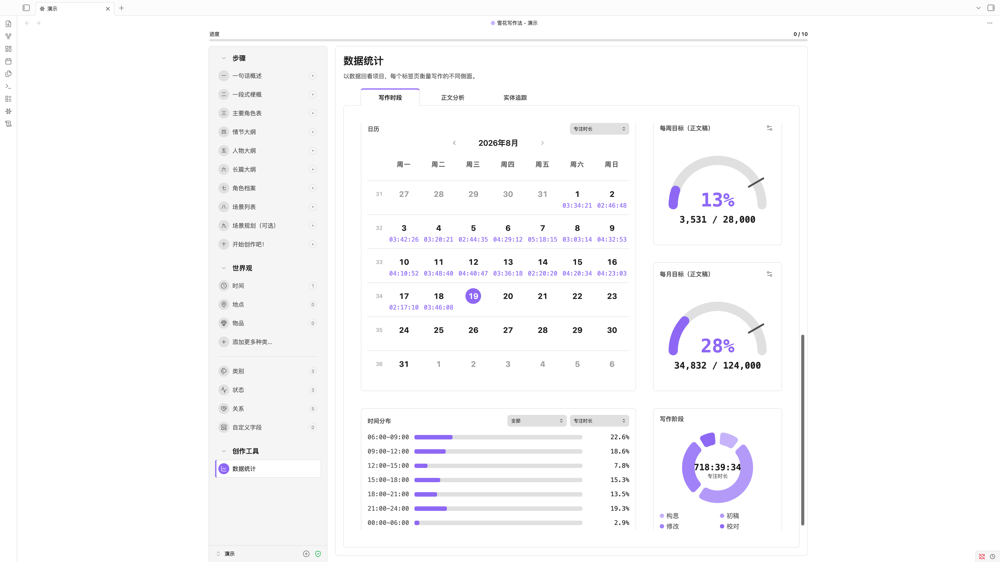</a></p>

**正文分析**着眼于草稿的文字本身。最上方列出总阅读时间、每章阅读时间、每章句数、每句字数，以及对话在全部文字中所占的比例。下面每一章各占一行，可以按标题搜索，也可以按篇幅筛选。**词频**统计词语本身并排出名次，还会用你最常用的词组成一片词云。停用词和你自己的角色、地点等名称默认不计入，需要时再勾选。中文以词为单位统计，而不是逐字计数。

<p align="center"><a href="assets/screenshots/prose_analysis_cn.png">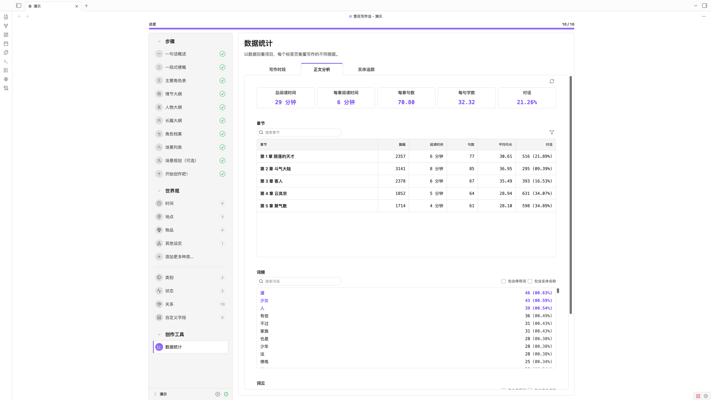</a></p>

**实体追踪**记录出场的人与物在全书中留下的足迹。正文写到的每一个角色、场景、时间、地点、物品，以及你自定义种类中的成员，都各占一行。每一行写着被提及了多少次、其中多少处已经是链接、首次与末次提及在哪一章，还有一条把整本书浓缩成一行的分布线。展开一行，就能看到每一处提及，按章节归在一起，并带着前后的句子。点击其中一处，就会跳到正文中的那个位置。你列出的敏感词、按章节统计的对话、无法确定属于哪一位成员的提及，以及你写下的忽略规则，也各有一节。

<p align="center"><a href="assets/screenshots/entity_tracking_1_cn.png">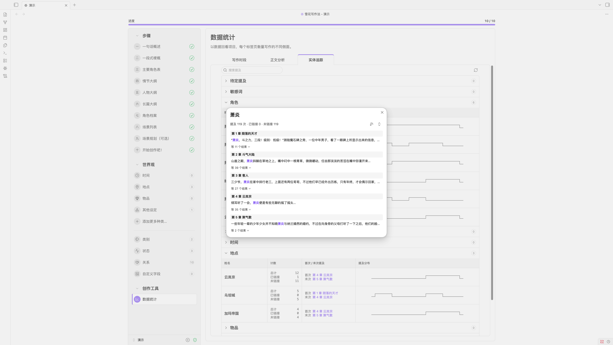</a></p>

**同样的追踪结果也会直接给正文着色。** 用纯文本写下的名字会在原处标出，已经写成链接的名字则按链接本身的样式标出。右键可以把纯文本的那一处转成链接，也可以忽略它：只忽略这一处、在本章忽略，或在它出现的所有地方忽略。工具栏的高亮菜单里有这些开关。实体的高亮可以选首次提及、未链接的提及或全部提及。敏感词、对话和你自定义的**高亮规则**也各有一个开关。规则可以用文本或正则表达式来写，颜色与装饰由你来选。

<p align="center"><a href="assets/screenshots/entity_tracking_2_cn.png">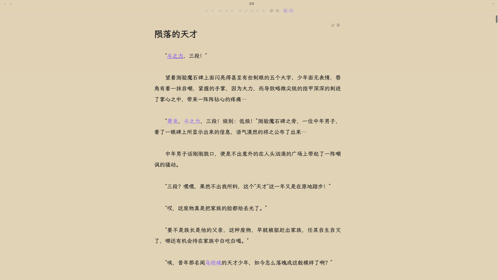</a></p>

## 安装

除非有特别的理由，建议从社区插件市场安装。这样装上的是经过审核的发布版本，也能跟上 Obsidian 自身的更新。BRAT 和手动安装则留给测试版本，以及不自行安装任何东西的 Vault。

### 社区插件市场（推荐）

1. 在 Obsidian 中打开 **设置 → 第三方插件**。
2. 选择 **浏览**，搜索 **Snowflake Method（雪花写作法）**。
3. 选择 **Snowflake Method**，点击 **安装**，然后启用插件。

### BRAT

1. 安装 [BRAT](https://github.com/TfTHacker/obsidian42-brat)。
2. 选择 **Add beta plugin**，输入 `ZzPoLariszZ/obsidian-snowflake-method`。
3. 在 **第三方插件** 中启用 **Snowflake Method（雪花写作法）**。

### 手动安装

1. 从[最新的发布版本](https://github.com/ZzPoLariszZ/obsidian-snowflake-method/releases/latest)下载 `main.js`、`manifest.json` 和 `styles.css`。
2. 创建文件夹 `<仓库>/.obsidian/plugins/snowflake-method/`。
3. 把这三个文件复制到这个文件夹里。
4. 重载 Obsidian，然后在 **第三方插件** 中启用 **Snowflake Method（雪花写作法）**。

### 升级

更新插件本身绝不会改写你的笔记。插件生成的文件会自己保持最新。工作台第一次显示一个项目时，会悄悄把 `00_系统` 下的系统模板和项目元数据笔记上的版本戳更新到当前版本。你自己写的笔记，只有在你点了一个按钮之后才会改变。只要其中有一篇出自旧版本，工作台就会显示「较旧的项目格式」，并注明有几篇。点击「更新」，一次就能把它们全部更新到当前版本。这个操作是安全的，可以重复执行。

## 指南

1. 打开命令面板，运行 **打开项目管理器** 命令。
2. 在项目管理器中选好项目根目录和语言，输入项目名称，然后创建项目。
3. 打开项目工作台，先从目标读者问题和一句话概述入手。
4. 某一步对你已经够用时，就把它标记为完成。故事有了变化，随时可以回来修改。
5. 篇幅较长的笔记，可以在工作台旁的固定分栏中打开，也可以在普通标签页中打开。
6. 计划就绪后，在第十步打开正文流，把整部小说当作连续的一页来写。

## 命令

| 命令 | 用途 |
|---|---|
| 添加角色 | 在当前项目中添加一篇共享的角色笔记。 |
| 添加场景 | 在当前项目中添加一篇共享的场景笔记。 |
| 添加伏笔 | 在当前项目中添加一条伏笔线索。 |
| 添加世界观笔记 | 在你选定的世界观种类下添加一篇笔记。 |
| 创建世界观种类 | 新增一类世界观笔记，带有自己的文件夹、面板和词表。 |
| 添加类别 | 在某个种类的词表中添加一个类别。 |
| 添加世界状态 | 在某个种类的词表中添加一种世界状态。 |
| 添加关系 | 在某个种类的词表中添加一种关系。 |
| 创建项目 | 创建一个新的 Markdown 原生雪花写作项目。 |
| 打开工作台 | 打开或显示当前项目的工作台。 |
| 打开健康检查器 | 检查项目结构，并修复可以安全修复的问题。 |
| 更新旧格式的笔记 | 更新所有由旧版本写下的笔记。 |
| 打开项目管理器 | 用来创建、重命名、打开、归档项目，或者把项目移入回收站。 |
| 打开角色数据库 | 打开当前项目角色的 Bases 视图。 |
| 打开场景数据库 | 打开当前项目场景的 Bases 视图。 |
| 打开世界观数据库 | 打开你选定的世界观种类的 Bases 视图。 |
| 打开可视化工作区 | 在独立的工作区中打开当前项目的故事结构。 |
| 打开场景看板工作区 | 打开可视化工作区的场景看板。每个场景是一张卡片，按叙事顺序排列。 |
| 打开自由画布工作区 | 打开可视化工作区的自由画布。笔记、记录、文件和文字都作为卡片摆在上面，可以连线和分组。 |
| 打开时间线工作区 | 打开可视化工作区的时间线。场景按发生的时间排开。 |
| 打开节拍表工作区 | 打开可视化工作区的节拍表。场景归在各幕和各个节拍之下。 |
| 打开正文流 | 打开正文，并定位到你上次写作的那篇笔记。 |
| 关闭正文流 | 关闭当前分栏中的正文流。 |
| 前往上一篇正文笔记 | 在正文中跳到前一篇。 |
| 前往下一篇正文笔记 | 在正文中跳到后一篇。 |
| 回到打开正文流的位置 | 回到你打开正文流时所在的那篇笔记。 |
| 在这一篇之前插入正文笔记 | 在你正在读的这一篇前面新增一篇。 |
| 在这一篇之后插入正文笔记 | 在你正在读的这一篇后面新增一篇。 |
| 在光标处拆分正文笔记 | 从光标处把正在写的笔记一分为二。 |
| 退出当前正文笔记的编辑 | 让页面正中的那一篇退出写作状态，回到渲染后的样子。 |
| 导出正文为纯文本 | 把整部正文导出为纯文本，写进导出文件夹。 |
| 将当前正文笔记导出为纯文本 | 把页面正中的这一篇导出为纯文本，写进导出文件夹。 |
| 复制当前正文笔记为纯文本 | 去掉页面正中这一篇的所有标记，再放到剪贴板。 |
| 按选项开始写作时段 | 先选好计时方式、时长和写作阶段，再开始。 |
| 开始正计时写作时段 | 开始一个时段，直到你停止才结束。 |
| 开始倒计时写作时段 | 开始一个时段，倒计时走完就结束。 |
| 开始番茄钟写作时段 | 开始一个时段，工作和休息交替进行。 |
| 暂停或继续写作时段 | 让进行中的时段暂停计时，或者接着计时。 |
| 停止写作时段 | 结束进行中的时段，并写下这次的记录。 |
| 打开写作时段侧边栏 | 在独立的侧栏中查看当天的写作数据。 |
| 新建任务 | 在当前项目的任务看板上添加一条任务。 |
| 新建便签 | 在当前项目中新建一张便签，并在悬浮面板中打开它。 |
| 打开便签侧边栏 | 在独立的侧栏中打开当前项目的便签。 |
| 切换数据统计范围 | 让统计范围在整个项目和仅正文稿之间切换。 |
| 切换写作时段外的字数记录 | 开启或关闭写作时段以外的字数记录。 |
| 统计项目字数 | 报告当前项目的字数，整个项目和仅正文稿各给出一份。 |
| 将专注模式设为关／开／深度／仅正文 | 每一档各有一条命令，直接切到那一档专注深度。 |
| 切换打字机滚动 | 让正在写的一行保持在页面中部。 |
| 切换自定义高亮 | 让你自己的高亮规则在正文中生效，或者暂时收起来。 |
| 切换正文中的笔记路径 | 显示或隐藏每篇正文笔记的存放位置。 |
| 切换正文中的顺序编号 | 显示或隐藏每篇正文笔记为自己记下的位置。 |
| 切换托管区段边界保护 | 临时开启或关闭同步标记的编辑保护。 |
| 切换在工作台旁打开笔记 | 在固定分栏和普通标签页之间选择。 |
| 切换工作台导航栏 | 把工作台旁的导航栏收成一列图标，或者重新展开。 |
| 切换从字段新建笔记时是否打开表单 | 从字段新建笔记时，选择先打开表单还是直接创建。 |
| 切换表格中的进度状态 | 显示或隐藏表格中名称下方的进度状态。 |
| 切换表格中的操作列 | 显示或隐藏每行的操作列。 |
| 切换任务看板中的派生任务 | 显示或隐藏插件根据你的写作派生出的卡片。 |
| 切换减少动画模式 | 在动画效果和减少动态效果之间切换。 |
| 切换自由模式 | 隐藏十个步骤和进度，或者让它们重新显示。 |

与正文相关的命令，只有当前视图是正文流时才能使用。其中**在光标处拆分正文笔记**还要求有一篇笔记正处于写作状态。两条针对当前笔记的命令，作用于页面正中的那一篇。

## 设置

| 设置 | 默认值 | 用途 |
|---|---|---|
| 项目根目录 | Vault 根目录 | 选择存放项目的父文件夹，路径相对于 Vault。 |
| 界面语言 | 跟随项目 | 跟随当前项目或 Obsidian，也可以固定为英文或简体中文。 |
| 默认项目语言 | 系统语言 | 新建项目时，模板使用哪种语言。 |
| 自由模式 | 关闭 | 隐藏十个步骤和进度。角色和场景会并入世界观列表。 |
| 在工作台旁打开笔记 | 开启 | 长篇笔记都在工作台旁的同一个固定分栏里打开。 |
| 减少动画 | 关闭 | 用静态的视觉效果代替动画。 |
| 保护托管区段边界 | 开启 | 防止同步标记被意外修改。 |
| 在表格中显示进度状态 | 关闭 | 在成员表格中，把每条笔记的进度状态显示在名称下方。 |
| 在表格中显示操作列 | 开启 | 每一行的操作按钮都始终显示。 |
| 从字段新建笔记 | 打开它的表单 | 从字段新建笔记时，选择先打开表单还是直接创建。 |
| 保持载入的笔记数 | 5 | 在你正在读的笔记前后，各保持载入这么多篇正文笔记。 |
| 显示笔记路径 | 开启 | 在正文笔记上方显示它的存放位置。 |
| 显示顺序编号 | 关闭 | 显示笔记记下的编号，这个编号决定它在正文中的阅读位置。 |
| 打字机滚动 | 开启 | 让正在写的一行保持在页面中部。 |
| 专注模式 | 关 | 淡化正在写的段落以外的一切。选「仅正文」这一档时，全屏只显示正文。 |
| 高亮提及 | 实体与对话关闭，其余开启 | 标出实体的名称和别名、敏感词、对话，以及你自己的规则。四者各有一个开关。实体还可以只标首次提及，或只标还没写成链接的提及，也可以全部标出。 |
| 自动配对括号与引号 | 开启 | 在正文中输入括号或引号时，自动补全另一半。 |
| 自动配对 Markdown 语法 | 开启 | 在正文中输入加粗、斜体等标记时，自动补全另一半。 |
| 回车开始新段落 | 开启 | 按回车会在段落之间多留一个空行。按 Shift+回车则在段内换行。 |
| 显示字数里程碑 | 关闭 | 字数每达到一个间隔，就在那一行旁边标出字数。 |
| 里程碑模式 | 按章节 | 在整部正文中连续累计，或者每篇笔记重新计数。 |
| 里程碑间隔 | 500 | 相邻两个里程碑之间的字数。 |
| 编号样式 | 关闭 | 新章节接着前一章的编号往下编。可选中文（第一章）、中文加阿拉伯数字（第 1 章）或英文（Chapter 1）。也可以用简化格式或正则表达式写自定义规则。 |
| 字体 | 跟随主题 | 选择正文使用的字体。新装的字体要重启 Obsidian 后才能看到。 |
| 字号 | 跟随主题 | 调整正文文字的大小。 |
| 行高 | 跟随主题 | 调整正文行与行之间的间距。 |
| 正文宽度 | 跟随主题 | 设置正文内容的最大宽度。 |
| 段间距 | 1 行 | 调整段落之间的间距。 |
| 首行缩进 | 无 | 设置每段开头的缩进。 |
| 文本对齐 | 两端对齐 | 选择段落文字的对齐方式。 |
| 自动连字符 | 关闭 | 在行末自动断开长单词。 |
| 浅色模式背景 | 跟随主题 | 选择浅色模式下正文的背景颜色。 |
| 深色模式背景 | 跟随主题 | 选择深色模式下正文的背景颜色。 |
| 网格线 | 无 | 在正文内容后面显示辅助线。 |
| 字数统计规则 | 微软 Word | 按哪一种工具的规则统计字数。 |
| 标题计入字数 | 仅忽略第一个一级标题 | 标题行算不算进写作字数。 |
| 专注计时方式 | 番茄钟 | 新时段默认使用哪种计时方式。 |
| 多久算摸鱼 | 60 秒 | 多少秒没有编辑，专注就转为摸鱼。 |
| 写作阶段 | 初稿 | 新时段默认处于哪个写作阶段。 |
| 开启专注模式时开始正计时时段 | 开启 | 进入专注模式时，自动开始一个时段。 |
| 在写作时段之外记录字数 | 开启 | 没开写作时段时写下的字数，也照样记录。和时间有关的统计仍然只来自写作时段。 |
| 数据统计范围 | 整个项目 | 写作统计显示哪一部分的字数。 |
| 每日目标：整个项目 | 6000 | 整个项目每天要净增多少字。设为 0 就关闭这个目标。 |
| 每日目标：仅正文稿 | 4000 | 正文稿每天要净增多少字。设为 0 就关闭这个目标。 |
| 每周起始日 | 周一 | 写作统计中每周从哪一天开始。 |
| 日期格式 | YYYY/MM/DD | 写作统计中日期的书写格式。 |
| 阅读速度（词/分钟） | 250 | 正文分析估算阅读时间时，按每分钟读多少个词来算。 |
| 阅读速度（字/分钟） | 400 | 正文分析估算阅读时间时，按每分钟读多少个中日韩文字来算。 |
| 自定义停用词 | 无 | 内置词表之外，词频统计还要排除的词。每行一个。 |
| 自定义敏感词 | 无 | 实体追踪要留意并统计的词。每行一个。 |
| 对话引号样式 | 四种全部开启 | 哪些引号算作一段对话的开头：“ ”、" "、「 」和『 』。 |
| 自定义高亮规则 | 无 | 你自己定的规则，用文本或正则表达式来写，颜色和装饰都由你选。 |
| 导出文件夹 | 项目旁的 Snowflake Export | 导出文件存放的文件夹。不能设为项目内部的文件夹。 |
| 导出格式 | 纯文本（.txt） | Markdown（.md）或纯文本（.txt）。两种格式内容相同，所有 Markdown 和 Obsidian 标记都会被去掉。 |
| 保留首行缩进 | 开启 | 保留段落的首行缩进。 |
| 保留段落间空行 | 关闭 | 保留段落之间的空行。 |
| 布局 | 一个文件 | 把正文导出为一个文件，或者每篇笔记各导出一个文件。 |
| 笔记之间 | 空行 | 导出为一个文件时，笔记之间用什么分隔：空行、一行短横线或三个星号。 |

## 隐私

Obsidian 雪花写作法采用本地优先的设计。项目文件和插件设置都留在你的 Vault 里，插件不会向外传送你的创作内容或配置。

- 不需要注册账号、订阅，也不需要连接外部服务。
- 插件不会发起网络请求，也不包含 AI 服务、遥测或数据分析。自由画布上的网页链接只显示网址，不会抓取任何内容。
- 项目用的都是 Obsidian 兼容的文件。停用插件后，内容照样可以正常阅读和编辑。

## 结构

每个项目都保存为所选项目根目录下的一个直接子文件夹。文件夹、文件名和初始笔记，会按创建项目时选择的语言本地化。

<details>
<summary>中文项目结构示例</summary>

```text
<项目根目录>/
└── 我的小说/
    ├── 00_系统/
    │   ├── 001_项目元数据.md
    │   └── ...
    ├── 10_概述/
    │   ├── 11_一句话概述.md
    │   └── ...
    ├── 20_角色/
    │   ├── 21_类别/
    │   │   └── 主角/
    │   │       └── 主角.md
    │   ├── 24_自定义字段/
    │   │   └── 年龄.md
    │   └── 角色总览.base
    ├── 30_大纲/
    ├── 40_场景/
    │   └── 场景总览.base
    ├── 50_正文/
    │   ├── 初稿.md
    │   └── 第一部/
    │       └── 第一章.md
    ├── 60_世界观/
    │   ├── 61_时间/
    │   ├── 62_地点/
    │   ├── 63_物品/
    │   └── 64_门派/
    ├── 70_工具/
    │   ├── 71_数据统计/
    │   │   ├── 711_写作时段/
    │   │   │   └── 2026/
    │   │   │       └── 2026_08_<设备>_writing_session.json
    │   │   ├── 712_正文分析/
    │   │   │   └── <设备>_analysis_stats.json
    │   │   └── 713_实体追踪/
    │   │       ├── mention_ignores.json
    │   │       └── <设备>_mention_index.json
    │   ├── 72_任务管理/
    │   │   ├── 721_任务/
    │   │   │   └── tasks.json
    │   │   ├── 722_伏笔/
    │   │   │   └── foreshadowing.json
    │   │   ├── 723_修订/
    │   │   │   └── revisions.json
    │   │   └── 724_便签/
    │   │       └── 20260904T223121.847+0800.md
    │   └── 73_可视化/
    │       ├── 732_自由画布/
    │       │   ├── freeform-view-<id>.json
    │       │   ├── freeform.json
    │       │   └── <视图名称>.canvas
    │       ├── 733_时间线/
    │       │   ├── timeline.json
    │       │   └── <视图名称>.canvas
    │       └── 734_节拍表/
    │           ├── beat-sheet.json
    │           └── <节拍表名称>.canvas
    └── ...
```

</details>

写作时段按设备分开记录，这样同步时就不会有两台机器争着写同一个文件。实体追踪中写下的忽略规则、你提出的修订和你追踪的伏笔，各自存为一个共享文件，跟着 Vault 走。每张便签都是单独的一个 Markdown 文件。便签的悬浮面板停在哪里，按设备分别记住，不写进笔记。旁边的实体索引和正文统计是缓存，不是记录。它们缺失或过期时，插件都会从正文重新建立。所以就算删掉它们，代价最多也就是插件把全书重读一遍的时间。

归档一个项目，会把它的整个文件夹移进 `Snowflake Archive`。这个文件夹和各个项目放在同一层，不在任何项目里面。笔记本身不会有任何改动。项目的所有引用都在它自己的文件夹内，所以归档期间不会留下任何断链。项目管理器会列出归档里的项目，你随时可以取回。如果原来的名称已被占用，会给它换一个还没被用过的名称。手动把文件夹移进或移出，效果完全一样。归档只是一个存放位置，背后没有别的机制。

导出会把纯文本文件写进 `Snowflake Export`。它和归档文件夹一样，与各个项目放在同一层。如果你在设置里另指定了一个项目之外的文件夹，就会写到那里。以前导出过、后来又从正文中移走的笔记，它导出的文件不会被删除。导出为 Obsidian 白板是唯一的例外，它的文件会放在项目内工作区自己的文件旁边，如上面的目录所示。

正文可以只有一篇笔记，也可以有很多篇，文件夹怎么组织都行。每篇笔记都用 `snowflake-manuscript-sequence` 记下自己的位置，所以移动或重命名笔记，都不会改变它的阅读顺序。正文流会按这个顺序，把它们连成一整页来显示。

工作台只同步一对托管区段边界之间的文字：

```markdown
<!-- snowflake:section:one-sentence-summary:start -->
这里的创作内容可以正常编辑。
<!-- snowflake:section:one-sentence-summary:end -->
```

这些 HTML 注释是结构标记，不是正文内容。边界保护默认开启，防止标记行被意外修改。标记之间的内容会和工作台同步。标记之外的 Markdown 始终由你自己管理，插件不会替换。如果标记缺失、重复、顺序颠倒或互相重叠，插件会报告问题，并停止不安全的写入。

## 路线图

- [x] 取得 Randy Ingermanson 或 Advanced Fiction Writing 的书面授权，以便本插件使用雪花写作法这一名称（已于 2026 年 9 月通过邮件获得授权）
- [ ] 加入《How to Write a Novel Using the Snowflake Method》第 20 章中的创作示例（另行沟通）
- [x] 十步引导工作台 (0.1.0)
- [x] Obsidian 原生项目 (0.1.0)
- [x] 中英双语 (0.1.0)
- [x] 修订提醒 (0.1.0)
- [x] 安全修复 (0.1.0)
- [x] Bases 视图 (0.2.0)
- [x] 正文流 (0.4.0)
- [x] 打字机滚动 (0.5.0)
- [x] 专注模式 (0.5.0)
- [x] 笔记正文中的字段 (0.7.0)
- [x] 世界观 (0.8.0)
- [x] 自定义字段 (0.9.0)
- [x] 项目归档 (0.10.0)
- [x] 自由模式 (0.10.0)
- [x] 写作时段 (0.11.0)
- [x] 数据统计 (0.11.0)
- [x] 自定义排版 (0.13.0)
- [x] 实体追踪 (0.14.0)
- [x] 正文分析 (0.14.0)
- [x] 修订 (0.15.0)
- [x] 任务管理面板 (0.15.0)
- [x] 字数里程碑 (0.16.0)
- [x] 自动章节编号 (0.16.0)
- [x] 纯文本导出 (0.16.0)
- [x] 伏笔 (0.17.0)
- [x] 便签 (0.17.0)
- [x] 任务看板 (0.18.0)
- [x] 可视化工作区 (0.19.0)
- [x] 场景看板 (0.19.0)
- [x] 时间线 (0.20.0)
- [x] 节拍表 (0.21.0)
- [x] 自由画布 (0.22.0)
- [x] 将可视化工作区导出为 Obsidian Canvas (0.23.0)

## 开发

### 环境要求

- Node.js 20 或更高版本
- 支持 lockfile 的 npm
- 一个用来测试打包插件的独立开发 Vault，以及 Obsidian 1.13.0 或更高版本

目前的持续集成在 Ubuntu 上分别用 Node.js 20、22 和 24 验证项目。

### 初始化

```sh
git clone https://github.com/ZzPoLariszZ/obsidian-snowflake-method.git
cd obsidian-snowflake-method
npm ci
```

`npm ci` 会严格按照 `package-lock.json` 安装依赖。生成的 `main.js` 是构建产物，不要直接编辑。

### 命令

| 命令 | 用途 |
|---|---|
| `npm run dev` | 监听 TypeScript 源文件，生成带内联 source map 的 `main.js`。 |
| `npm test` | 把完整的 Vitest 测试套件运行一次。 |
| `npm run test:watch` | 开发时以监听模式运行 Vitest。 |
| `npm run build` | 做类型检查，并生成不带 source map 的压缩生产构建。 |
| `npm run lint` | 对整个仓库运行 ESLint。 |
| `npm run check` | 依次运行测试、生产构建和 lint，这三项是提交前必须通过的。 |

所有准备提交审核的 commit，都应该先通过 `npm run check`。要在 Obsidian 中做本地测试，就把生成的 `main.js` 和 `manifest.json`、`styles.css` 一起放进 `<仓库>/.obsidian/plugins/snowflake-method/`，再重载 Obsidian。请使用单独的开发 Vault，不要直接用存放正式作品的 Vault。

### 持续集成

每次 push 和 pull request，都会在所有受支持的 Node.js 版本上运行测试、构建和 lint。只有整个矩阵全部通过，修改才适合合并。CI 会从源代码重新生成分发包，不把本地生成的构建产物当作验证依据。

### 发布流程

1. 从 `main` 分支的干净工作区开始，先确认 `npm run check` 已经通过。
2. 按语义化版本的规则，运行 `npm version patch -m "chore: release %s"`，或者把 `patch` 换成 `minor`、`major`。这里的提交信息不能省略，否则 npm 会直接拿纯版本号当 commit 标题。
3. 版本脚本会同步更新 `package.json`、`package-lock.json`、`manifest.json` 和 `versions.json`，然后创建发布 commit。它还会给这个提交打上带 `v` 前缀的标签，比如 `v0.9.0`，但本项目不用这种写法。推送之前，先把它换成纯数字，在这个例子里就是 `git tag -d v0.9.0 && git tag 0.9.0`。本项目的标签都是轻量标签，而且不能带 `v` 前缀。
4. commit 和标签分两步推送：先 `git push origin main`，再用 `git push origin` 推送刚才创建的标签。`--follow-tags` 带不上这里的标签，因为它只推送附注标签，遇到轻量标签会默默跳过。推送之后，用 `git ls-remote --tags origin` 确认远端已经有了这个标签。发布工作流由标签触发，没有标签就什么都不会运行。
5. GitHub Actions 会核对标签与 `manifest.json` 中的版本是否完全一致。接着用 `npm ci` 安装依赖，重新运行测试、生产构建和 lint。
6. 验证通过后，工作流会为 `main.js`、`manifest.json` 和 `styles.css` 生成构建来源证明。随后把它们和自动生成的发布说明一起，附到 GitHub 的草稿发布上。
7. 确认草稿发布和其中的附件都没问题后，再正式发布。

正式分发的插件只包含 `main.js`、`manifest.json` 和 `styles.css`。不要把源代码、开发依赖或外层目录放进发布附件。

## 许可证

源代码采用 [MIT License](LICENSE)。「雪花写作法」这一名称及原始方法资料的相关权利，归各自的权利人所有。

自由画布标签页的画布基于 [React Flow](https://reactflow.dev)（MIT，webkid GmbH）和 [React](https://react.dev)（MIT，Meta）构建。它还用到了 React Flow 所依赖的 [d3](https://d3js.org) 模块（ISC，Mike Bostock）。数据统计中的词云用的是 [d3-cloud](https://github.com/jasondavies/d3-cloud)（BSD-3-Clause，Jason Davies）。它们的许可声明随各自的软件包一同分发。
